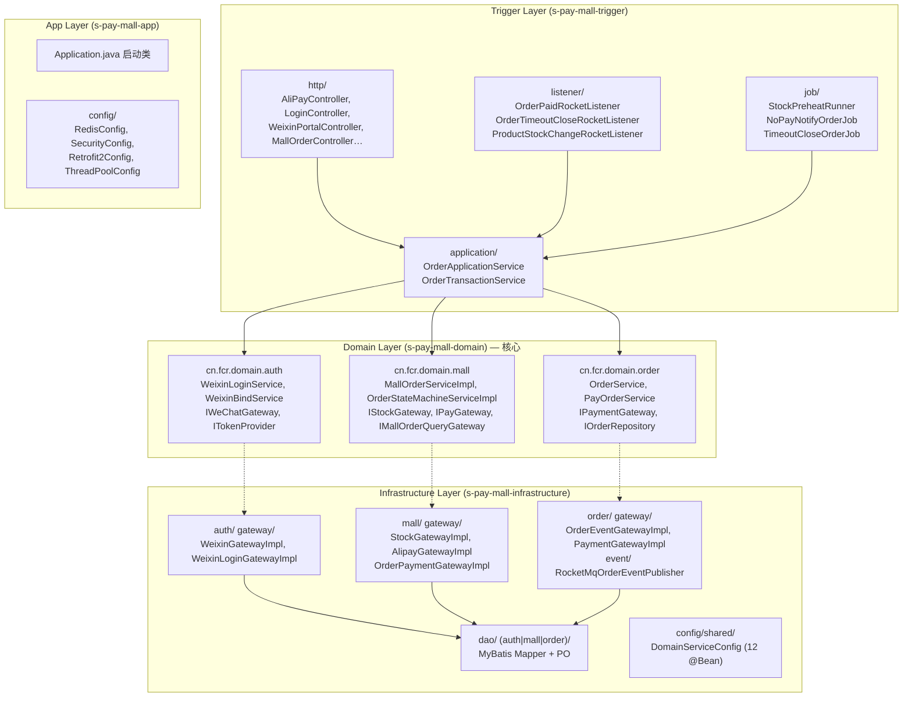
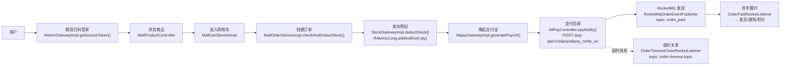

# s-pay-mall 商城系统 — 架构设计与知识汇总

> 本文档为系统架构设计的完整知识集，遵循 DDD 分层原则，覆盖核心业务链路、技术亮点及面试考点。

---

## 一、项目简介

s-pay-mall 是一个基于 **领域驱动设计 (DDD)** 架构的电商商城系统，采用前后端分离架构。支持**微信公众号扫码登录**、**支付宝当面付**、**RocketMQ 异步履约**、**Redis 库存预扣减**等核心电商功能。项目以 Maven 多模块组织，严格遵循 `Trigger → Application → Domain ← Infrastructure` 单向依赖。

---

## 二、技术栈

| 分组 | 技术选型 | 说明 |
|------|----------|------|
| **后端框架** | Spring Boot 2.7.12 + Java 17 | 应用框架 |
| **持久层** | MyBatis-Plus + MySQL 8.0 | 数据访问 |
| **缓存** | Redis (Lettuce) + Redisson 3.x | 缓存与分布式原子操作 |
| **消息队列** | Apache RocketMQ 5.x | 异步解耦、延时消息 |
| **认证** | JWT Token | 无状态认证 |
| **支付** | 支付宝当面付 (Alipay SDK) | 支付渠道 |
| **微信生态** | 微信公众号扫码登录 | 社交登录 |
| **API 客户端** | Retrofit2 | 微信 API 调用 |
| **前端** | Vue 3 + TypeScript + Element Plus 2.3.2 + Vite | SPA |
| **构建** | Maven 多模块 | 依赖管理 |

---

## 三、DDD 分层架构



**依赖规约（强约束）：**

- 依赖方向严格单向：`Trigger → Application → Domain ← Infrastructure`
- 领域层不依赖任何具体技术框架（无 Spring、Redis、MQ 注解）
- Domain Service 实现类为纯 POJO，通过 `DomainServiceConfig`（12 个 `@Bean`）手动注入容器
- 基础设施层通过实现 Domain 层接口完成依赖倒置

---

## 四、核心业务链路全景图



---

## 五、模块文档导航

| 文档 | 描述 | 核心技术点 |
|------|------|-----------|
| [module-auth.md](module-auth.md) | 微信扫码登录鉴权 | Redis 缓存 access_token（Key=`wechat:access_token:{appid}`，TTL=110min）、前后端轮询、JWT 签发 |
| [module-order-pay.md](module-order-pay.md) | 订单创建 + 支付宝支付回调 | 幂等三层防御、RSA2 验签、RocketMQ 异步解耦 (topic: `order_paid`)、延时关单 |
| [module-stock.md](module-stock.md) | Redis 库存预扣减 | RAtomicLong 原子操作、双检查防超卖、SETNX 幂等、StockPreheatRunner 冷启动预热 |

> **已合并**: 旧的 `pay.md` 和 `weixinLogin.md` 内容已合并进 `module-order-pay.md` 和 `module-auth.md`。

---

## 六、快速启动

### 必需环境变量

```bash
# 数据库
DB_HOST=localhost; DB_PORT=3306; DB_NAME=s_pay_mall
DB_USERNAME=root; DB_PASSWORD=your_password

# Redis
REDIS_HOST=localhost; REDIS_PORT=6379
REDIS_PASSWORD=your_redis_password

# 微信
WECHAT_APP_ID=your_app_id
WECHAT_APP_SECRET=your_app_secret

# 支付宝
ALIPAY_APP_ID=your_app_id
ALIPAY_PRIVATE_KEY=your_private_key
ALIPAY_PUBLIC_KEY=alipay_public_key
```

### 启动命令

```bash
# 后端
cd s-pay-mall-app && mvn spring-boot:run

# 前端
cd s-pay-mall-front && npm install && npm run dev
```

---

## 七、项目结构说明

```
s-pay-mall/
├── s-pay-mall-api/              # API 契约 (DTO, VO, Facade 接口)
├── s-pay-mall-app/              # 启动模块 (Spring Boot 启动 + Config)
├── s-pay-mall-domain/           # 领域层 (Entity, DomainService, Gateway 接口)
├── s-pay-mall-infrastructure/   # 基础设施层 (Gateway 实现, DAO, MQ)
│   ├── auth/                    #   认证领域实现
│   ├── mall/                    #   商城领域实现
│   ├── order/                   #   订单领域实现
│   ├── config/                  #   基础设施配置 (含 shared/)
│   └── dao/                     #   MyBatis Mapper + PO
├── s-pay-mall-trigger/          # 触发层 (Controller, Listener, Job, ApplicationService)
├── s-pay-mall-types/            # 通用类型 (Enum, 错误码, 基础 VO)
├── s-pay-mall-front/            # 前端 (Vue 3 + Element Plus)
└── docs/design/                 # 设计文档
    ├── README.md                # 本文件
    ├── module-auth.md           # 登录鉴权
    ├── module-order-pay.md      # 订单支付
    └── module-stock.md          # 库存服务
```

---

> 最新更新：2026-06
