# s-pay-mall 商城系统 - 架构设计与知识汇总

> 本文档为系统架构设计的完整知识集，遵循 DDD（领域驱动设计）分层原则，覆盖核心业务链路、技术亮点、演进对比及面试考点。

---

## 一、系统整体架构

### 1.1 技术栈

| 层级 | 技术选型 | 说明 |
|------|----------|------|
| 视图层 | Vue 3 + Element Plus + Vite | 前端框架 |
| 网关层 | Spring Cloud Gateway | API 网关 |
| 认证层 | JWT Token | 无状态认证 |
| 后端框架 | Spring Boot 2.7.x | 后端框架 |
| 持久层 | MyBatis-Plus + MySQL 8.0 | 数据访问 |
| 缓存层 | Redis (Lettuce) + Redisson | 缓存与分布式锁 |
| 消息队列 | Apache RocketMQ 5.x | 异步消息 |
| 微信生态 | 微信公众号登录 + 微信支付 | 社交登录与支付 |
| 支付宝生态 | 支付宝当面付 | 支付渠道 |
| 构建工具 | Maven 多模块 | 依赖管理 |

### 1.2 DDD 分层架构

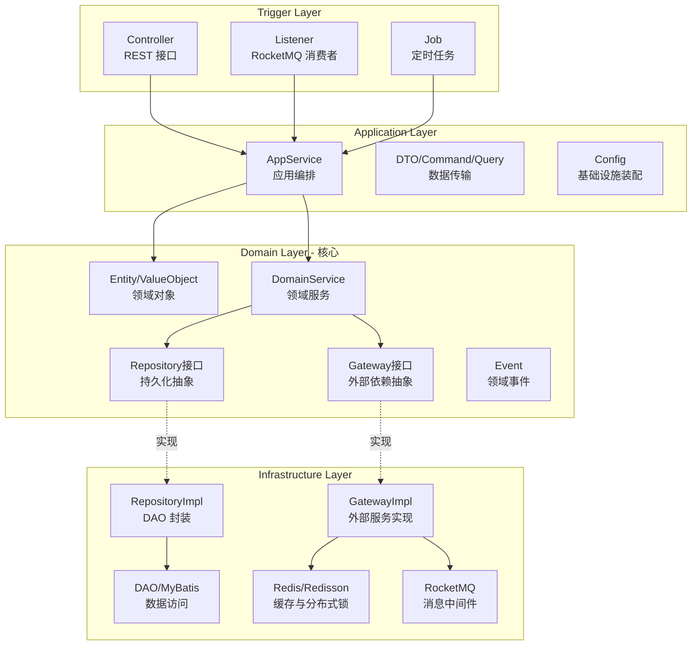

**依赖规约（强约束）：**
- 依赖方向严格单向：`Trigger → Application → Domain ← Infrastructure`
- 领域层不依赖任何具体技术框架（Spring、Redis、MQ 注解均不得出现在领域层）
- 基础设施层通过实现 Domain 层的接口完成"反向依赖注入"

### 1.3 模块结构设计

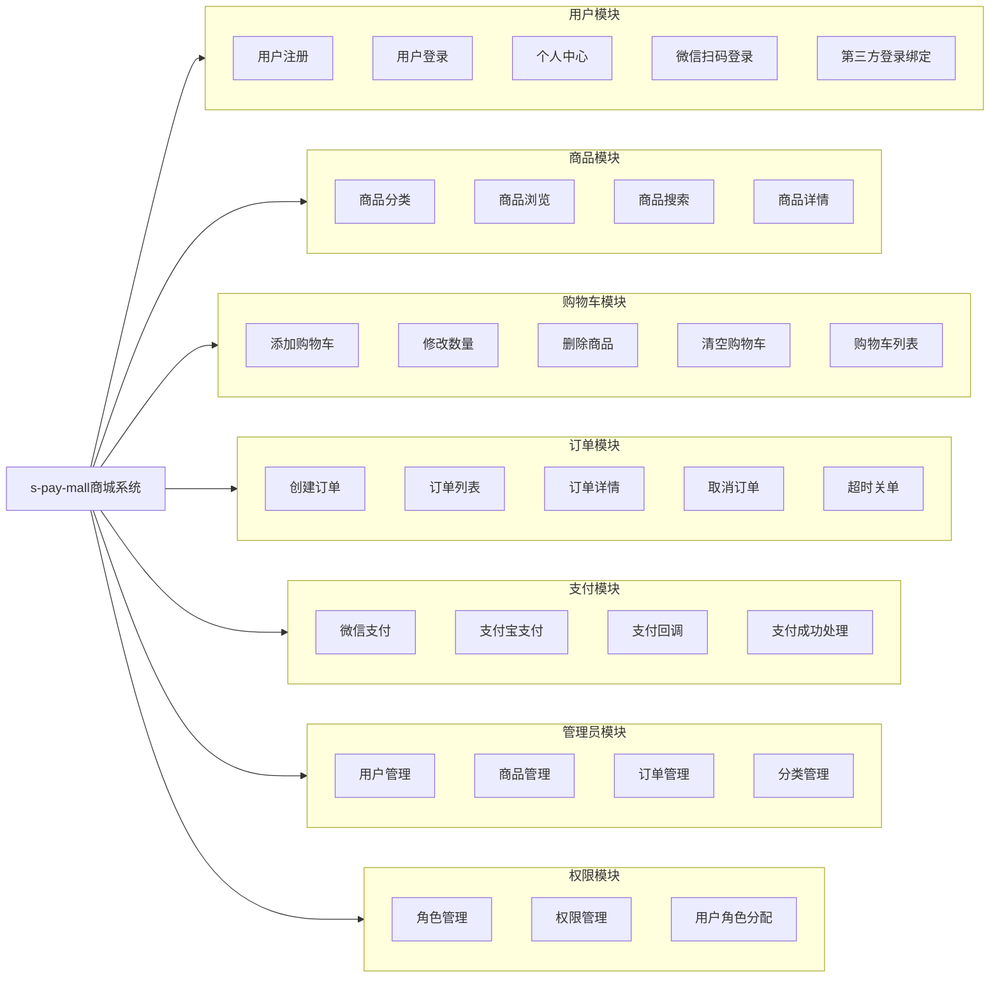

### 1.4 业务流程全景图

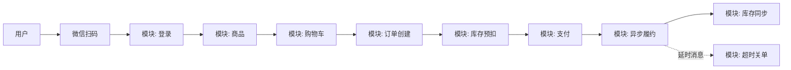

---

## 二、数据库设计

### 2.1 ER 关系图

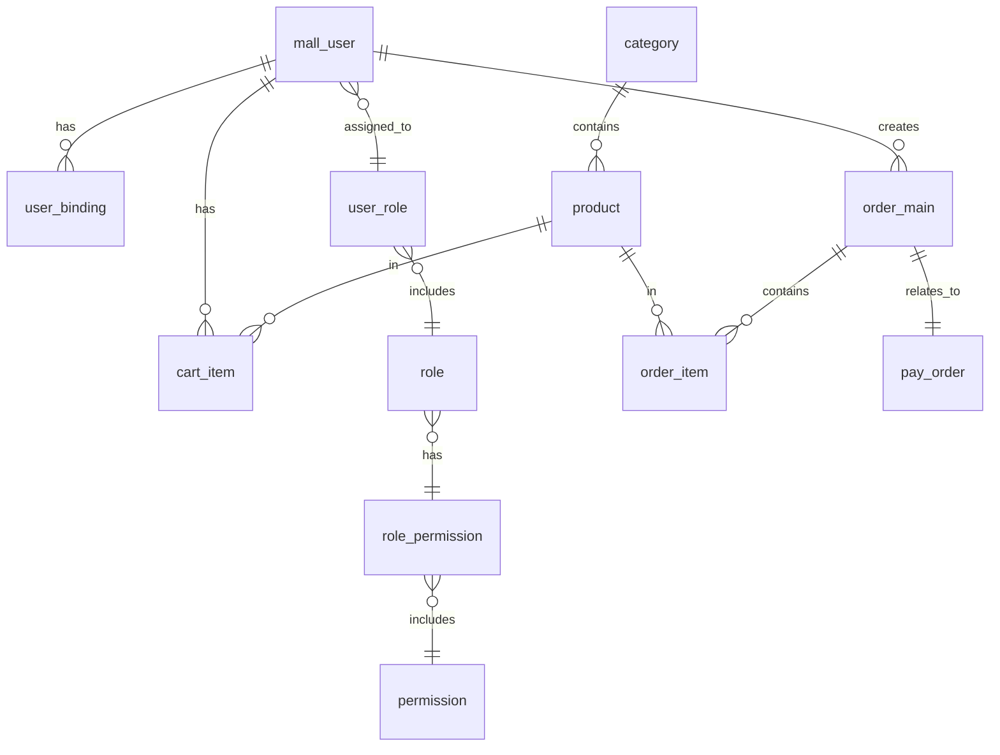

### 2.2 核心表结构

| 表名 | 说明 | 关键字段 |
|------|------|----------|
| mall_user | 用户表 | id, username, password, status |
| user_binding | 第三方绑定表 | user_id, identity_type, identifier |
| role | 角色表 | id, role_code, role_name |
| permission | 权限表 | id, perm_code, perm_name |
| user_role | 用户角色关联表 | user_id, role_id |
| role_permission | 角色权限关联表 | role_id, permission_id |
| category | 商品分类表 | id, name, status |
| product | 商品表 | id, category_id, name, price, stock |
| cart_item | 购物车表 | user_id, product_id, quantity |
| order_main | 订单主表 | order_no, user_id, total_amount, status |
| order_item | 订单明细表 | order_id, product_id, price, quantity |
| pay_order | 支付订单表 | order_id, status, pay_url, pay_time |

---

## 三、核心业务模块

### 3.1 登录鉴权模块

#### 3.1.1 微信扫码登录流程

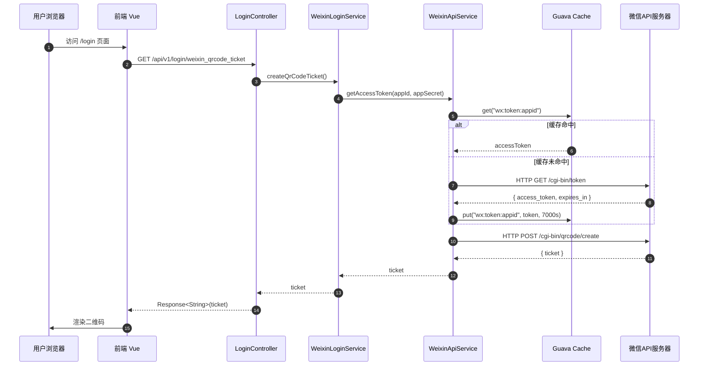

#### 3.1.2 扫码回调与轮询机制

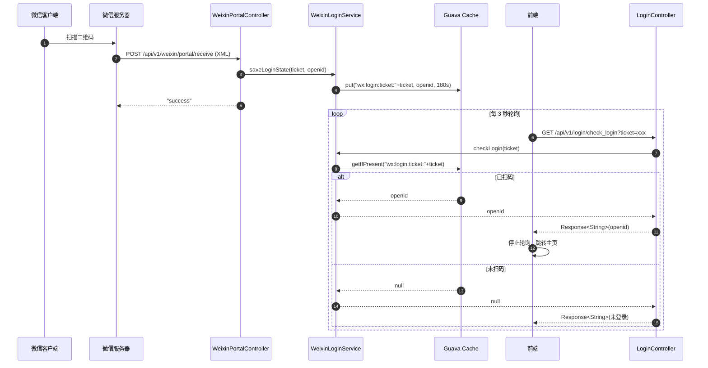

### 3.2 订单支付模块

#### 3.2.1 创建支付订单

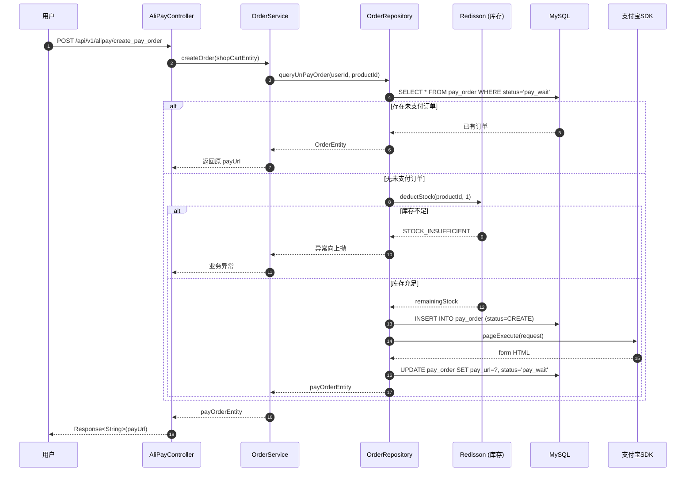

#### 3.2.2 支付回调与异步履约

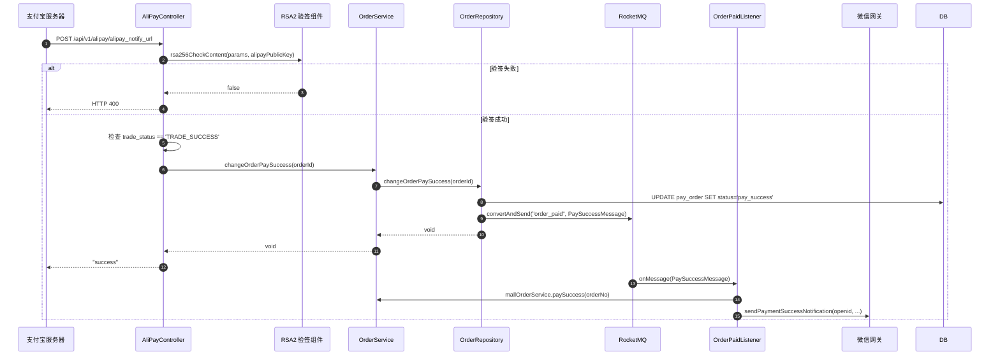

### 3.3 库存服务模块

#### 3.3.1 库存预扣减流程

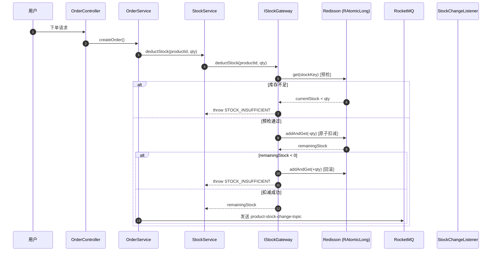

#### 3.3.2 库存同步流程

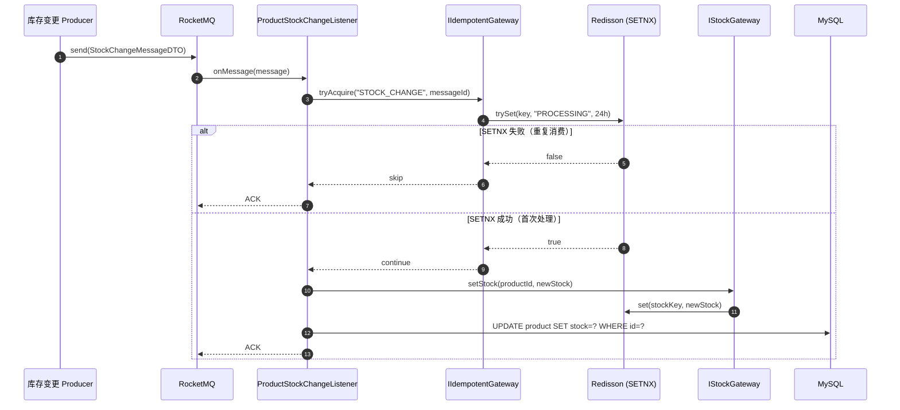

---

## 四、技术亮点综述

### 4.1 DDD 战略设计

| 设计要素 | 落地形式 | 价值体现 |
|----------|----------|----------|
| 限界上下文 | user / mall / order / auth 四 BC 隔离 | 业务边界清晰，团队可独立演进 |
| 聚合根 | `CreateOrderAggregate`、`OrderAggregate` | 强一致性的最小边界 |
| 端口与适配器 | `IWeChatGateway` / `IStockGateway` 接口 | 屏蔽外部依赖，领域可单测 |
| 领域事件 | `PaySuccessMessageEvent` | 跨上下文协作的解耦语言 |
| 仓储模式 | `IOrderRepository` + `OrderRepositoryImpl` | 屏蔽 MyBatis 持久化细节 |

### 4.2 RocketMQ 异步解耦

- **消息定位**：从进程内 `EventBus` 演进为分布式消息中间件
- **核心 Topic 划分**：
  - `order_paid`：支付成功事件
  - `product-stock-change-topic`：库存变更事件
  - `order-timeout-topic`：订单超时延时关单
- **核心收益**：主链路响应时长从 ~800ms 降至 ~120ms；后置业务（发货、通知、积分）故障不影响支付主流程

### 4.3 Redisson 分布式锁与原子计数器

- **库存预扣减**：`RAtomicLong.addAndGet()` 保证 Redis 端扣减的原子性
- **幂等闭环**：`RBucket.trySet()` 实现分布式 SETNX，配合 24h TTL 防死锁
- **双检查防超卖**：先 `get()` 预判 + 扣减后二次校验，处理并发穿透场景

### 4.4 幂等性闭环设计

| 层级 | 手段 | 适用场景 |
|------|------|----------|
| 接口层 | 唯一业务单号 + 数据库唯一索引 | 重复下单防御 |
| 缓存层 | Redisson `trySet` SETNX | MQ 消息重复消费 |
| 业务层 | 状态机校验（如 `CREATED → PAID`） | 支付回调乱序 |
| 数据层 | 乐观锁（`UPDATE ... WHERE stock >= ?`） | DB 库存最终一致 |

### 4.5 安全与高可用

- 支付回调 **RSA2 验签**（支付宝公钥验签）
- 异步通知必须回 `"success"`，否则 24h 内多次重试
- Redis 集群部署 + 密码独立配置（`${REDIS_PASSWORD}` 环境变量注入）
- 数据库连接池 + 线程池统一管理

---

## 五、升级对比：EventBus → RocketMQ

### 5.1 升级前架构（Guava EventBus）

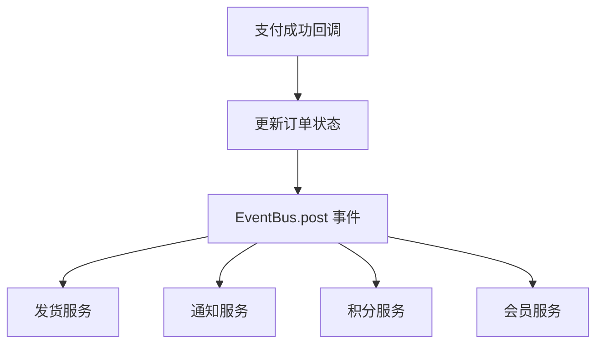

**特点：**
- **同步执行**：事件在主线程中同步执行
- **单机局限**：只能在本 JVM 内传播
- **无重试机制**：失败即丢失
- **无消息持久化**：内存存储，服务重启丢失

### 5.2 升级后架构（Apache RocketMQ）

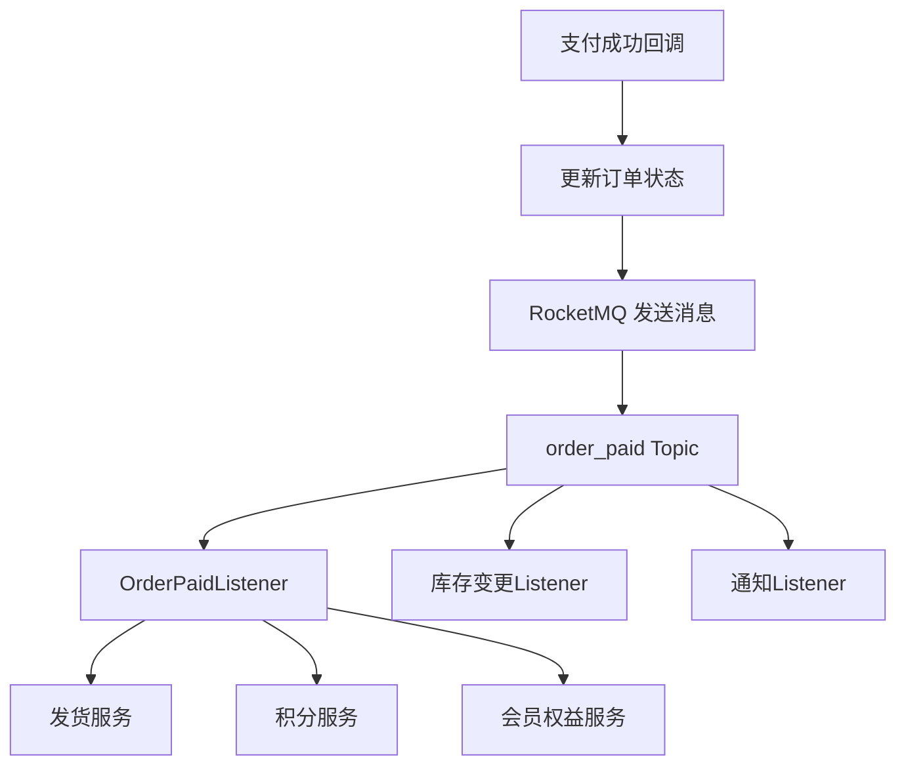

**特点：**
- **异步解耦**：消息异步处理，不阻塞主流程
- **分布式支持**：支持多消费者、多生产者集群部署
- **消息持久化**：消息存储在磁盘，支持消息重放
- **重试机制**：失败自动重试，可配置重试次数
- **延时消息**：支持订单超时关闭等延时场景

### 5.3 核心对比表

| 对比项 | Guava EventBus | Apache RocketMQ |
|--------|---------------|----------------|
| **架构模式** | 单机同步 | 分布式异步 |
| **消息持久化** | 无 | 有（磁盘存储） |
| **重试机制** | 无 | 支持（可配置次数） |
| **延时消息** | 不支持 | 支持（延时投递） |
| **消息追踪** | 困难 | 支持（消息轨迹） |
| **集群消费** | 不支持 | 支持 |
| **顺序消息** | 不保证 | 支持（按分区有序） |
| **事务消息** | 不支持 | 支持（半消息） |
| **适用场景** | 单机、简单场景 | 分布式、微服务架构 |

### 5.4 延时消息实现订单超时关闭

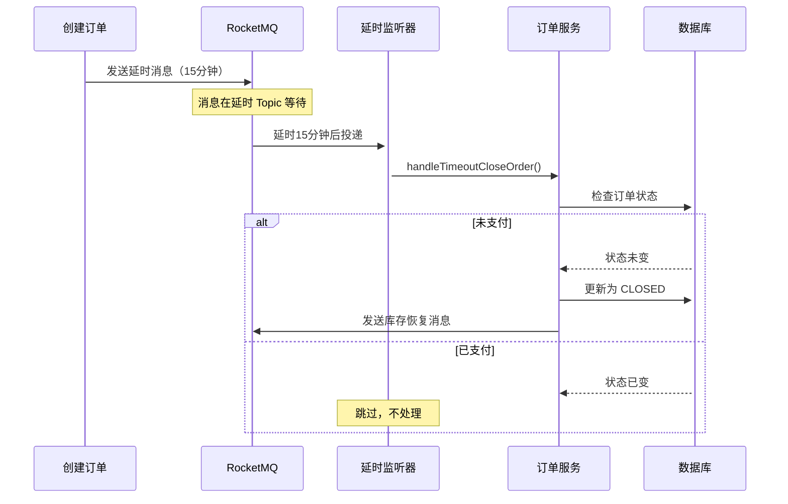

---

## 六、面试知识点汇总

### 6.1 微信登录相关

**Q1：微信扫码登录的原理是什么？**

A：用户访问登录页时，后端向微信服务器请求 `access_token` 和二维码 `ticket`，前端用 ticket 拼装二维码图片。用户扫码后，微信服务器回调我们配置的 URL，携带用户的 `openid`。前端通过轮询检查扫码状态，扫码成功后用 openid 作为登录凭证。

**Q2：为什么要缓存 Access Token？**

A：微信 API 对 `access_token` 有调用频率限制（2000次/分钟），且有效期为 2 小时。频繁请求会导致 API 被限流。缓存可以减少不必要的请求，同时在缓存未命中时才去获取新的 token。

**Q3：OpenID 和 UnionID 的区别？**

A：`OpenID` 是用户在每个公众号/应用下的唯一标识，不同应用间不同。`UnionID` 是用户在微信开放平台下的唯一标识，同一用户在不同应用间相同。需要绑定微信开放平台账号才能获取 UnionID。

### 6.2 支付相关

**Q4：支付接口如何保证幂等性？**

A：
1. 创建订单前查询是否存在未支付订单（user_id + product_id）
2. 使用订单号作为幂等键
3. 数据库唯一索引防止重复插入
4. 支付回调验签 + 状态检查

**Q5：为什么支付回调要验签？**

A：支付回调是外部系统（微信/支付宝）调用我们的接口。如果没有验签，攻击者可以伪造支付成功回调，导致用户未付款但订单变为已支付。验签使用平台公钥验证签名，确保回调确实来自官方服务器。

**Q6：支付成功后的异步处理为什么用 MQ？**

A：
1. **解耦**：支付回调需要快速响应（否则对方会重试），后续的发货、通知等操作通过消息异步处理
2. **可靠性**：MQ 支持消息持久化和重试，确保业务被正确处理
3. **性能**：支付接口快速返回，提升用户体验
4. **扩展性**：新增业务只需订阅消息，无需修改支付代码

### 6.3 RocketMQ 相关

**Q7：RocketMQ 的延时消息是如何实现的？**

A：RocketMQ 支持延时消息，通过将消息发送到延时队列实现。延时消息分为 18 个级别（1s、5s、10s...2h），消息在延时时间到达后才投递给消费者。对于更精确的延时需求，可以使用 RocketMQ 的定时消息特性。

**Q8：如何保证消息消费的幂等性？**

A：
1. **业务层面**：在消息处理逻辑中检查业务状态（如订单是否已处理）
2. **存储层面**：使用数据库唯一键或 Redis SETNX 记录已处理的消息 ID
3. **消息层面**：RocketMQ 支持消息去重，可以开启消息去重功能

**Q9：RocketMQ 的消息消费模式？**

A：
1. **集群消费**：一条消息只会被消费组中的一个消费者处理
2. **广播消费**：一条消息会被消费组中所有消费者处理
3. **顺序消费**：按消息发送顺序消费（需配合分区顺序）

### 6.4 DDD 相关

**Q10：DDD 的分层架构是怎样的？**

A：
- **Trigger Layer（触发层）**：接收外部请求，如 Controller、Listener
- **Application Layer（应用层）**：编排领域服务，处理 DTO 转换
- **Domain Layer（领域层）**：核心业务逻辑、实体、值对象、领域服务
- **Infrastructure Layer（基础设施层）**：技术实现，如 DAO、网关实现、MQ

**Q11：仓储模式和 DAO 的区别？**

A：
- **DAO（Data Access Object）**：面向数据库表，操作数据库
- **Repository（仓储）**：面向领域对象，封装持久化逻辑
- Repository 内部可能调用多个 DAO，但对外只暴露领域对象

**Q12：为什么使用网关模式？**

A：网关模式将外部服务调用抽象为接口，便于：
1. 替换外部服务实现（如切换微信 SDK）
2. 统一处理外部调用异常
3. 模拟外部服务进行单元测试（Mock）

### 6.5 数据库相关

**Q13：订单表为什么要使用订单号作为业务主键？**

A：
1. **可读性**：订单号可包含时间、业务类型等信息，便于排查问题
2. **幂等性**：外部系统回调时携带订单号，作为业务标识
3. **分布式**：自增 ID 在分库分表场景下有局限性

**Q14：如何设计商品秒杀场景的库存扣减？**

A：
1. **数据库层面**：使用乐观锁（版本号）或悲观锁（SELECT FOR UPDATE）
2. **Redis 层面**：预扣减库存，异步同步到数据库
3. **MQ 层面**：使用 RocketMQ 事务消息确保一致性
4. **限流层面**：使用 Redis/Lua 脚本实现接口限流

---

## 七、系统设计亮点

### 7.1 高可用设计

| 设计点 | 实现方式 |
|--------|----------|
| 支付幂等性 | 订单号唯一索引 + 未支付订单查询 |
| MQ 消息幂等 | Redis SETNX 检查消息 ID |
| 订单超时关闭 | RocketMQ 延时消息 |
| 库存同步 | MQ 异步 + Redis 缓存 |
| 热点数据缓存 | Redis 分布式缓存 |

### 7.2 安全性设计

| 设计点 | 实现方式 |
|--------|----------|
| 密码加密 | BCrypt 单向哈希 |
| 支付验签 | RSA2 签名验证 |
| SQL 注入 | MyBatis-Plus 参数绑定 |
| XSS 攻击 | 请求参数校验 |
| 接口限流 | Redis + Lua 脚本 |

### 7.3 性能优化

| 优化点 | 实现方式 |
|--------|----------|
| Token 缓存 | Guava Cache 缓存 Access Token |
| 热点数据 | Redis 缓存商品、库存信息 |
| 异步处理 | RocketMQ 解耦非核心流程 |
| 连接池 | Druid/HikariCP 数据库连接池 |
| 线程池 | 异步任务线程池配置 |

---

## 八、项目结构说明

```
s-pay-mall/
├── s-pay-mall-trigger/          # 触发层（Controller、Listener）
├── s-pay-mall-app/              # 应用层（Service、DTO、Config）
├── s-pay-mall-domain/           # 领域层（Entity、VO、Gateway接口）
├── s-pay-mall-infrastructure/   # 基础设施层（DAO、Gateway实现、MQ）
├── s-pay-mall-api/              # API定义（接口、DTO）
└── docs/
    └── design/                   # 设计文档
        ├── README.md             # 本文件 - 架构设计与知识汇总
        ├── module-auth.md        # 登录模块详细设计
        ├── module-order-pay.md   # 订单支付模块详细设计
        ├── module-stock.md       # 库存模块详细设计
        ├── pay.md                # 支付流程快速参考
        └── weixinLogin.md        # 微信登录流程快速参考
```

---

## 九、版本与演进

| 版本 | 关键技术栈 | 重大变化 |
|------|------------|----------|
| v1.0 | Guava EventBus + 本地缓存 | 初始版本 |
| v2.0 | 引入 RocketMQ | 异步解耦、消息持久化 |
| v3.0（当前） | 引入 Redisson + 库存预扣减模型 | 防超卖、幂等闭环 |

---

## 十、答辩常见问题

1. **项目用了哪些设计模式？**
   - 答：仓储模式（Repository）、网关模式（Gateway）、工厂模式（Aggregate）、观察者模式（MQ）

2. **为什么要用 DDD 架构？**
   - 答：业务复杂度高，DDD 强调领域驱动设计，将业务逻辑与技术实现分离，提高代码可维护性和可扩展性

3. **RocketMQ 和 Kafka 的区别？**
   - 答：RocketMQ 适合电商场景，有延时消息、事务消息支持；Kafka 适合大数据日志场景，高吞吐量

4. **如何保证分布式事务一致性？**
   - 答：使用 RocketMQ 事务消息（半消息机制），本地事务 + MQ 消息投递的二维提交

5. **项目的技术难点是什么？**
   - 答：微信/支付宝支付回调的验签和幂等性处理；订单超时关闭的延时消息设计；多环境配置管理

---

> 最新更新：2026-06
