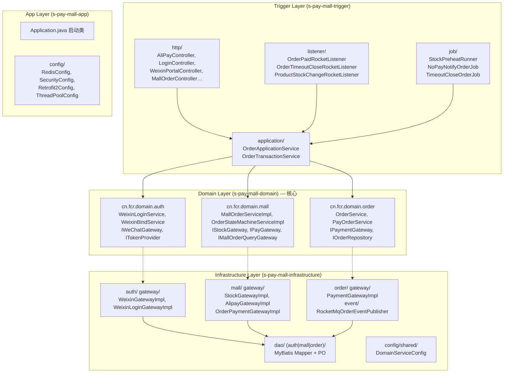
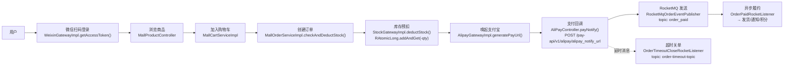

# s-pay-mall 商城系统 — 架构设计与知识汇总

> 本文档为系统架构设计的知识集，覆盖核心业务链路图、DDD 分层 mermaid 图及模块文档导航。
>
> **项目概述/技术栈/启动命令/模块结构**: 见 [AGENTS.md](../../AGENTS.md)（项目上下文唯一来源）。
> **DDD 架构规则**: 见 [DDD_ARCHITECTURE_SPEC.md](../../DDD_ARCHITECTURE_SPEC.md)（架构规则唯一真相源）。

---

## 一、DDD 分层架构图

```mermaid
flowchart TB
    subgraph Trigger["Trigger Layer (s-pay-mall-trigger)"]
        T1["http/<br/>AliPayController, LoginController,<br/>WeixinPortalController, MallOrderController…"]
        T2["listener/<br/>OrderPaidRocketListener<br/>OrderTimeoutCloseRocketListener<br/>ProductStockChangeRocketListener"]
        T3["job/<br/>StockPreheatRunner<br/>NoPayNotifyOrderJob<br/>TimeoutCloseOrderJob"]
        T4["application/<br/>OrderApplicationService<br/>OrderTransactionService"]
    end

    subgraph App["App Layer (s-pay-mall-app)"]
        A1["Application.java 启动类"]
        A2["config/<br/>RedisConfig, SecurityConfig,<br/>Retrofit2Config, ThreadPoolConfig"]
    end

    subgraph Domain["Domain Layer (s-pay-mall-domain) — 核心"]
        D1["cn.fcr.domain.auth<br/>WeixinLoginService, WeixinBindService<br/>IWeChatGateway, ITokenProvider"]
        D2["cn.fcr.domain.mall<br/>MallOrderServiceImpl, OrderStateMachineServiceImpl<br/>IStockGateway, IPayGateway, IMallOrderQueryGateway"]
        D3["cn.fcr.domain.order<br/>OrderService, PayOrderService<br/>IPaymentGateway, IOrderRepository"]
    end

    subgraph Infra["Infrastructure Layer (s-pay-mall-infrastructure)"]
        I1["auth/ gateway/<br/>WeixinGatewayImpl, WeixinLoginGatewayImpl"]
        I2["mall/ gateway/<br/>StockGatewayImpl, AlipayGatewayImpl<br/>OrderPaymentGatewayImpl"]
        I3["order/ gateway/<br/>PaymentGatewayImpl<br/>event/ RocketMqOrderEventPublisher"]
        I4["dao/ (auth|mall|order)/<br/>MyBatis Mapper + PO"]
        I5["config/shared/<br/>DomainServiceConfig"]
    end

    T1 --> T4
    T2 --> T4
    T3 --> T4
    T4 --> D1
    T4 --> D2
    T4 --> D3
    D1 -.-> I1
    D2 -.-> I2
    D3 -.-> I3
    I1 --> I4
    I2 --> I4
    I3 --> I4
```

**依赖规约**: 详见 [DDD_ARCHITECTURE_SPEC.md §1](../../DDD_ARCHITECTURE_SPEC.md)。

> DomainServiceConfig 的 `@Bean` 数量以代码实际为准（见 [DomainServiceConfig.java](../../s-pay-mall-infrastructure/src/main/java/cn/fcr/infrastructure/config/shared/DomainServiceConfig.java)），不在此写死数量。

---

## 二、核心业务链路全景图

```mermaid
flowchart LR
    U[用户] --> A1["微信扫码登录<br/>WeixinGatewayImpl.getAccessToken()"]
    A1 --> A2["浏览商品<br/>MallProductController"]
    A2 --> A3["加入购物车<br/>MallCartServiceImpl"]
    A3 --> A4["创建订单<br/>MallOrderServiceImpl.checkAndDeductStock()"]
    A4 --> A5["库存预扣<br/>StockGatewayImpl.deductStock()<br/>RAtomicLong.addAndGet(-qty)"]
    A5 --> A6["唤起支付宝<br/>AlipayGatewayImpl.generatePayUrl()"]
    A6 --> A7["支付回调<br/>AliPayController.payNotify()<br/>POST /pay-api/v1/alipay/alipay_notify_url"]
    A7 --> A8["RocketMQ 发送<br/>RocketMqOrderEventPublisher<br/>topic: order_paid"]
    A8 --> A9["异步履约<br/>OrderPaidRocketListener<br/>→ 发货/通知/积分"]
    A7 -.->|延时消息| A10["超时关单<br/>OrderTimeoutCloseRocketListener<br/>topic: order-timeout-topic"]
```

> 端点完整定义见 [API_CONTRACT.md](../../API_CONTRACT.md)。

---

## 三、模块文档导航

| 文档 | 描述 | 核心技术点 |
|------|------|-----------|
| [module-auth.md](module-auth.md) | 微信扫码登录鉴权 | Redis 缓存 access_token（Key=`wechat:access_token:{appid}`，TTL=110min）、前后端轮询、JWT 签发 |
| [module-order-pay.md](module-order-pay.md) | 订单创建 + 支付宝支付回调 | 幂等三层防御、RSA2 验签、RocketMQ 异步解耦 (topic: `order_paid`)、延时关单 |
| [module-stock.md](module-stock.md) | Redis 库存预扣减 | RAtomicLong 原子操作、双检查防超卖、SETNX 幂等、StockPreheatRunner 冷启动预热 |

> **已合并**: 旧的 `pay.md` 和 `weixinLogin.md` 内容已合并进 `module-order-pay.md` 和 `module-auth.md`。

---

## 四、快速启动

> 环境变量、启动命令详见 [AGENTS.md §常用命令](../../AGENTS.md)。

---

> 最新更新：2026-08-23
