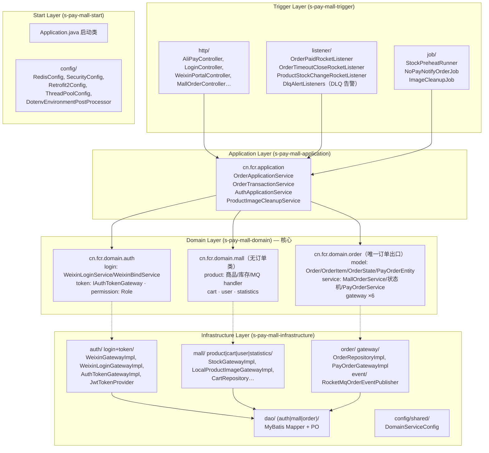
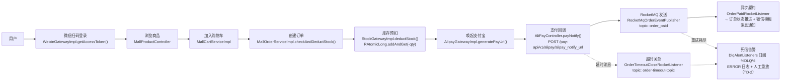

# s-pay-mall 商城系统 — 架构设计与知识汇总

> 本文档为系统架构设计的知识集，覆盖核心业务链路图、DDD 分层 mermaid 图及模块文档导航。
>
> **项目概述/技术栈/启动命令/模块结构**: 见 [AGENTS.md](../../AGENTS.md)（项目上下文唯一来源）。
> **DDD 架构规则**: 见 [DDD_ARCHITECTURE_SPEC.md](../../DDD_ARCHITECTURE_SPEC.md)（架构规则唯一真相源）。

---

## 一、DDD 分层架构图

```mermaid
flowchart TB
    subgraph Trigger["Trigger Layer (s-pay-mall-trigger)"]
        T1["http/<br/>AliPayController, LoginController,<br/>WeixinPortalController, MallOrderController…"]
        T2["listener/<br/>OrderPaidRocketListener<br/>OrderTimeoutCloseRocketListener<br/>ProductStockChangeRocketListener<br/>DlqAlertListeners（DLQ 告警）"]
        T3["job/<br/>StockPreheatRunner<br/>NoPayNotifyOrderJob<br/>ImageCleanupJob"]
    end

    subgraph App["Application Layer (s-pay-mall-application)"]
        T4["cn.fcr.application<br/>OrderApplicationService<br/>OrderTransactionService<br/>AuthApplicationService<br/>ProductImageCleanupService"]
    end

    subgraph Start["Start Layer (s-pay-mall-start)"]
        A1["Application.java 启动类"]
        A2["config/<br/>RedisConfig, SecurityConfig,<br/>Retrofit2Config, ThreadPoolConfig,<br/>DotenvEnvironmentPostProcessor"]
    end

    subgraph Domain["Domain Layer (s-pay-mall-domain) — 核心"]
        D1["cn.fcr.domain.auth<br/>login: WeixinLoginService/WeixinBindService<br/>token: IAuthTokenGateway · permission: Role"]
        D2["cn.fcr.domain.mall（无订单类）<br/>product: 商品/库存/MQ handler<br/>cart · user · statistics"]
        D3["cn.fcr.domain.order（唯一订单出口）<br/>model: Order/OrderItem/OrderState/PayOrderEntity<br/>service: MallOrderService/状态机/PayOrderService<br/>gateway ×6"]
    end

    subgraph Infra["Infrastructure Layer (s-pay-mall-infrastructure)"]
        I1["auth/ login+token/<br/>WeixinGatewayImpl, WeixinLoginGatewayImpl,<br/>AuthTokenGatewayImpl, JwtTokenProvider"]
        I2["mall/ product|cart|user|statistics/<br/>StockGatewayImpl, LocalProductImageGatewayImpl,<br/>CartRepository…"]
        I3["order/ gateway/<br/>OrderRepositoryImpl, PayOrderGatewayImpl<br/>event/ RocketMqOrderEventPublisher"]
        I4["dao/ (auth|mall|order)/<br/>MyBatis Mapper + PO"]
        I5["config/shared/<br/>DomainServiceConfig"]
    end

    T1 --> T4
    T2 --> T4
    T3 --> T4
    T4 --> D1
    T4 --> D2
    T4 --> D3
    D1 -.-> I1
    D2 -.-> I2
    D3 -.-> I3
    I1 --> I4
    I2 --> I4
    I3 --> I4
```

**依赖规约**: 详见 [DDD_ARCHITECTURE_SPEC.md §1](../../DDD_ARCHITECTURE_SPEC.md)。

> DomainServiceConfig 的 `@Bean` 数量以代码实际为准（见 [DomainServiceConfig.java](../../s-pay-mall-infrastructure/src/main/java/cn/fcr/infrastructure/config/shared/DomainServiceConfig.java)），不在此写死数量。

---

## 二、核心业务链路全景图

```mermaid
flowchart LR
    U[用户] --> A1["微信扫码登录<br/>WeixinGatewayImpl.getAccessToken()"]
    A1 --> A2["浏览商品<br/>MallProductController"]
    A2 --> A3["加入购物车<br/>MallCartServiceImpl"]
    A3 --> A4["创建订单<br/>MallOrderServiceImpl.checkAndDeductStock()"]
    A4 --> A5["库存预扣<br/>StockGatewayImpl.deductStock()<br/>RAtomicLong.addAndGet(-qty)"]
    A5 --> A6["唤起支付宝<br/>AlipayGatewayImpl.generatePayUrl()"]
    A6 --> A7["支付回调<br/>AliPayController.payNotify()<br/>POST /pay-api/v1/alipay/alipay_notify_url"]
    A7 --> A8["RocketMQ 发送<br/>RocketMqOrderEventPublisher<br/>topic: order_paid"]
    A8 --> A9["异步履约<br/>OrderPaidRocketListener<br/>→ 订单状态推进 + 微信模板消息通知"]
    A7 -.->|延时消息| A10["超时关单<br/>OrderTimeoutCloseRocketListener<br/>topic: order-timeout-topic"]
    A8 -.->|重试耗尽| A11["死信告警<br/>DlqAlertListeners 订阅 %DLQ%<br/>ERROR 日志 + 人工重放（TD-2）"]
    A10 -.-> A11
```

> 账号绑定链路（账密 ↔ 微信，2026-10-07）：`GET /auth/bind/qrcode` → 扫码 SCAN 回调 → `POST /auth/bind/confirm`（userId 取自 JWT，openId 服务端解析，票据一次性）→ 写 `user_binding`；微信用户经 `POST /auth/password` 补设密码后账密登录同一账户。详见 [module-auth.md](module-auth.md) §五。

> 端点完整定义见 [API_CONTRACT.md](../../API_CONTRACT.md)。

---

## 三、模块文档导航

| 文档 | 描述 | 核心技术点 |
|------|------|-----------|
| [module-auth.md](module-auth.md) | 账密登录、微信扫码登录、账号绑定（双登录方式同一账户）、JWT 安全链 | Redis 缓存 access_token（Key=`wechat:access_token:{appid}`，TTL=110min）、前后端轮询、JWT 签发、user_binding 联合绑定、401/0003 认证语义（S-02/S-03） |
| [module-order-pay.md](module-order-pay.md) | 订单创建 + 支付宝支付回调 | 幂等三层防御、RSA2 验签 + 金额一致性（TD-5）、事件按流转发布（TD-6）、RocketMQ 异步解耦 (topic: `order_paid`)、延时关单 + Job 兜底（TD-7/8）、DLQ 告警（TD-2） |
| [module-stock.md](module-stock.md) | Redis 库存预扣减 | RAtomicLong 原子操作、双检查防超卖、SETNX 幂等、StockPreheatRunner 冷启动预热 |
| [module-product-image.md](module-product-image.md) | 商品图片管理 + 孤儿文件清理 | 存储网关抽象（可迁移 OSS）、null 更新保护、双层路径穿越防护、24h 保护期清理任务、零外网依赖展示 |

> **已合并**: 旧的 `pay.md` 和 `weixinLogin.md` 内容已合并进 `module-order-pay.md` 和 `module-auth.md`。

---

## 四、快速启动

> 环境变量、启动命令详见 [AGENTS.md §常用命令](../../AGENTS.md)。

---

> 最新更新：2026-10-07（TD-1~TD-12 技术债批次关闭 + S-02/S-03 安全修复：JSON 命名统一 camelCase、订单状态存储口径统一（TD-4）、回调金额校验（TD-5）、事件按流转发布（TD-6）、Job 分布式锁 + 兜底关单（TD-7/8）、DLQ 告警监听器（TD-2）、JWT 401/0003 认证语义与前端闭环（S-02/S-03）；module-auth 补齐账密登录/账号绑定/安全链，module-order-pay 补齐金额校验/事件幂等/兜底任务/DLQ，全部经全量 E2E 回归）
>
> 2026-10-05（新增 [module-product-image.md](module-product-image.md)：商品图片管理全链路——本地存储网关抽象、上传/展示/清理闭环，含孤儿文件定时清理机制；新增 [ROADMAP.md](ROADMAP.md)：演进路线——未来功能、升级点设计、技术债关闭记录与未处理项；P0 批次三项已按 10-05 核实结果关闭，见 ROADMAP §1.4）
>
> 2026-10-03（M2 领域重构：auth 拆 login/token/permission，mall 拆 product/cart/user/statistics，订单簇收编 order；同日 legacy sunset 完成：旧链包整体删除、守卫规则 5 防回潮，边界规则由 DomainArchitectureGuardTest 守卫规则 3/4/5 自动化守护）
