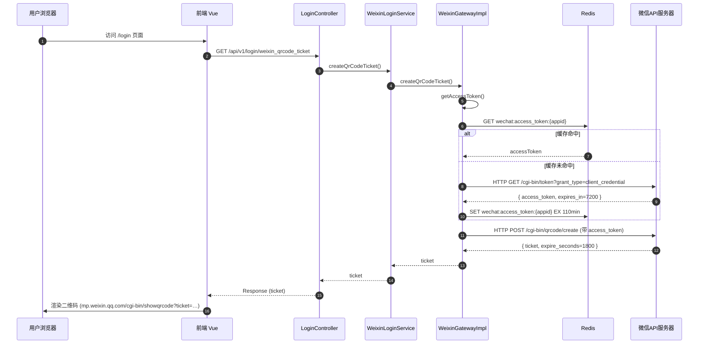
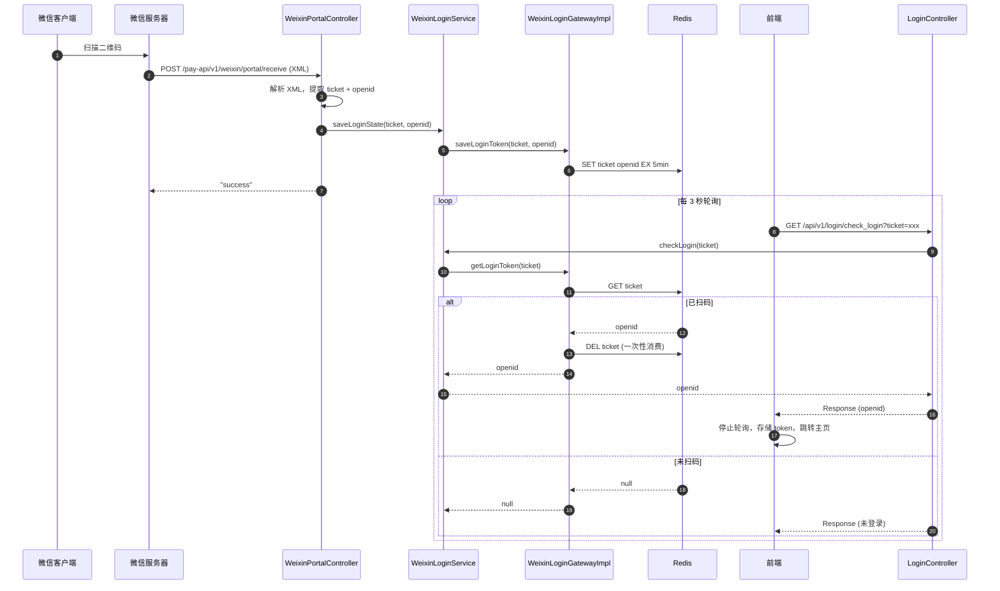
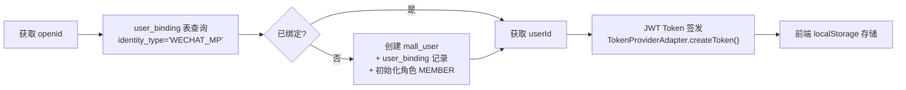

# 模块一：登录鉴权（Authentication）

> **领域上下文**：Auth Context
> **核心场景**：微信公众号扫码登录
> **依赖外部**：微信开放平台 API、Redis (StringRedisTemplate)
> **关键性质**：无状态、临时凭证驱动、Cache-Aside 缓存模式

---

## 一、模块定位

本模块负责用户的身份识别与会话建立。系统采用 **微信公众号扫码登录** 方案，相较于密码登录具备以下优势：
- 无需记忆密码，降低用户使用门槛
- 借助微信生态 OpenID 唯一标识，避免密码泄露风险
- 接入成本低，公众号已认证即可对接

---

## 二、登录时序：获取二维码

### 2.1 关键设计点

**① AccessToken 缓存策略（Cache-Aside 模式）**

- 实现类：`WeixinGatewayImpl.getAccessToken()`（第 148 行）
- 存储：`StringRedisTemplate`，Key = `wechat:access_token:{appid}`
- TTL：**110 分钟**（微信官方有效期 120 分钟，提前 10 分钟续期，避免边界过期）
- 缓存未命中时回源微信 API `cgi-bin/token`

**② Ticket 的临时性**

- Ticket 由微信 API 生成，有效期 1800s（30 分钟）
- 扫码后 Ticket 立即失效

---

## 三、登录时序：扫码回调与轮询

### 3.1 异步解耦：回调与查询分离

微信扫码是**异步事件**——微信服务器回调我们的接口（WeixinPortalController），但无法主动通知浏览器。前端通过**短轮询（3s 间隔）**检测 Redis 中是否出现 openid，将"扫码事件"与"登录态查询"解耦。

**关键实现：一次性 Token**

`WeixinLoginGatewayImpl.getLoginToken()` 读取后立即 `DELETE` 该 key，保证 token 不会被重复获取。

### 3.2 凭证时效控制

| 凭证 | 存储位置 | Redis Key | TTL | 说明 |
|------|----------|-----------|-----|------|
| accessToken | Redis (StringRedisTemplate) | `wechat:access_token:{appid}` | 110min (6600s) | 提前于微信官方 7200s 续期 |
| ticket | 微信服务器 | — | 1800s | 微信侧强制，扫码后立即失效 |
| ticket→openid 映射 | Redis (StringRedisTemplate) | `{ticket}` (直接作为 key) | 5min (300s) | WeixinLoginGatewayImpl.saveLoginToken()，get 后即删 |

---

## 四、登录态持久化与第三方绑定

**关键表结构：**

- `mall_user`：核心登录账号（username、password、status）
- `user_binding`：`identity_type` (WECHAT_MP) + `identifier` (openid) 联合唯一索引
- `user_role`：用户-角色关联

**创建新用户流程（WeixinLoginGatewayImpl.createWechatUserAndBind()）：**

1. 创建临时用户 `temp_{uuid8}` → 获取自增 ID
2. 更新用户名为 `wx_user_{userId}`
3. 创建 `user_binding` 绑定记录
4. 初始化角色为 `MEMBER`（roleId=2）

---

## 五、技术亮点与面试高频考点

| 维度 | 考点 | 标准答案 |
|------|------|----------|
| **缓存** | 为什么要缓存 accessToken？ | 微信 API 有调用频率限制（2000次/分），且 token 有效期 2h；Redis 缓存 110min（提前 10min 续期）避免每次登录都请求微信 |
| **轮询 vs SSE** | 为什么不直接用长连接？ | 短时一次性交互，3s 轮询实现简单、容错高；大规模场景可升级 SSE |
| **OpenID vs UnionID** | 二者区别？ | OpenID 是某公众号下的用户唯一标识；UnionID 是开放平台下跨应用统一标识（需绑定开放平台） |
| **安全性** | 凭证可能被窃取吗？ | ticket→openid 仅存 Redis 5min，get 后即删；前端只见 ticket，短 TTL 降低重放窗口 |
| **一次性消费** | getLoginToken 为何读后即删？ | 防止同一 ticket 被多次轮询取走，保证 token 一次使用后失效 |
| **DDD 应用** | 端口与适配器体现？ | IWeChatGateway 接口由 WeixinGatewayImpl (Retrofit2) 适配实现；领域层 WeixinLoginService 不感知 HTTP 客户端 |
| **新用户处理** | 首次扫码如何自动注册？ | WeixinLoginGatewayImpl.createWechatUserAndBind()：创建 mall_user → user_binding → 初始化 MEMBER 角色，一气呵成 |

---

## 六、异常场景与降级

| 场景 | 现象 | 处理策略 |
|------|------|----------|
| 微信 API 不可用 | 获取 accessToken/ticket 失败 | 返回 5xx，前端展示"登录服务暂不可用" |
| 用户取消授权 | 微信回调不含 openid | 缓存不写入，轮询 60s 后超时提示二维码失效 |
| Ticket 过期 | 轮询始终为 null | 前端 60s 后停止轮询，提示刷新二维码 |
| Redis 不可用 | 缓存读写失败 | 降级为直连微信 API（牺牲性能保可用，需验证） |

---

> **关键源码索引**：
> - AccessToken 缓存：[`WeixinGatewayImpl.getAccessToken()`](file:///Users/xiaolv/Develop/projects/backend/java/s-pay-mall/s-pay-mall-infrastructure/src/main/java/cn/fcr/infrastructure/auth/gateway/WeixinGatewayImpl.java#L148)
> - 登录 Token：[`WeixinLoginGatewayImpl.saveLoginToken()`](file:///Users/xiaolv/Develop/projects/backend/java/s-pay-mall/s-pay-mall-infrastructure/src/main/java/cn/fcr/infrastructure/auth/gateway/WeixinLoginGatewayImpl.java#L109)
> - 回调入口：[`WeixinPortalController.post()`](file:///Users/xiaolv/Develop/projects/backend/java/s-pay-mall/s-pay-mall-trigger/src/main/java/cn/fcr/trigger/http/WeixinPortalController.java#L59)
> - 轮询入口：[`LoginController.checkLogin()`](file:///Users/xiaolv/Develop/projects/backend/java/s-pay-mall/s-pay-mall-trigger/src/main/java/cn/fcr/trigger/http/LoginController.java#L65)
> - Redis Key 常量：[`Constants.REDIS_WECHAT_ACCESS_TOKEN_PREFIX`](file:///Users/xiaolv/Develop/projects/backend/java/s-pay-mall/s-pay-mall-types/src/main/java/cn/fcr/types/common/Constants.java#L12)
