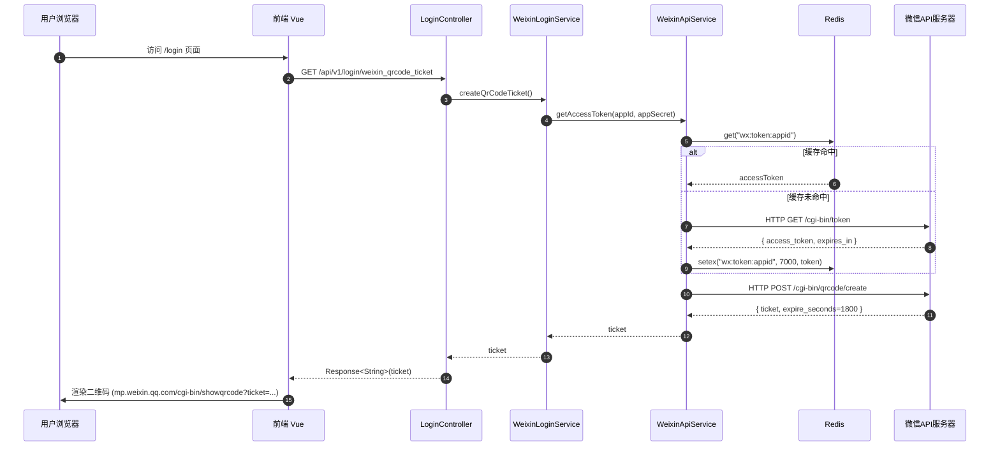
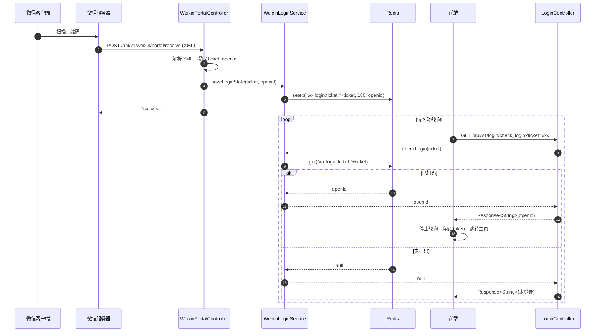
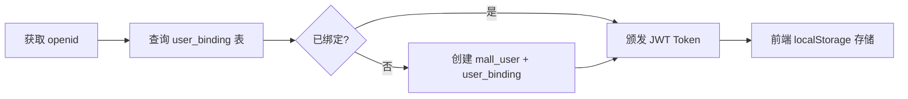

# 模块一：登录鉴权（Authentication）

> **领域上下文**：Auth Context  
> **核心场景**：微信公众号扫码登录  
> **依赖外部**：微信开放平台 API、Redis  
> **关键性质**：无状态、临时凭证驱动

---

## 一、模块定位

本模块负责用户的身份识别与会话建立。系统采用 **微信公众号扫码登录** 方案，相较于密码登录具备以下优势：
- 无需记忆密码，降低用户使用门槛
- 借助微信生态 OpenID 唯一标识，避免密码泄露风险
- 接入成本低，公众号已认证即可对接

---

## 二、登录时序：获取二维码

### 2.1 关键设计点

**① AccessToken 缓存策略**
- 使用 Redis `StringRedisTemplate`，过期时间略小于微信官方 7200s（取 7000s 提前刷新）
- 缓存未命中时回源微信 API，避免每次登录都请求 token，规避微信 API 频率限制（2000次/分）

**② Ticket 的临时性**
- Ticket 有效期仅 30 分钟，扫码后立即失效
- 以 `ticket` 为 key 建立"扫码凭证 → openid"的临时映射

---

## 三、登录时序：扫码回调与轮询

### 3.1 异步解耦：回调与查询分离

微信扫码是 **异步事件**，无法在用户扫码瞬间就完成登录态同步。前端通过 **短轮询（3s 间隔）** 检测本地缓存中是否出现 openid，从而将"扫码事件"与"登录态查询"解耦。

### 3.2 凭证时效控制

| 凭证 | 存储位置 | TTL | 失效原因 |
|------|----------|-----|----------|
| accessToken | Redis (StringRedisTemplate) | 7000s | 提前于官方 7200s 过期 |
| ticket | 微信服务器 | 1800s | 微信侧强制 |
| ticket→openid 映射 | Redis (StringRedisTemplate) | 180s | 防止轮询无限重试 |

---

## 四、登录态持久化与第三方绑定

**关键表结构：**
- `mall_user`：核心登录账号
- `user_binding`：`identity_type` (WECHAT_MP / ALIPAY / PHONE) + `identifier` (openid) 联合唯一索引

---

## 五、技术亮点与面试高频考点

| 维度 | 考点 | 标准答案 |
|------|------|----------|
| **缓存** | 为什么要缓存 accessToken？ | 微信 API 有调用频率限制（2000次/分），且 token 有效期 2h，使用 Redis 缓存可显著降低 RT 与限流风险 |
| **轮询 vs SSE/WebSocket** | 为什么不直接用长连接？ | 系统为短时一次性交互，3s 轮询实现简单、容错高；大规模场景可升级 SSE |
| **OpenID vs UnionID** | 二者区别？ | OpenID 是某公众号下的用户唯一标识；UnionID 是开放平台下跨应用统一标识（需绑定开放平台） |
| **安全性** | 凭证可能被窃取吗？ | ticket→openid 仅存于 Redis 缓存，前端只见 ticket；且短 TTL 降低重放窗口 |
| **解耦** | 为什么回调与登录查询分离？ | 微信回调是被动事件，无法主动告知前端；轮询是主动探查模式，符合异步事件驱动设计 |
| **DDD 应用** | 端口与适配器体现？ | `IWeixinApiService` 接口由 Retrofit 适配器实现，领域层不感知 HTTP 客户端 |

---

## 六、异常场景与降级

| 场景 | 现象 | 处理策略 |
|------|------|----------|
| 微信 API 不可用 | 获取 token 失败 | 返回 5xx，前端展示"登录服务暂不可用" |
| 用户取消授权 | 微信回调 `subscribe=0` | 缓存不写入，轮询 60s 后超时提示 |
| Ticket 过期 | 轮询始终为 null | 前端 60s 后停止轮询，提示二维码失效并刷新 |
| Redis Cache 不可用 | 缓存读失败 | 降级为直连微信 API（牺牲性能保可用） |

---

> **相关源码定位**：
> - 触发层：[`s-pay-mall-trigger/.../controller/`](file:///Users/xiaolv/Develop/projects/backend/java/s-pay-mall/s-pay-mall-trigger)
> - 基础设施层：[`WeChatTokenRepository`](file:///Users/xiaolv/Develop/projects/backend/java/s-pay-mall/s-pay-mall-infrastructure/src/main/java/cn/fcr/infrastructure/adapter/repository/WeChatTokenRepository.java)
