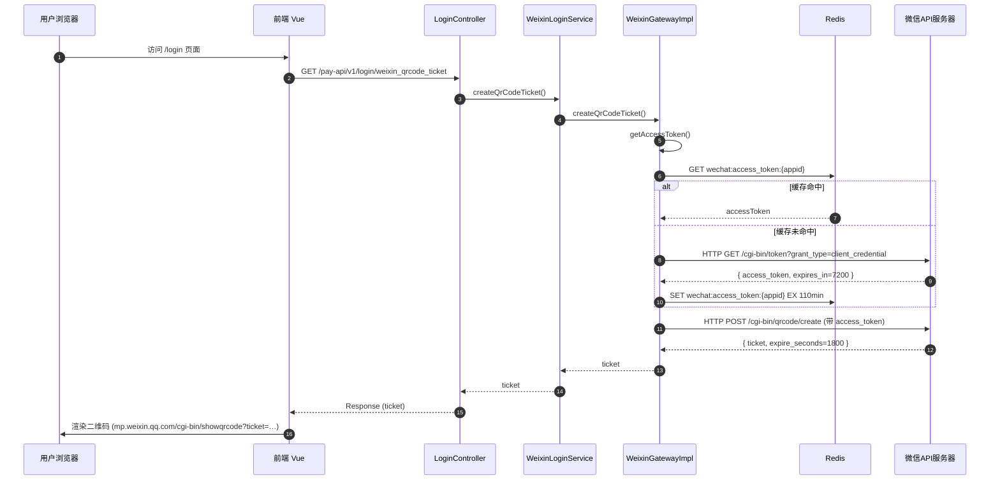
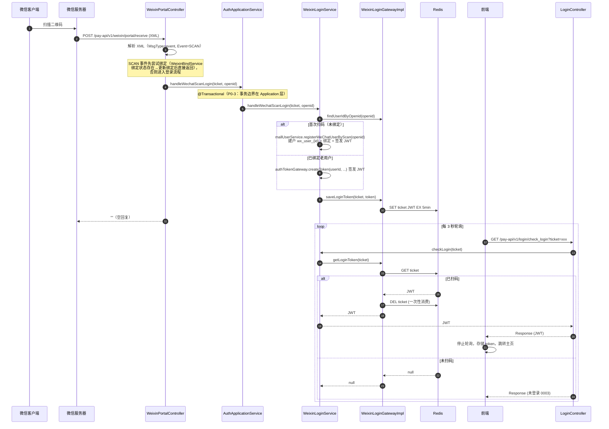
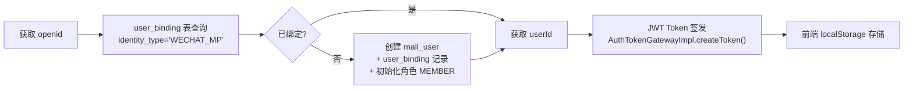

# 模块一：登录鉴权（Authentication）

> **领域上下文**：Auth Context
> **核心场景**：微信公众号扫码登录
> **依赖外部**：微信开放平台 API、Redis (StringRedisTemplate)
> **关键性质**：无状态、临时凭证驱动、Cache-Aside 缓存模式

---

## 一、模块定位

本模块负责用户的身份识别与会话建立。系统采用 **微信公众号扫码登录** 方案，相较于密码登录具备以下优势：
- 无需记忆密码，降低用户使用门槛
- 借助微信生态 OpenID 唯一标识，避免密码泄露风险
- 接入成本低，公众号已认证即可对接

---

## 二、登录时序：获取二维码

```mermaid
sequenceDiagram
    autonumber
    participant U as 用户浏览器
    participant F as 前端 Vue
    participant C as LoginController
    participant S as WeixinLoginService
    participant W as WeixinGatewayImpl
    participant Redis as Redis
    participant WX as 微信API服务器

    U->>F: 访问 /login 页面
    F->>C: GET /pay-api/v1/login/weixin_qrcode_ticket
    C->>S: createQrCodeTicket()
    S->>W: createQrCodeTicket()
    W->>W: getAccessToken()
    W->>Redis: GET wechat:access_token:{appid}
    alt 缓存命中
        Redis-->>W: accessToken
    else 缓存未命中
        W->>WX: HTTP GET /cgi-bin/token?grant_type=client_credential
        WX-->>W: { access_token, expires_in=7200 }
        W->>Redis: SET wechat:access_token:{appid} EX 110min
    end
    W->>WX: HTTP POST /cgi-bin/qrcode/create (带 access_token)
    WX-->>W: { ticket, expire_seconds=1800 }
    W-->>S: ticket
    S-->>C: ticket
    C-->>F: Response (ticket)
    F->>U: 渲染二维码 (mp.weixin.qq.com/cgi-bin/showqrcode?ticket=…)
```

### 2.1 关键设计点

**① AccessToken 缓存策略（Cache-Aside 模式）**

- 实现类：`WeixinGatewayImpl.getAccessToken()`
- 存储：`StringRedisTemplate`，Key = `wechat:access_token:{appid}`
- TTL：**110 分钟**（微信官方有效期 120 分钟，提前 10 分钟续期，避免边界过期）
- 缓存未命中时回源微信 API `cgi-bin/token`

**② Ticket 的临时性**

- Ticket 由微信 API 生成，有效期 1800s（30 分钟）
- 扫码后 Ticket 立即失效

---

## 三、登录时序：扫码回调与轮询

```mermaid
sequenceDiagram
    autonumber
    participant WX as 微信客户端
    participant WXAPI as 微信服务器
    participant Portal as WeixinPortalController
    participant App as AuthApplicationService
    participant S as WeixinLoginService
    participant GW as WeixinLoginGatewayImpl
    participant Redis as Redis
    participant F as 前端
    participant C as LoginController

    WX->>WXAPI: 扫描二维码
    WXAPI->>Portal: POST /pay-api/v1/weixin/portal/receive (XML)
    Portal->>Portal: 解析 XML（MsgType=event, Event=SCAN）
    Note over Portal: SCAN 事件先尝试绑定（WeixinBindService<br/>绑定状态存在→更新绑定后直接返回），<br/>否则进入登录流程
    Portal->>App: handleWechatScanLogin(ticket, openid)
    Note over App: @Transactional（P0-3：事务边界在 Application 层）
    App->>S: handleWechatScanLogin(ticket, openid)
    S->>GW: findUserIdByOpenid(openid)
    alt 首次扫码（未绑定）
        S->>S: mallUserService.registerWeChatUserByScan(openid)<br/>建户 wx_user_{id} + 绑定 + 签发 JWT
    else 已绑定老用户
        S->>S: authTokenGateway.createToken(userId, ...) 签发 JWT
    end
    S->>GW: saveLoginToken(ticket, token)
    GW->>Redis: SET ticket JWT EX 5min
    Portal-->>WXAPI: ""（空回复）

    loop 每 3 秒轮询
        F->>C: GET /pay-api/v1/login/check_login?ticket=xxx
        C->>S: checkLogin(ticket)
        S->>GW: getLoginToken(ticket)
        GW->>Redis: GET ticket
        alt 已扫码
            Redis-->>GW: JWT
            GW->>Redis: DEL ticket (一次性消费)
            GW-->>S: JWT
            S-->>C: JWT
            C-->>F: Response (JWT)
            F->>F: 停止轮询，存储 token，跳转主页
        else 未扫码
            Redis-->>GW: null
            GW-->>S: null
            C-->>F: Response (未登录 0003)
        end
    end
```

### 3.1 异步解耦：回调与查询分离

微信扫码是**异步事件**——微信服务器回调我们的接口（WeixinPortalController），但无法主动通知浏览器。前端通过**短轮询（3s 间隔）**检测 Redis 中是否出现 openid，将"扫码事件"与"登录态查询"解耦。

**关键实现：一次性 Token**

回调链路在**签发 JWT 之后**才写入 Redis（`WeixinLoginGatewayImpl.saveLoginToken(ticket, token)`，存的是 JWT 而非 openid），`getLoginToken()` 读取后立即 `DELETE` 该 key，保证 token 不会被重复获取。SCAN 事件先到 `WeixinBindService` 尝试**扫码绑定**（已登录用户绑定微信），绑定状态不存在才走登录流程。

### 3.2 凭证时效控制

| 凭证 | 存储位置 | Redis Key | TTL | 说明 |
|------|----------|-----------|-----|------|
| accessToken | Redis (StringRedisTemplate) | `wechat:access_token:{appid}` | 110min (6600s) | 提前于微信官方 7200s 续期 |
| ticket | 微信服务器 | — | 1800s | 微信侧强制，扫码后立即失效 |
| ticket→JWT 映射 | Redis (StringRedisTemplate) | `{ticket}` (直接作为 key) | 5min (300s) | `WeixinLoginGatewayImpl.saveLoginToken()`，get 后即删 |

---

## 四、登录态持久化与第三方绑定

```mermaid
flowchart LR
    A[获取 openid] --> B["user_binding 表查询<br/>identity_type='WECHAT_MP'"]
    B --> C{已绑定?}
    C -->|是| D[获取 userId]
    C -->|否| E["创建 mall_user<br/>+ user_binding 记录<br/>+ 初始化角色 MEMBER"]
    E --> D
    D --> F["JWT Token 签发<br/>AuthTokenGatewayImpl.createToken()"]
    F --> G["前端 localStorage 存储"]
```

**关键表结构：**

- `mall_user`：核心登录账号（username、password、status）
- `user_binding`：`identity_type` (WECHAT_MP) + `identifier` (openid) 联合唯一索引
- `user_role`：用户-角色关联

**创建新用户流程（`IMallUserService.registerWeChatUserByScan()`，P0-6 起建户规则唯一收敛在 domain 层用户领域服务）：**

1. 创建临时用户 `temp_{uuid8}` → 获取自增 ID（公共步骤 `createUser`：查重 + 建户 + 赋 MEMBER 角色）
2. 更新用户名为 `wx_user_{userId}`
3. 创建 `user_binding` 绑定记录
4. 签发 JWT（username=`wx_user_{userId}`，role=MEMBER）

> 注：P0-6 前该流程位于 `WeixinLoginGatewayImpl.createWechatUserAndBind()`（Infrastructure 层直写三个 DAO），
> 与 `MallUserServiceImpl.registerWithWeChat()` 双写同一套建户规则；现已上收，网关只保留 openid 查询与登录态缓存。

---

## 五、技术亮点与面试高频考点

| 维度 | 考点 | 标准答案 |
|------|------|----------|
| **缓存** | 为什么要缓存 accessToken？ | 微信 API 有调用频率限制（2000次/分），且 token 有效期 2h；Redis 缓存 110min（提前 10min 续期）避免每次登录都请求微信 |
| **轮询 vs SSE** | 为什么不直接用长连接？ | 短时一次性交互，3s 轮询实现简单、容错高；大规模场景可升级 SSE |
| **OpenID vs UnionID** | 二者区别？ | OpenID 是某公众号下的用户唯一标识；UnionID 是开放平台下跨应用统一标识（需绑定开放平台） |
| **安全性** | 凭证可能被窃取吗？ | Redis 只存 ticket→JWT 映射（5min），get 后即删；前端只见 ticket，短 TTL 降低重放窗口 |
| **一次性消费** | getLoginToken 为何读后即删？ | 防止同一 ticket 被多次轮询取走，保证 token 一次使用后失效 |
| **DDD 应用** | 端口与适配器体现？ | IWeChatGateway 接口由 WeixinGatewayImpl (Retrofit2) 适配实现；领域层 WeixinLoginService 不感知 HTTP 客户端 |
| **新用户处理** | 首次扫码如何自动注册？ | `WeixinLoginService` 判定 openid 未绑定 → `IMallUserService.registerWeChatUserByScan()`：建 mall_user（临时名→`wx_user_{id}`）→ 绑 user_binding → 赋 MEMBER 角色 → 签发 JWT，一气呵成；"是否新用户"规则在 auth 域，建户规则在 user 域，均不在 Infrastructure |

---

## 六、异常场景与降级

| 场景 | 现象 | 处理策略 |
|------|------|----------|
| 微信 API 不可用 | 获取 accessToken/ticket 失败 | 返回 5xx，前端展示"登录服务暂不可用" |
| 用户取消授权 | 微信回调不含 openid | 缓存不写入，轮询 60s 后超时提示二维码失效 |
| Ticket 过期 | 轮询始终为 null | 前端 60s 后停止轮询，提示刷新二维码 |
| Redis 不可用 | 缓存读写失败 | 降级为直连微信 API（牺牲性能保可用，需验证） |

---

> **关键源码索引**（仓库内相对路径）：
> - AccessToken 缓存：`s-pay-mall-infrastructure/src/main/java/cn/fcr/infrastructure/auth/login/gateway/WeixinGatewayImpl.java`（`getAccessToken()`）
> - 登录 Token：`s-pay-mall-infrastructure/src/main/java/cn/fcr/infrastructure/auth/login/gateway/WeixinLoginGatewayImpl.java`（`saveLoginToken()` / `getLoginToken()`）
> - 扫码自动注册：`s-pay-mall-domain/src/main/java/cn/fcr/domain/mall/user/service/impl/MallUserServiceImpl.java`（`registerWeChatUserByScan()`，P0-6 建户规则唯一入口）
> - 事务边界：`s-pay-mall-application/src/main/java/cn/fcr/application/AuthApplicationService.java`（`handleWechatScanLogin()`，P0-3）
> - 回调入口：`s-pay-mall-trigger/src/main/java/cn/fcr/trigger/http/WeixinPortalController.java`（SCAN 事件分流：绑定 or 登录）
> - 轮询入口：`s-pay-mall-trigger/src/main/java/cn/fcr/trigger/http/LoginController.java`（`checkLogin()`）
> - Redis Key 常量：`s-pay-mall-types/src/main/java/cn/fcr/types/common/Constants.java`（`REDIS_WECHAT_ACCESS_TOKEN_PREFIX`）
