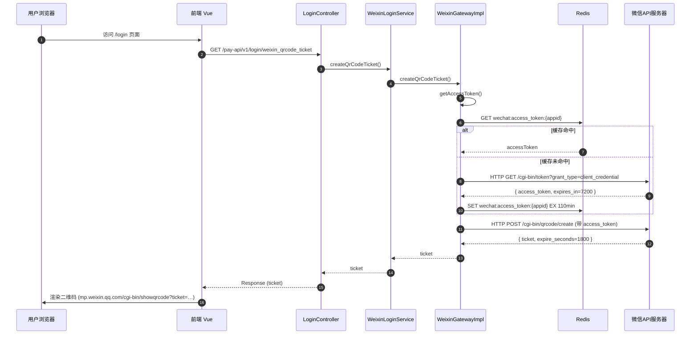
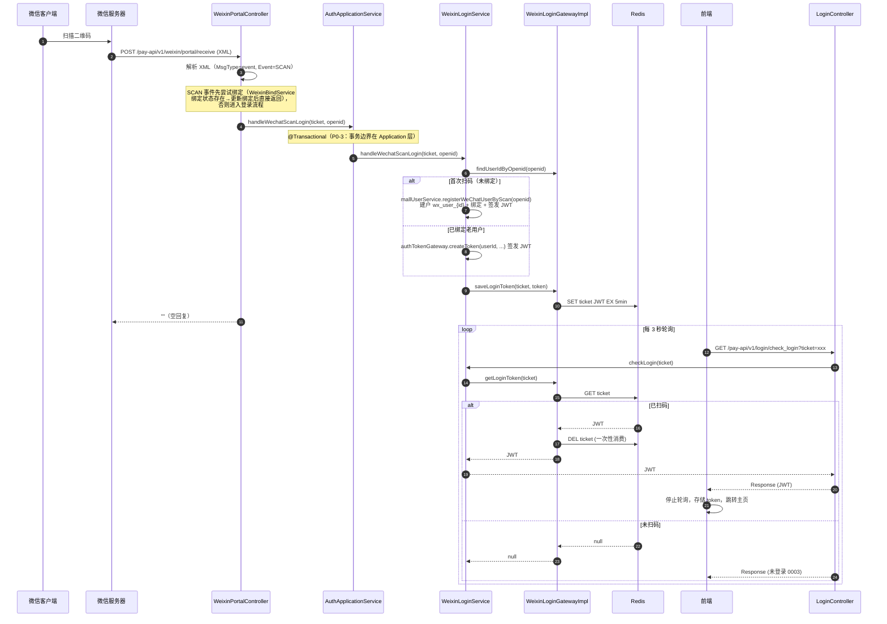
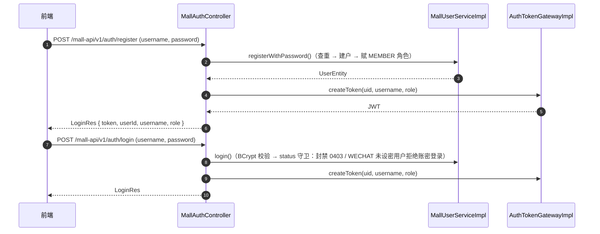
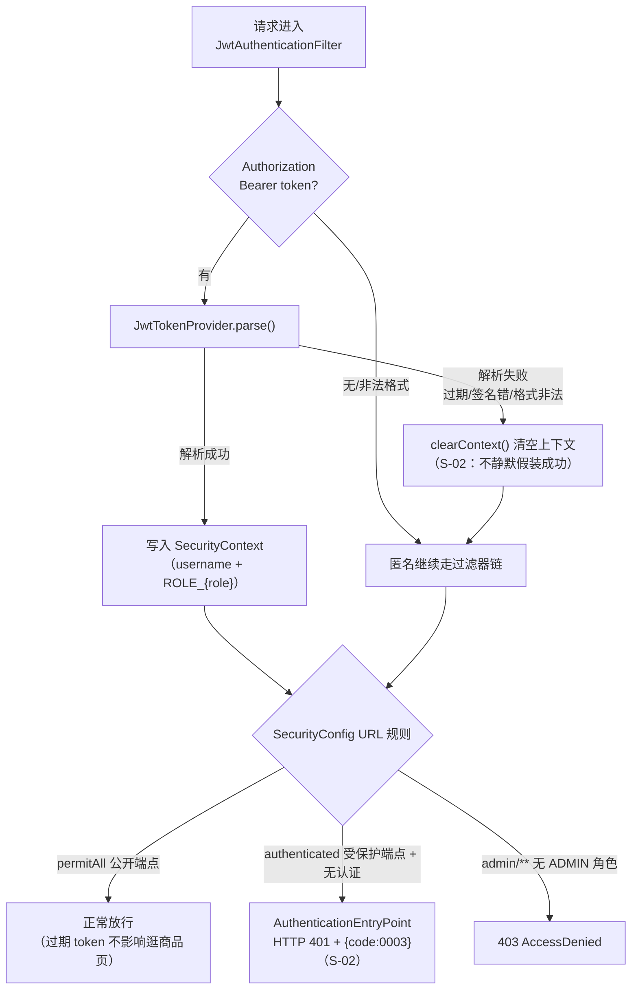
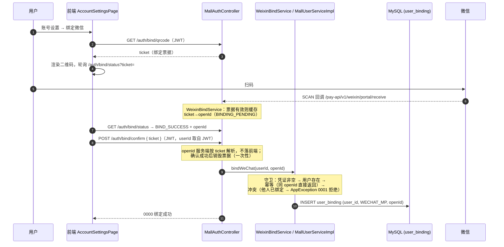
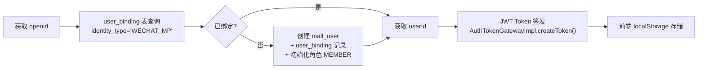

# 模块一：登录鉴权与账号绑定（Authentication & Binding）

> **领域上下文**：Auth Context + Mall Context（user）
> **核心场景**：账密登录、微信公众号扫码登录、双登录方式绑定同一账户（微信↔账密）
> **依赖外部**：微信开放平台 API、Redis (StringRedisTemplate)、Spring Security、JJWT
> **关键性质**：无状态 JWT、临时凭证驱动、Cache-Aside 缓存模式、user_binding 联合绑定

---

## 一、模块定位

本模块负责用户的**身份识别、会话建立与第三方账号绑定**。系统支持**两种登录方式，最终汇入同一账户**：

| 登录方式 | 入口 | 适用用户 | 落点 |
|----------|------|----------|------|
| 账密登录 | `POST /mall-api/v1/auth/login` | 注册时设置了密码的用户（status=ACTIVE） | 签发 JWT（uid/username/role） |
| 微信扫码登录 | `GET /pay-api/v1/login/weixin_qrcode_ticket` + 轮询 | 微信扫码注册（status=WECHAT）或已绑定微信的用户 | openid → user_binding 反查 userId → 签发同一结构 JWT |

**账号绑定**让两套登录方式可以登录同一个账户（2026-10-07 落地，关闭 TD-10）：
- **账密用户绑定微信**：`GET /auth/bind/qrcode` 取票据 → 微信扫码 → `POST /auth/bind/confirm` 确认（openId 服务端按 ticket 解析，不落前端；成功后销毁票据）；
- **微信用户补设密码**：`POST /auth/password`（状态 WECHAT→ACTIVE，之后可账密登录）；
- 绑定关系持久化在 `user_binding` 表（`identity_type='WECHAT_MP'` + `identifier=openid` 联合唯一键），`GET /auth/profile` 返回 `wechatBound` 标识。

相较于单一密码登录，扫码登录具备以下优势：
- 无需记忆密码，降低用户使用门槛
- 借助微信生态 OpenID 唯一标识，避免密码泄露风险
- 接入成本低，公众号已认证即可对接

---

## 二、微信扫码登录时序：获取二维码

```mermaid
sequenceDiagram
    autonumber
    participant U as 用户浏览器
    participant F as 前端 Vue
    participant C as LoginController
    participant S as WeixinLoginService
    participant W as WeixinGatewayImpl
    participant Redis as Redis
    participant WX as 微信API服务器

    U->>F: 访问 /login 页面
    F->>C: GET /pay-api/v1/login/weixin_qrcode_ticket
    C->>S: createQrCodeTicket()
    S->>W: createQrCodeTicket()
    W->>W: getAccessToken()
    W->>Redis: GET wechat:access_token:{appid}
    alt 缓存命中
        Redis-->>W: accessToken
    else 缓存未命中
        W->>WX: HTTP GET /cgi-bin/token?grant_type=client_credential
        WX-->>W: { access_token, expires_in=7200 }
        W->>Redis: SET wechat:access_token:{appid} EX 110min
    end
    W->>WX: HTTP POST /cgi-bin/qrcode/create (带 access_token)
    WX-->>W: { ticket, expire_seconds=1800 }
    W-->>S: ticket
    S-->>C: ticket
    C-->>F: Response (ticket)
    F->>U: 渲染二维码 (mp.weixin.qq.com/cgi-bin/showqrcode?ticket=…)
```

### 2.1 关键设计点

**① AccessToken 缓存策略（Cache-Aside 模式）**

- 实现类：`WeixinGatewayImpl.getAccessToken()`
- 存储：`StringRedisTemplate`，Key = `wechat:access_token:{appid}`
- TTL：**110 分钟**（微信官方有效期 120 分钟，提前 10 分钟续期，避免边界过期）
- 缓存未命中时回源微信 API `cgi-bin/token`

**② Ticket 的临时性**

- Ticket 由微信 API 生成，有效期 1800s（30 分钟）
- 扫码后 Ticket 立即失效

---

## 三、微信扫码登录时序：扫码回调与轮询

```mermaid
sequenceDiagram
    autonumber
    participant WX as 微信客户端
    participant WXAPI as 微信服务器
    participant Portal as WeixinPortalController
    participant App as AuthApplicationService
    participant S as WeixinLoginService
    participant GW as WeixinLoginGatewayImpl
    participant Redis as Redis
    participant F as 前端
    participant C as LoginController

    WX->>WXAPI: 扫描二维码
    WXAPI->>Portal: POST /pay-api/v1/weixin/portal/receive (XML)
    Portal->>Portal: 解析 XML（MsgType=event, Event=SCAN）
    Note over Portal: SCAN 事件先尝试绑定（WeixinBindService<br/>绑定状态存在→更新绑定后直接返回），<br/>否则进入登录流程
    Portal->>App: handleWechatScanLogin(ticket, openid)
    Note over App: @Transactional（P0-3：事务边界在 Application 层）
    App->>S: handleWechatScanLogin(ticket, openid)
    S->>GW: findUserIdByOpenid(openid)
    alt 首次扫码（未绑定）
        S->>S: mallUserService.registerWeChatUserByScan(openid)<br/>建户 wx_user_{id} + 绑定 + 签发 JWT
    else 已绑定老用户
        S->>S: authTokenGateway.createToken(userId, ...) 签发 JWT
    end
    S->>GW: saveLoginToken(ticket, token)
    GW->>Redis: SET ticket JWT EX 5min
    Portal-->>WXAPI: ""（空回复）

    loop 每 3 秒轮询
        F->>C: GET /pay-api/v1/login/check_login?ticket=xxx
        C->>S: checkLogin(ticket)
        S->>GW: getLoginToken(ticket)
        GW->>Redis: GET ticket
        alt 已扫码
            Redis-->>GW: JWT
            GW->>Redis: DEL ticket (一次性消费)
            GW-->>S: JWT
            S-->>C: JWT
            C-->>F: Response (JWT)
            F->>F: 停止轮询，存储 token，跳转主页
        else 未扫码
            Redis-->>GW: null
            GW-->>S: null
            C-->>F: Response (未登录 0003)
        end
    end
```

### 3.1 异步解耦：回调与查询分离

微信扫码是**异步事件**——微信服务器回调我们的接口（WeixinPortalController），但无法主动通知浏览器。前端通过**短轮询（3s 间隔）**检测 Redis 中是否出现 openid，将"扫码事件"与"登录态查询"解耦。

**关键实现：一次性 Token**

回调链路在**签发 JWT 之后**才写入 Redis（`WeixinLoginGatewayImpl.saveLoginToken(ticket, token)`，存的是 JWT 而非 openid），`getLoginToken()` 读取后立即 `DELETE` 该 key，保证 token 不会被重复获取。SCAN 事件先到 `WeixinBindService` 尝试**扫码绑定**（已登录用户绑定微信），绑定状态不存在才走登录流程。

### 3.2 凭证时效控制

| 凭证 | 存储位置 | Redis Key | TTL | 说明 |
|------|----------|-----------|-----|------|
| accessToken | Redis (StringRedisTemplate) | `wechat:access_token:{appid}` | 110min (6600s) | 提前于微信官方 7200s 续期 |
| ticket | 微信服务器 | — | 1800s | 微信侧强制，扫码后立即失效 |
| ticket→JWT 映射 | Redis (StringRedisTemplate) | `{ticket}` (直接作为 key) | 5min (300s) | `WeixinLoginGatewayImpl.saveLoginToken()`，get 后即删 |

---

## 四、账密登录与请求认证链（Spring Security + JWT）

### 4.1 账密登录与注册

```mermaid
sequenceDiagram
    autonumber
    participant F as 前端
    participant C as MallAuthController
    participant M as MallUserServiceImpl
    participant T as AuthTokenGatewayImpl

    F->>C: POST /mall-api/v1/auth/register (username, password)
    C->>M: registerWithPassword()（查重 → 建户 → 赋 MEMBER 角色）
    M-->>C: UserEntity
    C->>T: createToken(uid, username, role)
    T-->>C: JWT
    C-->>F: LoginRes { token, userId, username, role }

    F->>C: POST /mall-api/v1/auth/login (username, password)
    C->>M: login()（BCrypt 校验 → status 守卫：封禁 0403 / WECHAT 未设密用户拒绝账密登录）
    C->>T: createToken(uid, username, role)
    C-->>F: LoginRes
```

- 密码 BCrypt 加密存储（`PasswordEncoder` Bean，SecurityConfig 提供）
- JWT 载荷：`uid`、`username`、`role`；密钥 `security.jwt.secret`（prod 经 `SECURITY_JWT_SECRET` 注入）
- 前端将 `token/userId/username/role` 写入 localStorage，axios 请求拦截器自动附加 `Authorization: Bearer {token}`

### 4.2 请求认证链（每次请求）

```mermaid
flowchart TD
    A["请求进入<br/>JwtAuthenticationFilter"] --> B{Authorization<br/>Bearer token?}
    B -->|无/非法格式| C["匿名继续走过滤器链"]
    B -->|有| D["JwtTokenProvider.parse()"]
    D -->|解析成功| E["写入 SecurityContext<br/>（username + ROLE_{role}）"]
    D -->|解析失败<br/>过期/签名错/格式非法| F["clearContext() 清空上下文<br/>（S-02：不静默假装成功）"]
    F --> C
    E --> G{SecurityConfig URL 规则}
    C --> G
    G -->|permitAll 公开端点| H["正常放行<br/>（过期 token 不影响逛商品页）"]
    G -->|authenticated 受保护端点 + 无认证| I["AuthenticationEntryPoint<br/>HTTP 401 + {code:0003}<br/>（S-02）"]
    G -->|admin/** 无 ADMIN 角色| J["403 AccessDenied"]
```

**URL 规则（SecurityConfig）**：OPTIONS 预检、`/orders` 静态页、`/pay-api/v1/login/**`、`/pay-api/v1/weixin/**`、支付宝回调、登录/注册、商品/分类浏览 → permitAll；`/mall-api/v1/admin/**` → hasRole("ADMIN")；其余 → authenticated。

**认证语义与信息防护（S-03）**：
- `GlobalExceptionHandler` 新增 `JwtException` 处理器：token 过期/签名错统一归 **0003 未登录** + 固定文案，不再落兜底处理器归为 0001；
- 兜底 `onException` 不再透传 `e.getMessage()`（防 NPE 栈顶/SQL/JWT 细节外泄），固定文案，原始异常仅落服务端日志；
- Controller 内 `currentUserId()` 二次解析为兜底通道：无 token 抛 `AppException(0003)`。

**前端闭环（2026-10-07）**：axios 响应拦截器识别 HTTP 401 / 业务 code 0003 → 提示"登录已过期"→ 清理 localStorage 登录态四键 → 跳转 `/login`。

### 4.3 方法级安全现状

`@EnableMethodSecurity` 已启用但全项目零 `@PreAuthorize`（S-05 决议：保留不动）。当前为**粗粒度**鉴权：
URL 规则控端（管理端路径要求 ADMIN 角色）+ Controller 内 `currentUserId()` 取 uid；
`permission`/`role_permission` 两张表为预留的细粒度 RBAC 扩展点，代码零引用（TD-11 决议保留）。

---

## 五、账号绑定链路（微信 ↔ 账密，2026-10-07 落地）

### 5.1 账密用户绑定微信

```mermaid
sequenceDiagram
    autonumber
    participant U as 用户
    participant F as 前端 AccountSettingsPage
    participant C as MallAuthController
    participant S as WeixinBindService / MallUserServiceImpl
    participant DB as MySQL (user_binding)

    U->>F: 账号设置 → 绑定微信
    F->>C: GET /auth/bind/qrcode（JWT）
    C-->>F: ticket（绑定票据）
    F->>F: 渲染二维码，轮询 /auth/bind/status?ticket=
    U->>微信: 扫码
    微信-->>C: SCAN 回调 /pay-api/v1/weixin/portal/receive
    Note over C: WeixinBindService：票据有效则缓存<br/>ticket→openId（BINDING_PENDING）
    F->>C: GET /auth/bind/status → BIND_SUCCESS + openId
    F->>C: POST /auth/bind/confirm { ticket }（JWT，userId 取自 JWT）
    Note over C: openId 服务端按 ticket 解析，不落前端；<br/>确认成功后销毁票据（一次性）
    C->>S: bindWeChat(userId, openId)
    Note over S: 守卫：凭证非空 → 用户存在 →<br/>幂等（同 openId 直接返回）→<br/>冲突（他人已绑定 → AppException 0001 拒绝）
    S->>DB: INSERT user_binding (user_id, WECHAT_MP, openId)
    C-->>F: 0000 绑定成功
```

### 5.2 微信用户补设密码

`POST /auth/password { password }`（JWT）→ `MallUserServiceImpl.setPassword()`：
长度守卫（6~64）→ 用户存在守卫 → BCrypt 更新密码 → **status=WECHAT 时转为 ACTIVE**（微信扫码注册用户补设密码后账密登录正式可用）。正常用户调用则为纯改密码。

### 5.3 绑定关系数据模型与消费方

| 表/键 | 内容 | 消费方 |
|-------|------|--------|
| `user_binding` | `user_id` + `identity_type='WECHAT_MP'` + `identifier=openid`，`uk_type_identifier` 唯一键兜底防重复绑定 | openid→userId 登录反查、`isWeChatOpenIdBound` 冲突守卫、按 userId 查 openId 发支付模板消息、级联删除 |
| `mall_user.status` | `WECHAT`（扫码注册未设密）/ `ACTIVE`（正常）/ 封禁 | 账密登录守卫：WECHAT 用户须先设密 |
| `user_role` | MEMBER / ADMIN | 登录时随 JWT role 载荷签发 |

**幂等与冲突语义**：同一用户重复绑定同一 openId → 幂等成功（不产生重复行）；openId 已被他人绑定 → 拒绝（0001"该微信账号已被其他用户绑定"）。

---

## 六、登录态持久化与第三方绑定

```mermaid
flowchart LR
    A[获取 openid] --> B["user_binding 表查询<br/>identity_type='WECHAT_MP'"]
    B --> C{已绑定?}
    C -->|是| D[获取 userId]
    C -->|否| E["创建 mall_user<br/>+ user_binding 记录<br/>+ 初始化角色 MEMBER"]
    E --> D
    D --> F["JWT Token 签发<br/>AuthTokenGatewayImpl.createToken()"]
    F --> G["前端 localStorage 存储"]
```

**关键表结构：**

- `mall_user`：核心登录账号（username、password、status）
- `user_binding`：`identity_type` (WECHAT_MP) + `identifier` (openid) 联合唯一索引
- `user_role`：用户-角色关联

**创建新用户流程（`IMallUserService.registerWeChatUserByScan()`，P0-6 起建户规则唯一收敛在 domain 层用户领域服务）：**

1. 创建临时用户 `temp_{uuid8}` → 获取自增 ID（公共步骤 `createUser`：查重 + 建户 + 赋 MEMBER 角色）
2. 更新用户名为 `wx_user_{userId}`
3. 创建 `user_binding` 绑定记录
4. 签发 JWT（username=`wx_user_{userId}`，role=MEMBER）

> 注：P0-6 前该流程位于 `WeixinLoginGatewayImpl.createWechatUserAndBind()`（Infrastructure 层直写三个 DAO），
> 与 `MallUserServiceImpl.registerWithWeChat()` 双写同一套建户规则；现已上收，网关只保留 openid 查询与登录态缓存。

---

## 七、技术亮点与面试高频考点

| 维度 | 考点 | 标准答案 |
|------|------|----------|
| **缓存** | 为什么要缓存 accessToken？ | 微信 API 有调用频率限制（2000次/分），且 token 有效期 2h；Redis 缓存 110min（提前 10min 续期）避免每次登录都请求微信 |
| **轮询 vs SSE** | 为什么不直接用长连接？ | 短时一次性交互，3s 轮询实现简单、容错高；大规模场景可升级 SSE |
| **OpenID vs UnionID** | 二者区别？ | OpenID 是某公众号下的用户唯一标识；UnionID 是开放平台下跨应用统一标识（需绑定开放平台） |
| **安全性** | 凭证可能被窃取吗？ | Redis 只存 ticket→JWT 映射（5min），get 后即删；前端只见 ticket，短 TTL 降低重放窗口；绑定确认时 openId 不落前端（服务端按票据解析） |
| **一次性消费** | getLoginToken 为何读后即删？ | 防止同一 ticket 被多次轮询取走，保证 token 一次使用后失效 |
| **DDD 应用** | 端口与适配器体现？ | IWeChatGateway 接口由 WeixinGatewayImpl (Retrofit2) 适配实现；领域层 WeixinLoginService 不感知 HTTP 客户端 |
| **新用户处理** | 首次扫码如何自动注册？ | `WeixinLoginService` 判定 openid 未绑定 → `IMallUserService.registerWeChatUserByScan()`：建 mall_user（临时名→`wx_user_{id}`）→ 绑 user_binding → 赋 MEMBER 角色 → 签发 JWT，一气呵成；"是否新用户"规则在 auth 域，建户规则在 user 域，均不在 Infrastructure |
| **双登录方式** | 微信和账密如何登录同一账户？ | 账户本体是 `mall_user`，微信身份经 `user_binding`（identity_type+identifier 唯一键）映射到 userId；两种登录只是不同的"身份断言→userId→JWT"路径，JWT 结构完全一致 |
| **绑定安全** | 绑定接口如何防越权/防串号？ | confirm 的 userId 取自 JWT（非请求参数，防 IDOR）；openId 由服务端按一次性票据解析（前端不可指定任意 openId）；票据确认后即销毁 |
| **401 语义** | 未登录请求现在返回什么？（S-02/S-03） | HTTP 401 + `{code:0003}`（Security EntryPoint）；token 过期走业务通道也归 0003 固定文案；前端拦截器据此清登录态跳登录页 |

---

## 八、异常场景与降级

| 场景 | 现象 | 处理策略 |
|------|------|----------|
| 微信 API 不可用 | 获取 accessToken/ticket 失败 | 返回 5xx，前端展示"登录服务暂不可用" |
| 用户取消授权 | 微信回调不含 openid | 缓存不写入，轮询 60s 后超时提示二维码失效 |
| Ticket 过期 | 轮询始终为 null | 前端 60s 后停止轮询，提示刷新二维码 |
| Redis 不可用 | 缓存读写失败 | 降级为直连微信 API（牺牲性能保可用，需验证） |
| token 过期/非法 | 过滤器解析失败 | 受保护端点统一 401+0003（S-02），前端清登录态跳登录页；公开端点不受影响 |
| 微信已被他人绑定 | confirm 冲突守卫 | 0001"该微信账号已被其他用户绑定"，不写入绑定行 |

---

> **关键源码索引**（仓库内相对路径）：
> - AccessToken 缓存：`s-pay-mall-infrastructure/src/main/java/cn/fcr/infrastructure/auth/login/gateway/WeixinGatewayImpl.java`（`getAccessToken()`）
> - 登录 Token：`s-pay-mall-infrastructure/src/main/java/cn/fcr/infrastructure/auth/login/gateway/WeixinLoginGatewayImpl.java`（`saveLoginToken()` / `getLoginToken()`）
> - 扫码自动注册：`s-pay-mall-domain/src/main/java/cn/fcr/domain/mall/user/service/impl/MallUserServiceImpl.java`（`registerWeChatUserByScan()`，P0-6 建户规则唯一入口）
> - 事务边界：`s-pay-mall-application/src/main/java/cn/fcr/application/AuthApplicationService.java`（`handleWechatScanLogin()`，P0-3）
> - 回调入口：`s-pay-mall-trigger/src/main/java/cn/fcr/trigger/http/WeixinPortalController.java`（SCAN 事件分流：绑定 or 登录）
> - 轮询入口：`s-pay-mall-trigger/src/main/java/cn/fcr/trigger/http/LoginController.java`（`checkLogin()`）
> - 账密登录/注册/绑定端点：`s-pay-mall-trigger/.../trigger/http/mall/MallAuthController.java`（`login()` / `register()` / `bind/qrcode` / `bind/status` / `bind/confirm` / `password`）
> - 绑定领域规则：`s-pay-mall-domain/.../domain/mall/user/service/impl/MallUserServiceImpl.java`（`bindWeChat()` / `setPassword()`；守卫异常为 `AppException(0001, 文案)`）
> - JWT 过滤器与安全配置：`s-pay-mall-start/.../config/security/JwtAuthenticationFilter.java`（S-02 清空上下文）/ `SecurityConfig.java`（URL 规则 + 401 EntryPoint）
> - 异常语义：`s-pay-mall-trigger/.../trigger/http/mall/GlobalExceptionHandler.java`（`JwtException` → 0003，S-03）
> - 前端登录态闭环：`s-pay-mall-front/src/utils/axios.ts`（401/0003 → 清登录态跳登录）
> - Redis Key 常量：`s-pay-mall-types/src/main/java/cn/fcr/types/common/Constants.java`（`REDIS_WECHAT_ACCESS_TOKEN_PREFIX`）
