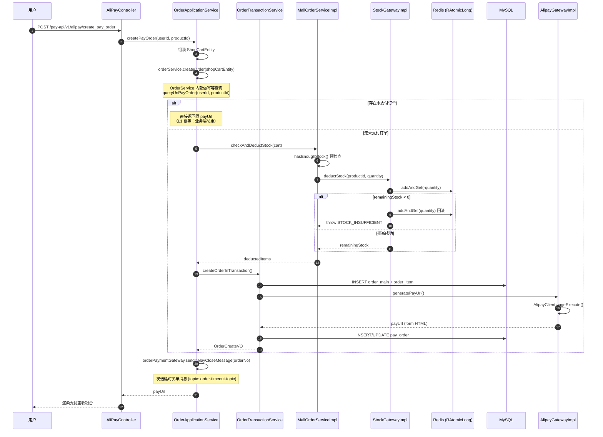
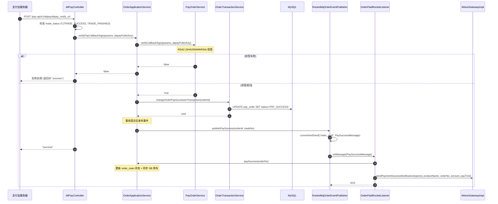
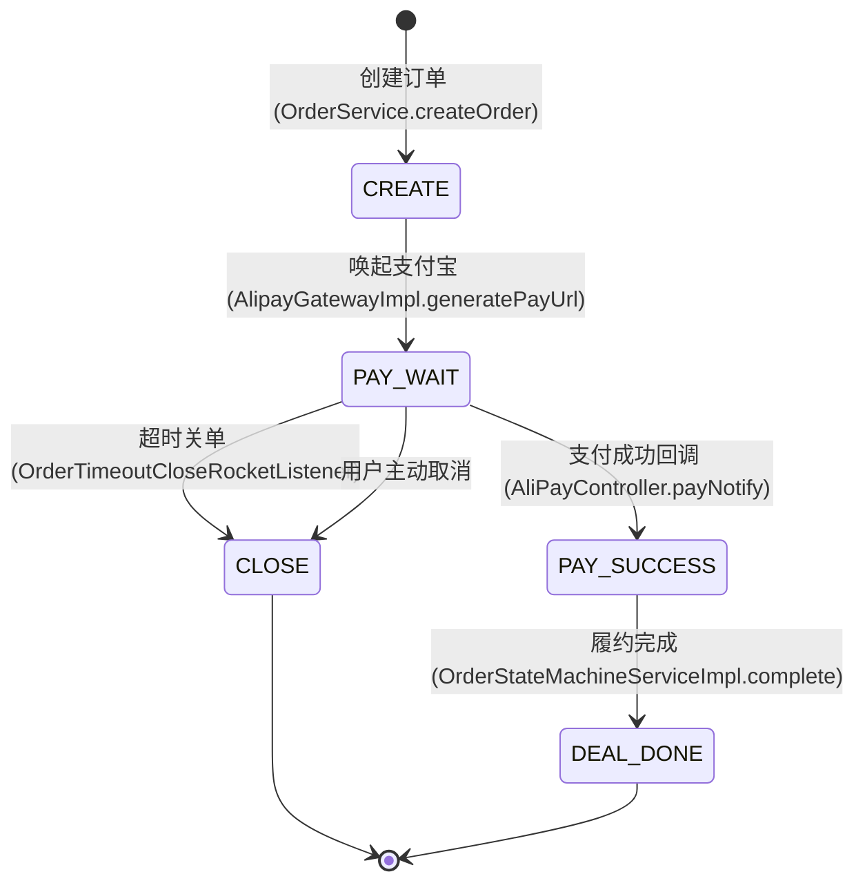
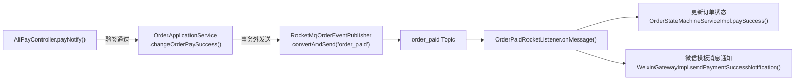
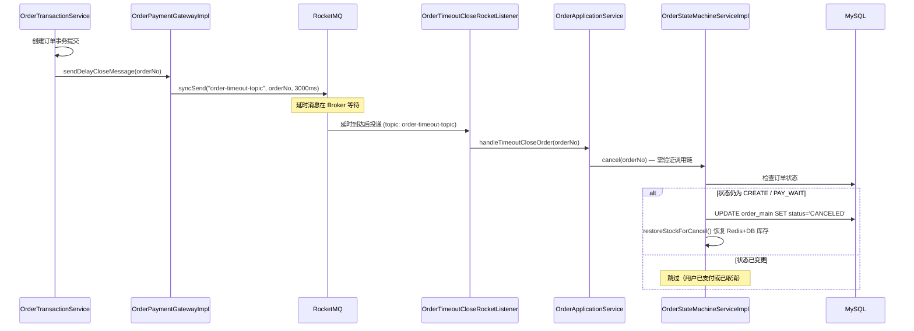

# 模块二：订单支付（Order & Pay）

> **领域上下文**：Order Context + Mall Context（聚合 Order + PayOrder）
> **核心场景**：创建订单、支付宝当面付、回调验签、RocketMQ 异步履约
> **依赖外部**：支付宝开放平台 (Alipay SDK)、RocketMQ
> **关键性质**：幂等闭环 + 异步解耦 + 状态机保护

---

## 一、模块定位

订单支付模块是商城系统的**核心交易链路**，承担以下职责：
1. 订单的创建、查询、状态流转
2. 接入支付宝当面付完成支付
3. 处理支付宝异步回调，RSA2 验签后更新订单状态
4. 通过 RocketMQ 解耦后置履约（支付成功通知、库存同步、微信模板消息）

---

## 二、订单创建：幂等性防御

### 2.1 时序图

### 2.2 幂等性三层防御

| 层级 | 防御机制 | 实现位置 |
|------|----------|----------|
| **L1：业务层** | 前置查询未支付订单（同用户+同商品） | `OrderService.createOrder()` 内部 `queryUnPayOrder` |
| **L2：数据层** | `order_no` 唯一索引 | `pay_order` 表 DDL |
| **L3：MQ 层** | SETNX 幂等键 (`mall:stock:msg:processed:{messageId}`，24h TTL) | `StockGatewayImpl.checkMessageIdempotent()` |

---

## 三、支付宝回调验签

### 3.1 时序图

### 3.2 验签三要素

1. **支付宝公钥**：从支付宝开放平台下载，配置在 `AliPayConfigProperties`
2. **签名算法**：`RSA2`（SHA256WithRSA），支付宝已弃用 SHA1
3. **签名内容**：支付宝将所有业务参数按字典序排序后签名

### 3.3 为什么必须返回 "success"

- 若返回非 `"success"`，支付宝将在 **24 小时内按策略重试**（间隔：4m / 10m / 10m / 1h / 2h / 6h / 15h，共 7 次）
- 重试会产生重复通知 → 必须保证订单状态变更的**幂等性**（UPDATE 时附带状态条件）

---

## 四、订单状态机

> 状态值来源：`cn.fcr.domain.order.model.valobj.OrderStatusVO` — CREATE / PAY_WAIT / PAY_SUCCESS / DEAL_DONE / CLOSE

**状态流转保护（OrderStateMachineServiceImpl）：**

| 方法 | 行号 | 守卫条件 | 操作 |
|------|------|----------|------|
| `paySuccess()` | 37 | `order.canPay()` | 更新 order_main → PAID，pay_order → PAID，同步扣减 DB 库存 |
| `deliver()` | 96 | `order.canDeliver()` | 更新 order_main → SHIPPED，pay_order → TRADE_DONE |
| `complete()` | 121 | `order.canComplete()` | 更新 order_main → DONE |
| `cancel()` | 141 | `order.canCancel()` | 更新 order_main → CANCELED，关闭 pay_order，恢复 Redis+DB 库存 |

---

## 五、RocketMQ 异步解耦

### 5.1 消息流转

### 5.2 Topic 矩阵

| Topic | 发送方 | 消费者 | 消息类型 | 说明 |
|-------|--------|--------|----------|------|
| `order_paid` | `RocketMqOrderEventPublisher` | `OrderPaidRocketListener` | `PaySuccessMessage` | 支付成功异步履约 |
| `order-timeout-topic` | `OrderPaymentGatewayImpl`、`OrderEventGatewayImpl` | `OrderTimeoutCloseRocketListener` | `String (orderNo)` | 延时关单 |
| `pay-success-topic` | `OrderEventGatewayImpl` | —（仅有生产者） | 业务通知 | 待接入消费者 |
| `product-stock-change-topic` | —（仅有消费者） | `ProductStockChangeRocketListener` | `StockChangeMsgDTO` | 库存变更幂等消费 |

---

## 六、延时消息：订单超时关闭

---

## 七、技术亮点与面试高频考点

| 维度 | 考点 | 标准答案 |
|------|------|----------|
| **幂等性** | 支付回调如何防止重复处理？ | 三层防御：业务层前置查询未支付订单 + 数据库 order_no 唯一索引 + MQ SETNX 幂等键（24h TTL） |
| **回调验签** | 为什么必须验签？ | 防止伪造回调攻击，未验签等于将订单状态暴露给攻击者；使用支付宝公钥 RSA2 验证 |
| **MQ 解耦** | 为什么不直接在回调里发货？ | 回调需快速返回 "success"（否则支付宝重试），发货/通知失败不应影响支付主链路 |
| **延时消息** | 订单超时关闭如何实现？ | RocketMQ 延时消息 (syncSend) + 状态机二次校验（已支付则跳过） |
| **回 "success"** | 不回或返回错误会怎样？ | 触发支付宝 24h 内 7 次重试，要求后端处理完全幂等 |
| **RSA2** | 签名算法演进？ | RSA1 (SHA1) 已不安全，支付宝强制升级 RSA2 (SHA256WithRSA) |
| **事务边界** | 为什么事件发布在事务外？ | 避免 MQ 发送在事务内导致事务 hold 时间过长，事务提交后再发消息 |

---

## 八、兜底定时任务

`NoPayNotifyOrderJob` — 每 30 秒扫描 `pay_order` 表中创建超过 5 分钟且状态仍为
`WAIT_PAY` 的订单，调用 `IAlipayQueryGateway.queryTradeSuccess()` 主动向支付宝核实
交易状态，对确认支付成功的订单执行补单（`changeOrderPaySuccess()`），作为支付回调
丢失场景的兜底保障。

SQL：`WHERE status = 'WAIT_PAY' AND create_time < DATE_SUB(NOW(), INTERVAL 5 MINUTE)`

调用链：`NoPayNotifyOrderJob → OrderApplicationService → OrderService →
OrderRepository → IOrderDao`

---

> **关键源码索引**：
> - 支付回调入口：[`AliPayController.payNotify()`](file:///Users/xiaolv/Develop/projects/backend/java/s-pay-mall/s-pay-mall-trigger/src/main/java/cn/fcr/trigger/http/AliPayController.java#L66)
> - 验签逻辑：[`PayOrderService.verifyCallbackSign()`](file:///Users/xiaolv/Develop/projects/backend/java/s-pay-mall/s-pay-mall-domain/src/main/java/cn/fcr/domain/order/service/PayOrderService.java)
> - 状态机：[`OrderStateMachineServiceImpl`](file:///Users/xiaolv/Develop/projects/backend/java/s-pay-mall/s-pay-mall-domain/src/main/java/cn/fcr/domain/mall/service/impl/OrderStateMachineServiceImpl.java)
> - 事件发布：[`RocketMqOrderEventPublisher`](file:///Users/xiaolv/Develop/projects/backend/java/s-pay-mall/s-pay-mall-infrastructure/src/main/java/cn/fcr/infrastructure/order/event/RocketMqOrderEventPublisher.java)
> - 支付成功消费：[`OrderPaidRocketListener`](file:///Users/xiaolv/Develop/projects/backend/java/s-pay-mall/s-pay-mall-trigger/src/main/java/cn/fcr/trigger/listener/OrderPaidRocketListener.java)
> - 超时关单消费：[`OrderTimeoutCloseRocketListener`](file:///Users/xiaolv/Develop/projects/backend/java/s-pay-mall/s-pay-mall-trigger/src/main/java/cn/fcr/trigger/listener/OrderTimeoutCloseRocketListener.java)
> - Application Service：[`OrderApplicationService`](file:///Users/xiaolv/Develop/projects/backend/java/s-pay-mall/s-pay-mall-trigger/src/main/java/cn/fcr/trigger/application/OrderApplicationService.java)
