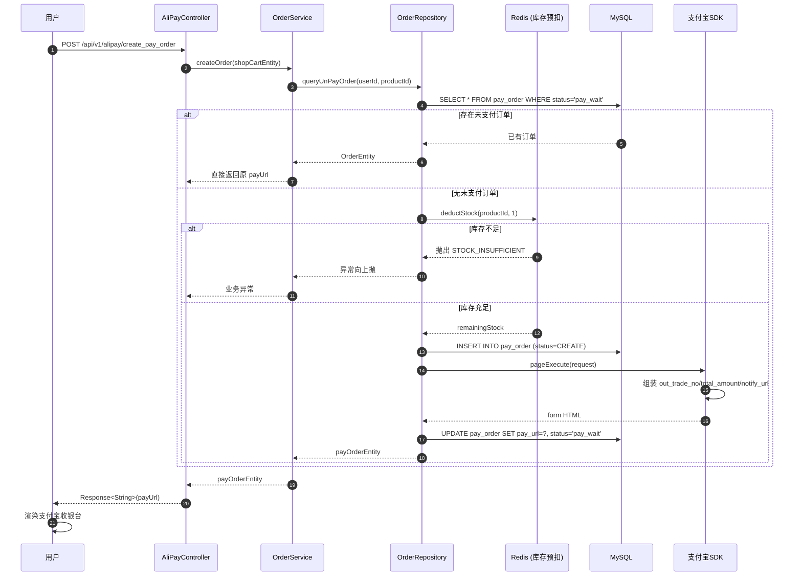
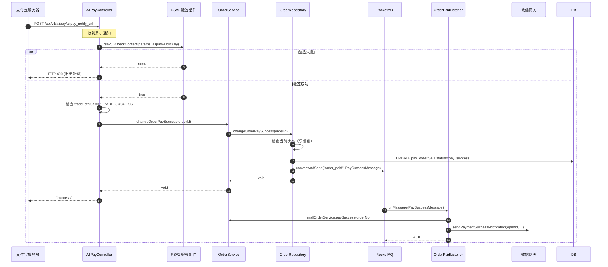
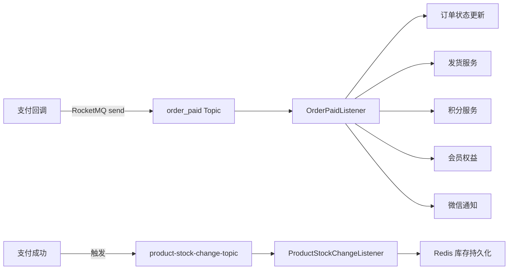
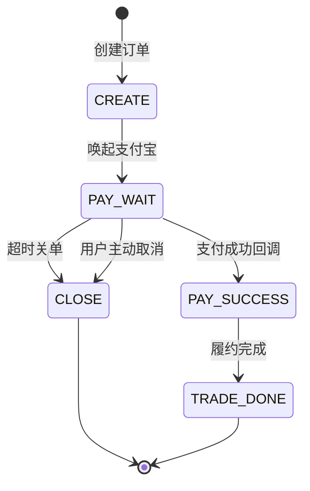

# 模块二：订单支付（Order & Pay）

> **领域上下文**：Order Context（聚合 Order + PayOrder）  
> **核心场景**：创建订单、支付宝当面付、回调验签、异步履约  
> **依赖外部**：支付宝开放平台、RocketMQ  
> **关键性质**：幂等闭环 + 异步解耦

---

## 一、模块定位

订单支付模块是商城系统的**核心交易链路**，承担以下职责：
1. 订单的创建、查询、状态流转
2. 接入支付宝当面付完成支付
3. 处理支付回调，更新订单状态
4. 通过 RocketMQ 解耦后置履约（发货、通知、积分、会员权益）

---

## 二、订单创建：幂等性防御

### 2.1 时序图



### 2.2 幂等性三层防御

| 层级 | 防御机制 | 说明 |
|------|----------|------|
| **L1：业务层** | `queryUnPayOrder` 前置查询 | 同用户+同商品若存在 `pay_wait` 订单，直接返回原 payUrl |
| **L2：数据层** | `order_no` 唯一索引 | 防止极端并发下重复 INSERT |
| **L3：MQ 层** | `messageId` 幂等键（SETNX） | 防止支付成功消息被多次消费 |

---

## 三、支付宝回调验签

### 3.1 时序图



### 3.2 验签三要素

1. **支付宝公钥**：从支付宝开放平台下载，配置在 `application.yml`
2. **签名算法**：`RSA2`（SHA256WithRSA），已弃用 SHA1
3. **签名内容**：支付宝将所有业务参数按字典序排序后签名

### 3.3 必返回 "success" 的关键性

```java
AliPayController-->>AlipayAPI: "success"
```

- 若返回非 `"success"`，支付宝将在 **24 小时内按策略重试**（4m / 10m / 10m / 1h / 2h / 6h / 15h）
- 重试会产生重复通知，必须保证订单状态变更的**幂等性**（UPDATE 时附带状态条件）

---

## 四、RocketMQ 异步解耦

### 4.1 消息流转架构



### 4.2 核心 Topic 矩阵

| Topic | Producer | Consumer | 消息类型 | 关键性质 |
|-------|----------|----------|----------|----------|
| `order_paid` | OrderRepository | OrderPaidRocketListener | `PaySuccessMessage` | 普通消息 |
| `product-stock-change-topic` | 库存网关 | ProductStockChangeRocketListener | `StockChangeMessageDTO` | 幂等消费 |
| `order-timeout-topic` | 订单服务 | OrderTimeoutCloseRocketListener | `String orderNo` | **延时消息** |
| `pay-success-topic` | OrderEventGateway | 多消费者 | 业务通知 | 普通消息 |

### 4.3 延时消息：订单超时关闭

```mermaid
sequenceDiagram
    participant Create as 创建订单
    participant MQ as RocketMQ
    participant DL as OrderTimeoutCloseListener
    participant SVC as OrderService
    participant DB as MySQL

    Create->>MQ: sendDelay(orderNo, level=15min)
    Note over MQ: 消息在延时队列等待
    MQ->>DL: 15min 后投递
    DL->>SVC: handleTimeoutCloseOrder(orderNo)
    SVC->>DB: SELECT status FROM pay_order
    alt 状态仍为 CREATE / pay_wait
        SVC->>DB: UPDATE status='CLOSE'
        SVC->>MQ: 发送库存恢复消息
    else 状态已为 pay_success
        Note over SVC: 跳过（用户已支付）
    end
```

> **RocketMQ 延时级别**：1s / 5s / 10s / 30s / 1m / 2m / 3m / 4m / 5m / 6m / 7m / 8m / 9m / 10m / 20m / 30m / 1h / 2h

---

## 五、状态机与异常分支



**状态流转保护：**
- 数据库 `status` 字段配合应用层状态机校验
- 关键 UPDATE 操作使用乐观锁：`WHERE status = ?` 影响行数 = 0 则放弃

---

## 六、技术亮点与面试高频考点

| 维度 | 考点 | 标准答案 |
|------|------|----------|
| **幂等性** | 支付回调如何防止重复处理？ | 三层防御：状态机校验、唯一索引、SETNX 幂等键 |
| **回调验签** | 为什么必须验签？ | 防止伪造回调，未验签等于将订单状态暴露给攻击者 |
| **MQ 解耦** | 为什么不直接在回调里发货？ | 回调需快速返回（否则重试），发货/通知失败不应影响主链路 |
| **延时消息** | 订单超时关闭如何实现？ | RocketMQ 延时消息 + 状态机二次校验（已支付则跳过） |
| **重试策略** | 支付宝重试机制对账的影响？ | 24h 内 7 次重试，要求后端处理完全幂等 |
| **回 "success"** | 不回或返回错误会怎样？ | 触发重试，订单状态可能被多次写入（需依赖幂等防御） |
| **RSA2 vs RSA1** | 签名算法演进？ | RSA1 (SHA1) 已不安全，支付宝强制升级 RSA2 (SHA256) |
| **数据一致性** | DB 与 Redis 库存如何最终一致？ | DB 事务先行，Redis 异步同步，消息消费失败可重试 |

---

> **相关源码定位**：
> - 仓储实现：[`OrderRepository`](file:///Users/xiaolv/Develop/projects/backend/java/s-pay-mall/s-pay-mall-infrastructure/src/main/java/cn/fcr/infrastructure/adapter/repository/OrderRepository.java)
> - 事件网关：[`OrderEventGatewayImpl`](file:///Users/xiaolv/Develop/projects/backend/java/s-pay-mall/s-pay-mall-infrastructure/src/main/java/cn/fcr/infrastructure/gateway/OrderEventGatewayImpl.java)
> - 支付监听器：[`OrderPaidRocketListener`](file:///Users/xiaolv/Develop/projects/backend/java/s-pay-mall/s-pay-mall-trigger/src/main/java/cn/fcr/trigger/listener/OrderPaidRocketListener.java)
