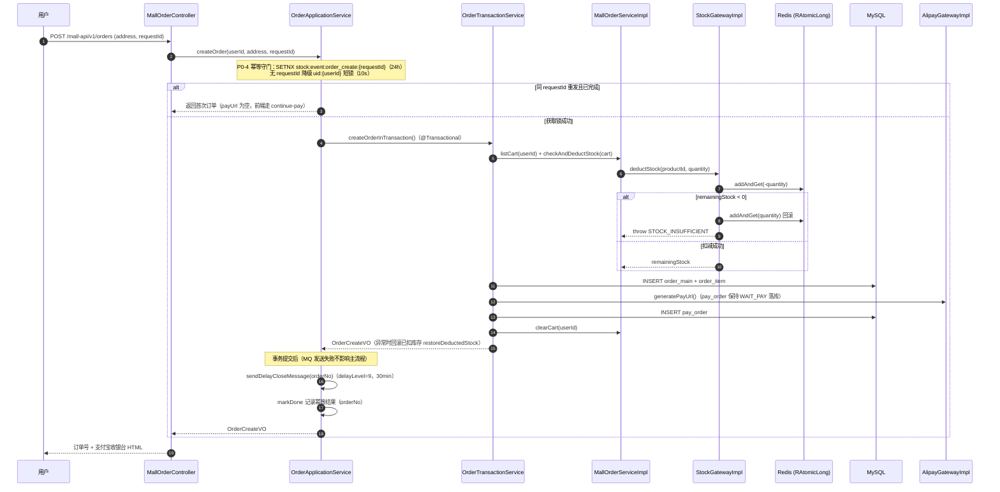
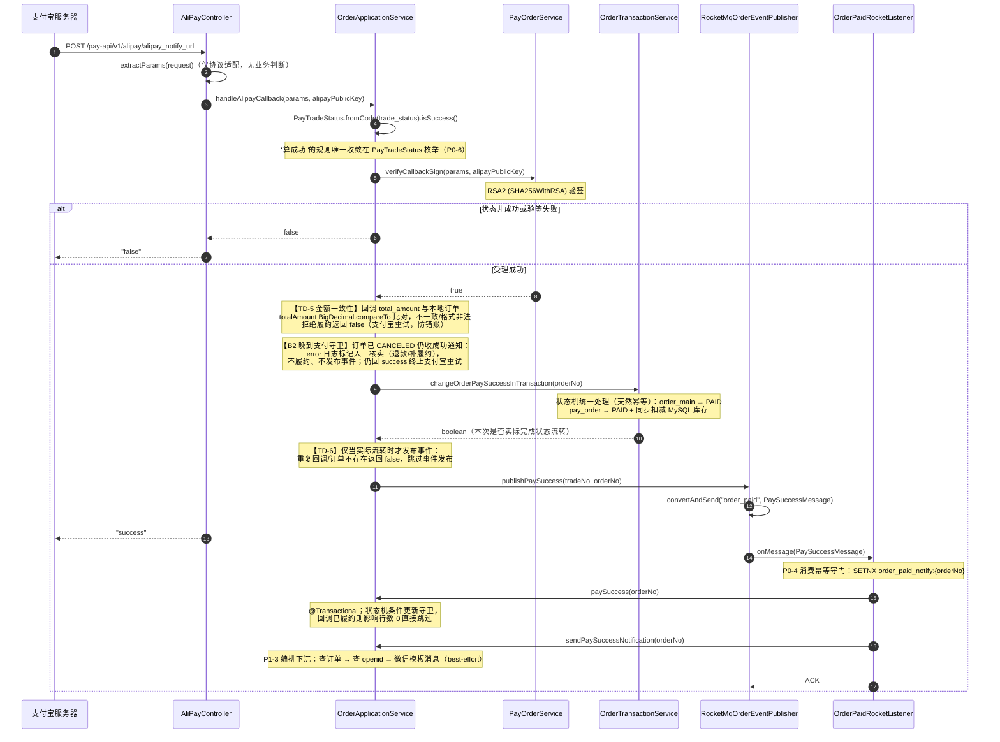
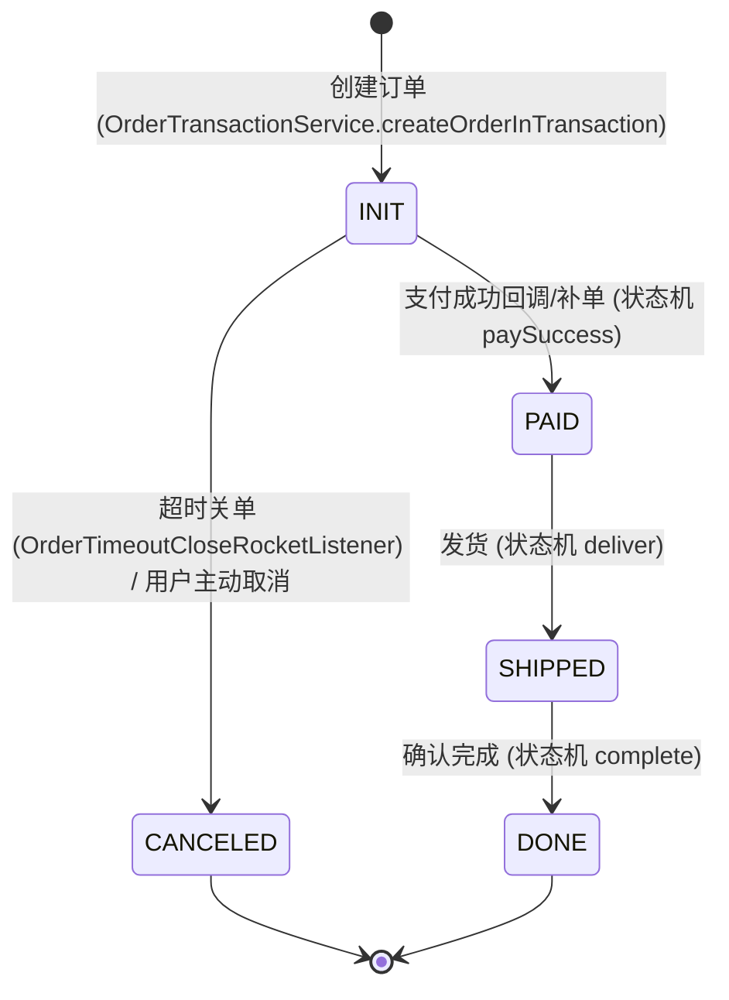
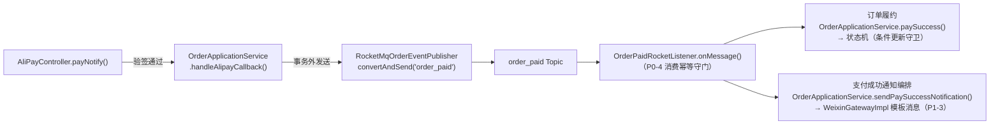
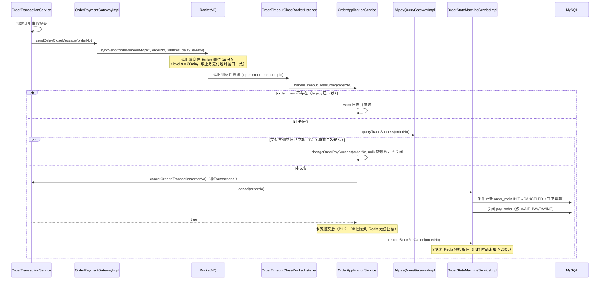

# 模块二：订单支付（Order & Pay）

> **领域上下文**：Order Context + Mall Context（聚合 Order + PayOrder）
> **核心场景**：创建订单、支付宝当面付、回调验签、RocketMQ 异步履约
> **依赖外部**：支付宝开放平台 (Alipay SDK)、RocketMQ
> **关键性质**：幂等闭环 + 异步解耦 + 状态机保护

---

## 一、模块定位

订单支付模块是商城系统的**核心交易链路**，承担以下职责：
1. 订单的创建、查询、状态流转
2. 接入支付宝当面付完成支付
3. 处理支付宝异步回调，RSA2 验签后更新订单状态
4. 通过 RocketMQ 解耦后置履约（支付成功通知、库存同步、微信模板消息）

---

## 二、订单创建：幂等性防御

### 2.1 时序图

```mermaid
sequenceDiagram
    autonumber
    participant U as 用户
    participant C as MallOrderController
    participant S as OrderApplicationService
    participant TX as OrderTransactionService
    participant M as MallOrderServiceImpl
    participant Stock as StockGatewayImpl
    participant R as Redis (RAtomicLong)
    participant DB as MySQL
    participant Ali as AlipayGatewayImpl

    U->>C: POST /mall-api/v1/orders (address, requestId)
    C->>S: createOrder(userId, address, requestId)
    Note over S: P0-4 幂等守门：SETNX stock:event:order_create:{requestId}（24h）<br/>无 requestId 降级 uid:{userId} 短锁（10s）
    alt 同 requestId 重发且已完成
        S-->>C: 返回首次订单（payUrl 为空，前端走 continue-pay）
    else 获取锁成功
        S->>TX: createOrderInTransaction()（@Transactional）
        TX->>M: listCart(userId) + checkAndDeductStock(cart)
        M->>Stock: deductStock(productId, quantity)
        Stock->>R: addAndGet(-quantity)
        alt remainingStock < 0
            Stock->>R: addAndGet(quantity) 回滚
            Stock-->>M: throw STOCK_INSUFFICIENT
        else 扣减成功
            Stock-->>M: remainingStock
        end
        TX->>DB: INSERT order_main + order_item
        TX->>Ali: generatePayUrl()（pay_order 保持 WAIT_PAY 落库）
        TX->>DB: INSERT pay_order
        TX->>M: clearCart(userId)
        TX-->>S: OrderCreateVO（异常时回滚已扣库存 restoreDeductedStock）
        Note over S: 事务提交后（MQ 发送失败不影响主流程）
        S->>S: sendDelayCloseMessage(orderNo)（delayLevel=9，30min）
        S->>S: markDone 记录幂等结果（orderNo）
        S-->>C: OrderCreateVO
    end
    C-->>U: 订单号 + 支付宝收银台 HTML
```

> 注：唤起支付宝（generatePayUrl）在创建订单事务内完成；pay_order 落库状态始终为 WAIT_PAY——
> 用户打开收银台不改变落库状态，超时关单与补单查询均以 pay_order 的 WAIT_PAY 行为准。

### 2.2 幂等性三层防御

| 层级 | 防御机制 | 实现位置 |
|------|----------|----------|
| **L1：应用层** | 下单幂等：requestId 为幂等键（Redis SETNX，key=`stock:event:order_create:{requestId}`，24h）；`PROCESSING` 与结果值（orderNo）分态——重发且已完成返回首次订单，处理中抛"请勿重复下单"；无 requestId 降级用户级短锁（10s）仅防双击 | `OrderApplicationService.createOrder()`（P0-4） |
| **L2：数据层** | `order_main.order_no` 唯一索引（`uq_order_no`）兜底，重复落库直接约束拒绝 | `docs/dev-ops/mysql/sql/s-pay-mall.sql` |
| **L3：状态机/MQ 层** | ① 支付履约 UPDATE 带源状态条件（影响行数 0 = 并发/重复回调，跳过全部副作用，防重复扣库存）② `order_paid` 消费幂等 SETNX（key=`stock:event:order_paid_notify:{orderNo}`，24h，消费失败释放并抛异常走重试） | `OrderStateMachineServiceImpl`（P0-9）/ `OrderPaidRocketListener`（P0-4） |

---

## 三、支付宝回调验签

### 3.1 时序图

```mermaid
sequenceDiagram
    autonumber
    participant Ali as 支付宝服务器
    participant C as AliPayController
    participant S as OrderApplicationService
    participant PS as PayOrderService
    participant TX as OrderTransactionService
    participant MQ as RocketMqOrderEventPublisher
    participant L as OrderPaidRocketListener

    Ali->>C: POST /pay-api/v1/alipay/alipay_notify_url
    C->>C: extractParams(request)（仅协议适配，无业务判断）

    C->>S: handleAlipayCallback(params, alipayPublicKey)
    S->>S: PayTradeStatus.fromCode(trade_status).isSuccess()
    Note over S: "算成功"的规则唯一收敛在 PayTradeStatus 枚举（P0-6）
    S->>PS: verifyCallbackSign(params, alipayPublicKey)
    Note over PS: RSA2 (SHA256WithRSA) 验签

    alt 状态非成功或验签失败
        S-->>C: false
        C-->>Ali: "false"
    else 受理成功
        PS-->>S: true
        Note over S: 【TD-5 金额一致性】回调 total_amount 与本地订单<br/>totalAmount BigDecimal.compareTo 比对，不一致/格式非法<br/>拒绝履约返回 false（支付宝重试，防错账）
        Note over S: 【B2 晚到支付守卫】订单已 CANCELED 仍收成功通知：<br/>error 日志标记人工核实（退款/补履约），<br/>不履约、不发布事件；仍回 success 终止支付宝重试
        S->>TX: changeOrderPaySuccessInTransaction(orderNo)
        Note over TX: 状态机统一处理（天然幂等）：order_main → PAID<br/>pay_order → PAID + 同步扣减 MySQL 库存
        TX-->>S: boolean（本次是否实际完成状态流转）
        Note over S: 【TD-6】仅当实际流转时才发布事件：<br/>重复回调/订单不存在返回 false，跳过事件发布
        S->>MQ: publishPaySuccess(tradeNo, orderNo)
        MQ->>MQ: convertAndSend("order_paid", PaySuccessMessage)
        C-->>Ali: "success"

        MQ->>L: onMessage(PaySuccessMessage)
        Note over L: P0-4 消费幂等守门：SETNX order_paid_notify:{orderNo}
        L->>S: paySuccess(orderNo)
        Note over S: @Transactional；状态机条件更新守卫，<br/>回调已履约则影响行数 0 直接跳过
        L->>S: sendPaySuccessNotification(orderNo)
        Note over S: P1-3 编排下沉：查订单 → 查 openid → 微信模板消息（best-effort）
        L-->>MQ: ACK
    end
```

### 3.2 验签三要素

1. **支付宝公钥**：从支付宝开放平台下载，配置在 `AliPayConfigProperties`
2. **签名算法**：`RSA2`（SHA256WithRSA），支付宝已弃用 SHA1
3. **签名内容**：支付宝将所有业务参数按字典序排序后签名

### 3.3 为什么必须返回 "success"

- 若返回非 `"success"`，支付宝将在 **24 小时内按策略重试**（间隔：4m / 10m / 10m / 1h / 2h / 6h / 15h，共 7 次）
- 重试会产生重复通知 → 必须保证订单状态变更的**幂等性**（UPDATE 时附带状态条件）

---

## 四、订单状态机

```mermaid
stateDiagram-v2
    [*] --> INIT: 创建订单 (OrderTransactionService.createOrderInTransaction)
    INIT --> PAID: 支付成功回调/补单 (状态机 paySuccess)
    INIT --> CANCELED: 超时关单 (OrderTimeoutCloseRocketListener) / 用户主动取消
    PAID --> SHIPPED: 发货 (状态机 deliver)
    SHIPPED --> DONE: 确认完成 (状态机 complete)
    CANCELED --> [*]
    DONE --> [*]
```

> 状态值来源：`cn.fcr.domain.order.model.entity.OrderState` — INIT / PAID / SHIPPED / DONE / CANCELED。
> **状态口径**（2026-10-07 TD-4 统一后）：领域与接口层统一用 code；DB 存储仅 INIT 例外存 `CREATED`
> （历史实现固化），其余状态按 code 原样存储；状态机写库目标值统一经 `toDbStatus()`。
> 读取统一经 `OrderState.fromDbStatus()`，并显式兼容存量旧值 `COMPLETED`（历史 DONE）、`CANCELLED`（历史 CANCELED）。
> pay_order 侧状态（WAIT_PAY / PAYING / PAID / TRADE_DONE / CLOSED）由 `PayStatus` 承载，与 order_main 口径独立。

**状态流转保护（OrderStateMachineServiceImpl）：**

| 方法 | 行号 | 守卫条件 | 操作 |
|------|------|----------|------|
| `paySuccess()` | 36 | `order.canPay()` | 条件更新 order_main INIT→PAID（影响行数 0 = 并发/重复回调，跳过后续副作用）→ pay_order → PAID → 同步扣减 MySQL 库存 |
| `deliver()` | 100 | `order.canDeliver()` | 条件更新 order_main PAID→SHIPPED → pay_order → TRADE_DONE |
| `complete()` | 130 | `order.canComplete()` | 条件更新 order_main SHIPPED→DONE |
| `cancel()` | 151 | `order.canCancel()` | 条件更新 order_main INIT→CANCELED → 关闭 pay_order（仅 WAIT_PAY/PAYING）→ 库存恢复由调用方在**事务提交后**经 `restoreStockForCancel()` 执行（仅恢复 Redis——INIT 时尚未扣 MySQL 库存） |

---

## 五、RocketMQ 异步解耦

### 5.1 消息流转

```mermaid
flowchart LR
    A["AliPayController.payNotify()"] -->|验签通过| B["OrderApplicationService<br/>.handleAlipayCallback()"]
    B -->|事务外发送| C["RocketMqOrderEventPublisher<br/>convertAndSend('order_paid')"]
    C --> D["order_paid Topic"]
    D --> E["OrderPaidRocketListener.onMessage()<br/>（P0-4 消费幂等守门）"]
    E --> F["订单履约<br/>OrderApplicationService.paySuccess()<br/>→ 状态机（条件更新守卫）"]
    E --> G["支付成功通知编排<br/>OrderApplicationService.sendPaySuccessNotification()<br/>→ WeixinGatewayImpl 模板消息（P1-3）"]
```

### 5.2 Topic 矩阵

| Topic | 发送方 | 消费者 | 消息类型 | 说明 |
|-------|--------|--------|----------|------|
| `order_paid` | `RocketMqOrderEventPublisher` | `OrderPaidRocketListener` | `PaySuccessMessage` | 支付成功异步履约 |
| `order-timeout-topic` | `OrderPaymentGatewayImpl` | `OrderTimeoutCloseRocketListener` | `String (orderNo)` | 延时关单（delayLevel=9，30min） |
| `product-stock-change-topic` | —（仅有消费者，TD-9 考证为有意保留） | `ProductStockChangeRocketListener` | `StockChangeMsgDTO` | 库存变更幂等消费（接入点保留） |
| `%DLQ%{consumerGroup}` | RocketMQ broker（重试耗尽自动转入） | `DlqAlertListeners`（TD-2，2026-10-07） | 同原消息 | 死信告警：ERROR 日志 + 消息体留痕，供人工重放；覆盖 order-paid / timeout 两个有生产者的组 |

> 2026-10-01 变更：`IOrderEventGateway`/`OrderEventGatewayImpl` 及 `pay-success-topic` 已删除（JV-003 第一批重复接口清理）。
> 三个业务消费组均显式 `maxReconsumeTimes=5`（P2-2）；死信由 DLQ 告警监听器值守，不再静默丢失。

---

## 六、延时消息：订单超时关闭

```mermaid
sequenceDiagram
    participant TX as OrderTransactionService
    participant GW as OrderPaymentGatewayImpl
    participant MQ as RocketMQ
    participant L as OrderTimeoutCloseRocketListener
    participant S as OrderApplicationService
    participant Q as AlipayQueryGatewayImpl
    participant OSS as OrderStateMachineServiceImpl
    participant DB as MySQL

    TX->>TX: 创建订单事务提交
    TX->>GW: sendDelayCloseMessage(orderNo)
    GW->>MQ: syncSend("order-timeout-topic", orderNo, 3000ms, delayLevel=9)
    Note over MQ: 延时消息在 Broker 等待 30 分钟<br/>（level 9 = 30min，与业务支付超时窗口一致）
    MQ->>L: 延时到达后投递 (topic: order-timeout-topic)
    L->>S: handleTimeoutCloseOrder(orderNo)
    alt order_main 不存在（legacy 已下线）
        S->>S: warn 日志并忽略
    else 订单存在
        S->>Q: queryTradeSuccess(orderNo)
        alt 支付宝侧交易已成功（B2 关单前二次确认）
            S->>S: changeOrderPaySuccess(orderNo, null) 转履约，不关闭
        else 未支付
            S->>TX: cancelOrderInTransaction(orderNo)（@Transactional）
            TX->>OSS: cancel(orderNo)
            OSS->>DB: 条件更新 order_main INIT→CANCELED（守卫幂等）
            OSS->>DB: 关闭 pay_order（仅 WAIT_PAY/PAYING）
            TX-->>S: true
            Note over S: 事务提交后（P1-2，DB 回滚时 Redis 无法回滚）
            S->>OSS: restoreStockForCancel(orderNo)
            Note over OSS: 仅恢复 Redis 预扣库存（INIT 时尚未扣 MySQL）
        end
    end
```

> 三道防线互补：延长关单窗口（30min）降低"支付瞬间撞关单"概率；关单前二次确认兜底残余窗口；
> 晚到支付终态显式（error 日志 + 人工介入标记），静默 ACK 是资金类 bug 的温床。

---

## 七、技术亮点与面试高频考点

| 维度 | 考点 | 标准答案 |
|------|------|----------|
| **幂等性** | 支付回调如何防止重复处理？ | 四层防御：验签 + 金额一致性比对（TD-5）→ 状态机条件更新（源状态守卫，影响行数 0 即跳过副作用）→ 事件仅在实际流转时发布（TD-6）→ MQ 消费端 SETNX 幂等键（24h TTL） |
| **回调验签** | 为什么必须验签？ | 防止伪造回调攻击，未验签等于将订单状态暴露给攻击者；使用支付宝公钥 RSA2 验证 |
| **金额校验** | 验签过了为什么还要比对金额？（TD-5） | 验签只保证"确实是支付宝发的"，不保证"金额对"（异常单/重复通知场景）；回调 total_amount 与本地订单 BigDecimal.compareTo 不一致即拒绝履约 |
| **事件不重复** | 重复回调会重复发 order_paid 吗？（TD-6） | 不会。状态机返回"是否实际流转"，只有实际流转才发布事件；E2E 断言重放 3 次事件计数恰为 1 |
| **MQ 解耦** | 为什么不直接在回调里发货？ | 回调需快速返回 "success"（否则支付宝重试），发货/通知失败不应影响支付主链路 |
| **延时消息** | 订单超时关闭如何实现？ | RocketMQ 延时消息 (delayLevel=9，30min) + 关单前二次确认（查支付宝）+ Job 40 分钟兜底关单（TD-7，防延时消息丢失） |
| **回 "success"** | 不回或返回错误会怎样？ | 触发支付宝 24h 内 7 次重试，要求后端处理完全幂等 |
| **RSA2** | 签名算法演进？ | RSA1 (SHA1) 已不安全，支付宝强制升级 RSA2 (SHA256WithRSA) |
| **事务边界** | 为什么事件发布在事务外？ | 避免 MQ 发送在事务内导致事务 hold 时间过长，事务提交后再发消息 |
| **死信处理** | 消费重试耗尽后怎么办？（TD-2） | 进 `%DLQ%` 主题后由 DLQ 告警监听器打 ERROR 日志（消息体留痕），人工经控制台重放；告警监听消费成功不再投递 |

---

## 八、兜底定时任务（NoPayNotifyOrderJob）

`@Scheduled(cron = "0/30 * * * * ?")` 每 30 秒执行，两个职责：

### 8.1 分布式锁（TD-8，2026-10-07）

多实例部署防重：全程包裹 Redisson `tryLock(0 等待, 60s 租约)`（key=`lock:job:no-pay-notify`，新建 key 不影响既有 key 语义），
拿不到锁的实例直接跳过本轮。锁在 finally 中按 `isHeldByCurrentThread` 释放。

### 8.2 补单补偿（原有职责）

查询 `pay_order` 中创建超过 **5 分钟**且状态仍为 `WAIT_PAY` 的订单（`queryNoPayNotifyOrder()`），
逐个调用 `IAlipayQueryGateway.queryTradeSuccess()` 主动向支付宝核实交易状态
（`code=10000 && tradeStatus=TRADE_SUCCESS` 双重校验），确认支付成功的订单执行补单
（`changeOrderPaySuccess(orderNo, null)`——补单路径无支付宝交易号，tradeNo 传 null）。

### 8.3 兜底关单补偿（TD-7，2026-10-07）

查询 `pay_order` 中创建超过 **40 分钟**仍未关闭的 `WAIT_PAY` 订单（`queryStaleWaitPayOrders()`，新查询）——
正常关单由下单时的 30 分钟延时消息触发，40 分钟为界留出 10 分钟余量，仅兜住延时消息丢失/消费失败的漏网订单，
不与正常关单链路竞争。逐个走 `handleTimeoutCloseOrder(orderNo)` 既有路径：支付宝二次确认已支付则转履约、
未支付则关单并恢复 Redis 预扣库存；状态机条件更新守卫保证幂等，单条失败隔离（记日志继续后续）。

### 8.4 调用链

`NoPayNotifyOrderJob（锁）→ OrderApplicationService.queryNoPayNotifyOrder / queryStaleWaitPayOrders →
IPayOrderGateway（PayOrderGatewayImpl）→ MyBatis Mapper`；核实与补单/关单在 Job 内编排，最终都汇聚到
状态机 `paySuccess` / `cancel`，条件更新守卫保证并发安全。

> 2026-10-07 前该 Job 为裸 `@Scheduled`（U-1 登记项），现已落地分布式锁与关单兜底，U-1 对应段可视为已覆盖。

---

> **关键源码索引**（仓库内相对路径）：
> - 订单创建入口：`s-pay-mall-trigger/.../trigger/http/mall/MallOrderController.java`（`POST /mall-api/v1/orders`）
> - 下单编排 + 幂等守门：`s-pay-mall-application/.../application/OrderApplicationService.java`（`createOrder()` / `handleAlipayCallback()` / `changeOrderPaySuccess()` / `handleTimeoutCloseOrder()`）
> - 事务边界：`s-pay-mall-application/.../application/OrderTransactionService.java`（`createOrderInTransaction()` / `changeOrderPaySuccessInTransaction()` / `cancelOrderInTransaction()`）
> - 交易状态枚举：`s-pay-mall-domain/.../domain/order/model/vo/PayTradeStatus.java`（`isSuccess()` 唯一承载"算成功"规则，P0-6）
> - 验签逻辑：`s-pay-mall-domain/.../domain/order/service/PayOrderService.java`（`verifyCallbackSign()`）
> - 状态机：`s-pay-mall-domain/.../domain/order/service/impl/OrderStateMachineServiceImpl.java`（含条件更新并发守卫，P0-9）
> - 订单状态枚举：`s-pay-mall-domain/.../domain/order/model/entity/OrderState.java`（code ↔ DB 状态双向映射）
> - 事件发布：`s-pay-mall-infrastructure/.../infrastructure/order/event/RocketMqOrderEventPublisher.java`
> - 延时关单消息：`s-pay-mall-infrastructure/.../infrastructure/order/gateway/OrderPaymentGatewayImpl.java`（`sendDelayCloseMessage()`，delayLevel=9）
> - 支付成功消费：`s-pay-mall-trigger/.../trigger/listener/OrderPaidRocketListener.java`（消费幂等守门）
> - 超时关单消费：`s-pay-mall-trigger/.../trigger/listener/OrderTimeoutCloseRocketListener.java`
> - 回调补偿 Job：`s-pay-mall-trigger/.../trigger/job/NoPayNotifyOrderJob.java`（分布式锁 TD-8 + 补单 + 兜底关单 TD-7）
> - 兜底关单查询：`s-pay-mall-infrastructure/.../infrastructure/dao/order/IOrderDao.java`（`queryNoPayNotifyOrder()` 5min / `queryStaleWaitPayOrders()` 40min）
> - DLQ 告警监听：`s-pay-mall-trigger/.../trigger/listener/DlqAlertListeners.java`（TD-2）
