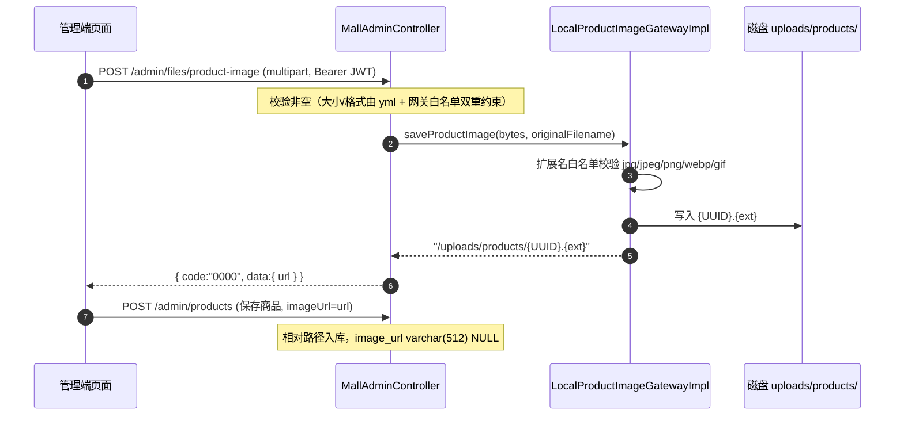

# 模块四：商品图片管理（Product Image Service）

> **领域上下文**：Mall Context（product）
> **核心场景**：商品图片上传、本地存储、前台展示、孤儿文件定时清理
> **依赖外部**：本地磁盘（`${app.config.upload-dir}`，默认 `./uploads`）
> **关键性质**：**可移植性设计**——存储网关抽象屏蔽存储介质，数据库只存相对路径，可零改动迁移对象存储（OSS/MinIO）
> **设计日期**：2026-10-05（P1 图片存储方案的本地化实现，不引入 OSS/Nginx）

---

## 一、需求背景

改造前系统**全链路没有图片支持**：`product` 表无图片字段，前端依赖 `via.placeholder.com`、京东图床热链等**外网占位图源**——离线环境（如答辩现场）全部裂图。

本模块在严格控制范围的前提下落地完整闭环：

```text
管理端：选择图片 → 预览 → 上传 → 保存相对路径
前台端：image_url 有 → 显示商品图片；无 → 显示本地默认图片（零外网依赖）
运维端：定时清理未被引用的孤儿图片文件
```

**明确不做的**（原 FUTURE_FEATURES P1 中属于过度设计的部分）：不引入 OSS/MinIO、不引入 Nginx 反向代理、不做隐私图片分级存储。本地磁盘 + Spring 静态资源映射在毕设/演示量级下与 Nginx 方案效果一致。

---

## 二、整体架构

### 2.1 DDD 分层落地

| 层 | 类 | 职责 |
|----|----|------|
| Trigger | `MallAdminController#uploadProductImage` | 接收 multipart 上传，返回 `{url}` |
| Trigger | `ImageCleanupJob` | `@Scheduled` 每日 04:00 触发清理 |
| Application | `ProductImageCleanupService` | 清理编排：引用比对、保护期过滤、失败隔离、统计汇总 |
| Domain | `IProductImageGateway` | **存储网关抽象**：save / list / delete，含白名单常量 `IMAGE_EXTENSIONS` |
| Domain | `IProductRepository#selectAllImageUrls` | 全部被引用图片路径查询 |
| Domain | `ProductImageFile` (record) | 轻量文件描述（filename + createdAt），无业务方法 |
| Infrastructure | `LocalProductImageGatewayImpl` | 本地磁盘实现：UUID 文件名、扩展名白名单、路径穿越防护 |
| Infrastructure | `WebConfig` | `/uploads/**` → `file:{upload-dir}/` 静态资源映射（缓存 1h） |
| Start | `SecurityConfig` | `/uploads/**` 加入 permitAll 白名单（商品图为公开资源） |

### 2.2 上传时序



**设计决策：上传与保存分离。** 前端"选图即上传、保存时只提交路径"，创建/更新商品接口契约不变（`imageUrl` 为可选字段）。避免"创建商品接口直接收文件"带来的 multipart 契约复杂化。

### 2.3 前台展示策略

```text
image_url
   ├── 有值 → （Vite dev 代理 / Vite build 后同源）
   └── 无值 → /images/product-default.png（本地默认图，public/ 目录随前端部署）
```

三个外网来源（via.placeholder.com、京东图床热链、picsum.photos）已全部删除，**展示链路零外网依赖**。

---

## 三、核心设计点

### 3.1 null 更新保护（必做项）

编辑商品场景的最大风险：**"只改价格不换图"时把原图误清掉**。

`ProductRepository#saveProduct` 更新分支对普通字段无条件 set，唯独 `imageUrl` 例外：

```java
// 图片为 null 时不更新该列：编辑商品未更换图片时必须保留原图，防止误清
if (product.getImageUrl() != null && !product.getImageUrl().isBlank()) {
    updateWrapper.set(Product::getImageUrl, product.getImageUrl());
}
```

配套约定：前端编辑保存时**未选择新图则不携带 `imageUrl` 字段**。双重保障，已 E2E 实测验证。

### 3.2 路径穿越双层防护

清理任务以数据库 `image_url` 引用为"保留依据"，必须保证异常路径不可能参与删除：

| 层 | 防护 | 位置 |
|----|------|------|
| 应用层 | 只取 basename（最后一个 `/` 之后）；含 `..` 或 `\` 的直接拒绝 | `ProductImageCleanupService#extractReferencedFilenames` |
| 网关层 | delete 再校验一次文件名，拒绝 `..`、`\`、`/`，目标强制落在 `products/` 子目录 | `LocalProductImageGatewayImpl#resolveSafeTarget` |

**保守策略**：形如 `/uploads/products/../../evil.jpg` 的脏数据，basename 提取结果为干净的 `evil.jpg`，按"可能被引用"处理——**清理任务宁可不删、不可误删**。

### 3.3 可移植性

- 数据库只存相对路径（`/uploads/products/xxx.jpg`），不存域名，换部署环境图片链接不失效
- 存储路径可配置：`upload-dir: ${APP_UPLOAD_DIR:./uploads}`，服务器/Mac 上可用环境变量覆盖，代码零改动
- 迁移 OSS 时只需新增 `IProductImageGateway` 的 OSS 实现并替换 Bean，Domain/Application/Trigger 三层无感

---

## 四、孤儿图片清理机制

### 4.1 要解决的问题

本地文件存储下，重复上传、换图、删商品、上传后保存失败都会产生**未被任何商品引用的孤儿文件**，长期占用磁盘。

### 4.2 清理流程

```mermaid
flowchart TD
    J[ImageCleanupJob<br/>每日 04:00 触发] --> S[ProductImageCleanupService]
    S --> R[查询全部被引用 image_url<br/>SELECT image_url FROM product<br/>WHERE image_url IS NOT NULL]
    S --> L[扫描 uploads/products/ 全部文件]
    R --> X[提取 basename 安全化<br/>拒绝 .. 与分隔符]
    X --> C{逐个文件判定}
    L --> C
    C -->|被引用| KEEP1[保留]
    C -->|非白名单扩展名| SKIP1[非图片跳过]
    C -->|创建时间 < 24h| SKIP2[保护期跳过<br/>防误删刚上传未保存的图]
    C -->|未引用且超保护期| DEL[deleteProductImage<br/>单文件失败不中断]
    DEL --> LOG[汇总日志:<br/>扫描/引用/删除/保护期/非图片/失败/耗时]
```



### 4.3 策略参数

| 项 | 取值 | 说明 |
|----|------|------|
| 调度框架 | Spring `@Scheduled` | 沿用现有 NoPayNotifyOrderJob 范式，不引入 xxl-job/quartz |
| 执行时间 | 每天 04:00（`0 0 4 * * ?`） | 低峰执行，可配置 |
| 保护期 | 24 小时 | 覆盖"上传成功但商品保存失败/重试中"的窗口 |
| 清理范围 | `uploads/products/` | 只处理商品图片目录 |
| 文件类型 | jpg/jpeg/png/webp/gif | 白名单内才删除，非白名单只计数不处理 |
| 判断依据 | `product.image_url` 引用关系 | 数据库为唯一事实源 |
| 删除策略 | 未引用 + 超保护期 | 宁可不删、不可误删 |
| 失败策略 | 单文件失败隔离 | 继续清理其余文件，计入失败数 |
| 事务 | 不使用 | 文件系统不参与 DB 事务，任务天然幂等 |
| 分布式锁 | 不增加 | 单实例部署；删除幂等，并发重复执行无害 |
| 开关 | `image-cleanup-enabled`（默认 true） | 异常时可一键关停 |

### 4.4 可观测性

每次执行输出汇总日志，被删文件逐条留痕——"为什么这个图片没了"随时可追：

```text
商品图片清理完成：扫描 12 个文件，当前引用 8 个，删除 2 个，
保护期跳过 1 个，非图片跳过 1 个，失败 0 个，耗时 35ms
```

---

## 五、配置项

| 配置 | 位置 | 默认值 | 说明 |
|------|------|--------|------|
| `app.config.upload-dir` | dev/prod yml | `${APP_UPLOAD_DIR:./uploads}` | 上传根目录（相对启动目录） |
| `spring.servlet.multipart.max-file-size` | dev/prod yml | `5MB` | 单文件上限 |
| `app.config.image-cleanup-enabled` | dev/prod yml | `true` | 清理任务开关 |
| `app.config.image-cleanup-cron` | dev/prod yml | `0 0 4 * * ?` | 清理触发时间 |
| `app.config.image-cleanup-protection-hours` | dev/prod yml | `24` | 保护期（小时） |

> **部署注意**：`./uploads` 相对的是**后端启动目录**。本地 IDEA 开发建议运行配置 Working directory 设为 `$MODULE_DIR$`（s-pay-mall-start）；服务器上在固定目录下启动 jar 或设 `APP_UPLOAD_DIR`。

---

## 六、安全与验证

### 6.1 安全点

- `/admin/files/product-image` 位于 `/mall-api/v1/admin/**` 下，由 Spring Security `hasRole("ADMIN")` 保护（S 系列安全修复体系内）
- `/uploads/**` 静态资源公开访问（商品图是公开资源），不经过业务 Controller，不占用 JVM 业务线程
- 文件内容为图片白名单扩展名；文件名由服务端生成（UUID），不使用用户原始文件名落盘

### 6.2 验证记录（2026-10-05）

| 验证 | 方式 | 结果 |
|------|------|------|
| 上传 → 静态访问 → 建商品 → 编辑不换图 → 换图 → 前台匿名查询 | curl 全链路 E2E | 通过（编辑不传图原图保留 PASS） |
| 清理服务语义（引用/保护期/非图片/保守引用/失败隔离/空目录） | `ProductImageCleanupServiceTest` ×6 | 全过 |
| 本地网关文件系统安全（白名单/路径穿越拒绝/静默成功） | `LocalProductImageGatewayImplTest` ×7（@TempDir） | 全过 |
| 回归 | domain 48 / application 11 / infrastructure 14 | 全绿 |

### 6.3 已知边界

- 单实例定时任务，无分布式锁；多实例部署时需改为广播型任务或加锁（当前毕设场景单实例）
- 清理只处理"未引用"文件，不处理"被引用但磁盘缺失"的反向场景（该场景前台已有默认图兜底）
