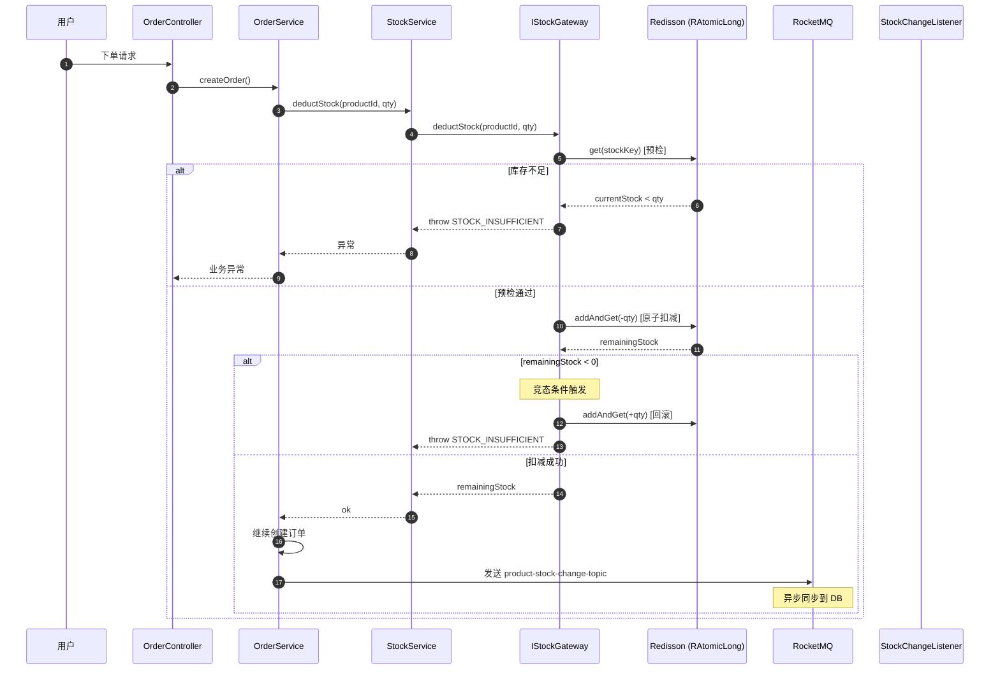
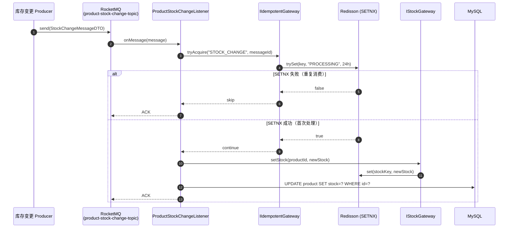
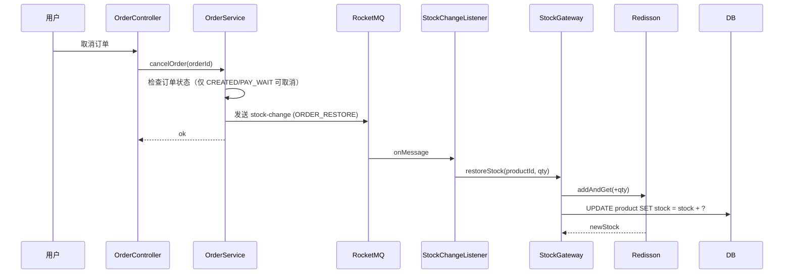

# 模块三：库存服务（Stock Service）

> **领域上下文**：Mall Context（独立 Stock 限界上下文）  
> **核心场景**：高并发下库存预扣、异步同步、幂等闭环、防超卖  
> **依赖外部**：Redis / Redisson、RocketMQ、MySQL  
> **关键性质**：**系统重难点**——分布式原子性、最终一致性、幂等性

---

## 一、模块定位

库存是电商系统的**核心资源**，直接关联交易可用性与资金安全。本系统设计 **"Redis 预扣 + DB 异步同步"** 的双层架构：

| 层级 | 角色 | 一致性要求 |
|------|------|------------|
| Redis（Redisson RAtomicLong） | 库存事实来源（高频读写） | 最终一致 |
| MySQL（product.stock） | 库存持久层（低频最终落库） | 强一致 |
| RocketMQ | 库存变更事件总线 | 至少一次 |

**为什么不在 DB 直接扣减？**
- DB 单行更新在 1k QPS 量级已是极限，难以承载秒杀场景
- Redis `INCR/DECR` 性能可达 10w+ QPS，且 RAtomicLong 提供原子操作

---

## 二、库存预扣减：核心流程

### 2.1 时序图



### 2.2 关键代码：双检查防超卖

```java
@Override
public long deductStock(Long productId, Integer quantity) {
    RAtomicLong stockCounter = redissonClient.getAtomicLong(STOCK_KEY_PREFIX + productId);
    
    // L1：预检
    long currentStock = stockCounter.get();
    if (currentStock < quantity) {
        throw new AppException("STOCK_INSUFFICIENT", "商品库存不足");
    }
    
    // L2：原子扣减
    long remainingStock = stockCounter.addAndGet(-quantity);
    
    // L3：二次校验（处理竞态）
    if (remainingStock < 0) {
        stockCounter.addAndGet(quantity); // 回滚
        throw new AppException("STOCK_INSUFFICIENT", "商品库存不足");
    }
    
    return remainingStock;
}
```

**为什么需要 L3 二次校验？**
- 线程 A 与线程 B 同时通过 L1 预检（都看到 stock=1）
- 线程 A 抢到锁扣减成功（stock=0）
- 线程 B 抢到锁扣减后 stock=-1 → 触发回滚
- 这是 **CAS（Compare-And-Swap）思想** 在 Redis 端的体现

---

## 三、库存同步：MQ 异步链路

### 3.1 时序图



### 3.2 同步场景与变更类型

| 变更类型 | 触发场景 | 消息流向 |
|----------|----------|----------|
| `ADMIN_UPDATE` | 后台管理员修改库存 | DB → Redis（覆盖） |
| `PAY_DEDUCT` | 支付成功扣减 | Redis 已扣减 → DB 持久化 |
| `ORDER_RESTORE` | 订单取消/超时恢复 | Redis 恢复 → DB 持久化 |

---

## 四、幂等闭环：双重 SETNX 设计

### 4.1 第一道幂等：业务主键

```java
// StockChangeMessageDTO 必须包含全局唯一 messageId
public class StockChangeMessageDTO {
    private String messageId;   // UUID，全局唯一
    private Long productId;
    private Integer newStock;
    private String changeType;
}
```

### 4.2 第二道幂等：Redisson trySet

```java
@Override
public boolean checkMessageIdempotent(String messageId) {
    String key = "mall:stock:msg:processed:" + messageId;
    RBucket<String> bucket = redissonClient.getBucket(key);
    
    // 24h TTL，SETNX 语义
    boolean isFirst = bucket.trySet("1", 86400, TimeUnit.SECONDS);
    return isFirst;
}
```

**幂等闭环关键原则：**
- **首次处理**：SETNX 返回 true → 执行业务 → 保持 Key 24h（防重复消费）
- **业务异常**：调用 `release()` 删除 Key → 允许 MQ 重试
- **重复消息**：SETNX 返回 false → 直接 ACK，跳过执行

### 4.3 幂等 Key 规范

| 维度 | 规范 |
|------|------|
| **前缀** | `stock:event:` 业务类型 / `mall:stock:msg:processed:` 消息ID |
| **TTL** | 24h（覆盖 MQ 重试窗口） |
| **值** | `PROCESSING` / `1`（无业务含义，仅作为标记） |

---

## 五、订单取消：库存恢复链路



---

## 六、库存预热：冷启动优化

```mermaid
flowchart LR
    A[应用启动] --> B[StockPreheatRunner]
    B --> C[查询所有在售商品]
    C --> D[批量加载到 Redis]
    D --> E[mall:product:stock:{id}]
```

**必要性：**
- 避免冷启动期首个请求穿透到 DB
- 保证后续扣减操作的 Redis 命中率

---

## 七、容错与降级

| 场景 | 现象 | 降级策略 |
|------|------|----------|
| Redis 不可用 | 扣减操作失败 | 拒绝下单（保护资金安全，不允许穿透 DB） |
| MQ 消费失败 | 库存未同步到 DB | 触发重试（最多 16 次），最终进入死信队列人工处理 |
| DB 扣减失败 | `affectedRows = 0` | 异步恢复 Redis 库存，告警通知 |
| 网络分区 | 主从切换 | 等待 Redis Sentinel 重新选主，期间拒绝写操作 |

---

## 八、技术亮点与面试高频考点

| 维度 | 考点 | 标准答案 |
|------|------|----------|
| **超卖防御** | 如何确保不超卖？ | Redis RAtomicLong 原子扣减 + 双检查（预判 + 扣减后校验） + DB 乐观锁兜底 |
| **Redis vs DB 扣减** | 为什么用 Redis？ | 性能（10w+ QPS vs 1k QPS）、原子性（RAtomicLong.addAndGet） |
| **CAP 取舍** | 库存系统的一致性？ | AP 系统：保证可用性（Redis 优先），最终一致通过 MQ 异步同步 |
| **幂等性** | MQ 重复消息如何处理？ | SETNX 幂等键（24h TTL）+ 业务主键唯一性 + 状态机校验 |
| **重试机制** | MQ 消费失败怎么办？ | RocketMQ 自带重试（最多 16 次），业务可设置重试次数；最终失败进入死信队列 |
| **冷启动** | 如何解决 Redis 冷启动？ | 应用启动时 `StockPreheatRunner` 批量预热 |
| **分布式锁** | 为什么不直接用分布式锁？ | 分布式锁性能开销大，RAtomicLong 原子操作更轻量 |
| **库存一致性** | Redis 与 DB 如何最终一致？ | DB 事务为权威源，Redis 异步同步，DB 失败可回滚 Redis |
| **秒杀热点** | 极端并发下如何优化？ | Redis Cluster 分片 + 本地缓存（Caffeine）+ 限流 + 排队 |
| **SETNX vs SET** | 为什么用 SETNX？ | 原子判断+赋值，避免竞态；TTL 防死锁 |

---

## 九、关键源码索引

- 网关实现：[`StockGatewayImpl`](file:///Users/xiaolv/Develop/projects/backend/java/s-pay-mall/s-pay-mall-infrastructure/src/main/java/cn/fcr/infrastructure/gateway/StockGatewayImpl.java)
- 幂等网关：[`IdempotentGatewayImpl`](file:///Users/xiaolv/Develop/projects/backend/java/s-pay-mall/s-pay-mall-infrastructure/src/main/java/cn/fcr/infrastructure/gateway/IdempotentGatewayImpl.java)
- 分布式锁：[`RedisDistributedLock`](file:///Users/xiaolv/Develop/projects/backend/java/s-pay-mall/s-pay-mall-infrastructure/src/main/java/cn/fcr/infrastructure/config/RedisDistributedLock.java)
- 库存监听器：[`ProductStockChangeRocketListener`](file:///Users/xiaolv/Develop/projects/backend/java/s-pay-mall/s-pay-mall-trigger/src/main/java/cn/fcr/trigger/listener/ProductStockChangeRocketListener.java)
- 预热任务：[`StockPreheatRunner`](file:///Users/xiaolv/Develop/projects/backend/java/s-pay-mall/s-pay-mall-trigger/src/main/java/cn/fcr/trigger/job/StockPreheatRunner.java)

---

> **核心设计哲学**：库存系统是 **CP 偏向 AP** 的工程实践——通过 **多层幂等 + 异步同步 + 状态机校验** 的组合拳，在保证最终一致性的前提下，将系统可用性提升到极致。
