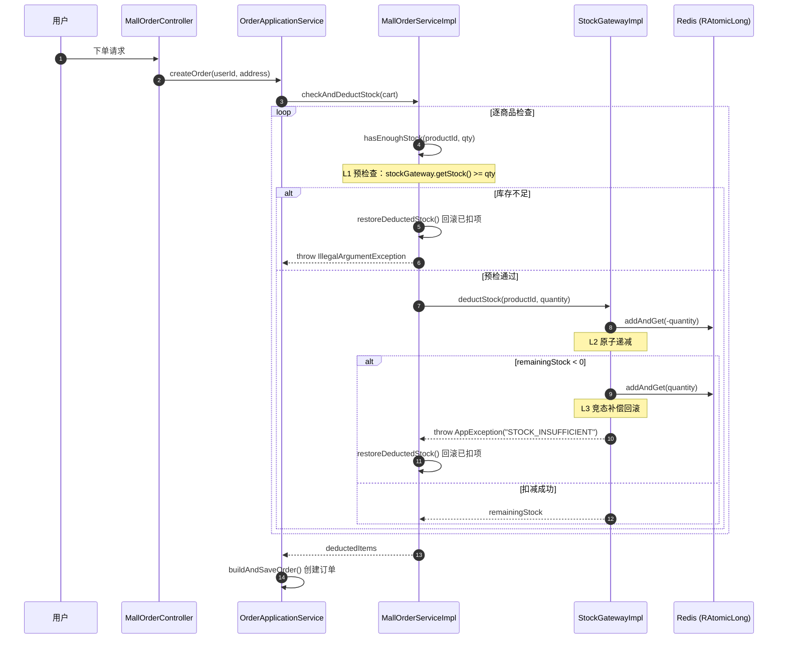
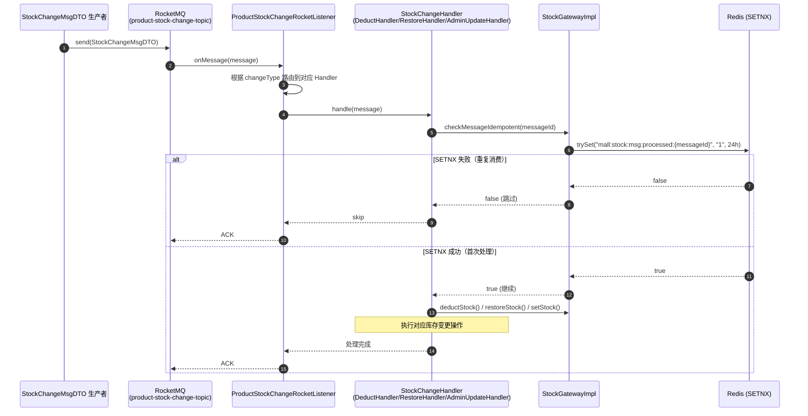
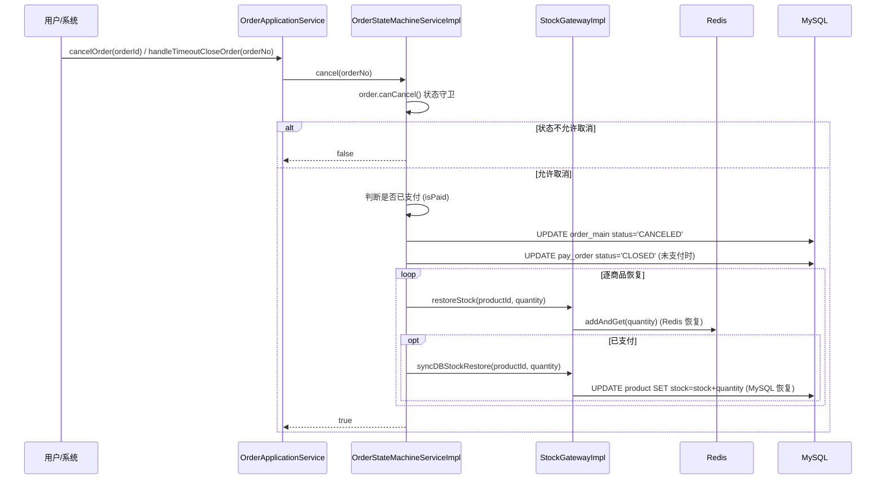
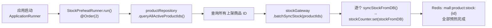

# 模块三：库存服务（Stock Service）

> **领域上下文**：Mall Context
> **核心场景**：高并发下库存预扣、异步同步 DB、幂等闭环、防超卖
> **依赖外部**：Redis / Redisson (RAtomicLong)、RocketMQ、MySQL
> **关键性质**：**系统重难点**——分布式原子性、最终一致性、幂等性

---

## 一、模块定位

库存是电商系统的**核心资源**，直接关联交易可用性与资金安全。本系统设计 **"Redis 预扣 + DB 异步同步"** 的双层架构：

| 层级 | 角色 | 一致性要求 | 实现 |
|------|------|------------|------|
| Redis（Redisson RAtomicLong） | 库存事实来源（高频读写） | 最终一致 | `StockGatewayImpl` |
| MySQL（product.stock） | 库存持久层（低频最终落库） | 强一致 | `IProductRepository.decreaseStock()` 乐观锁 |
| RocketMQ | 库存变更事件总线 | 至少一次 | `product-stock-change-topic` |

**为什么不在 DB 直接扣减？**
- DB 单行更新在 1k QPS 量级已是极限，难以承载高并发场景
- Redis `addAndGet()` 性能可达 10w+ QPS，且 RAtomicLong 提供原子操作保证

---

## 二、库存预扣减：核心流程

### 2.1 时序图（含三层检查分布）



### 2.2 关键代码：双层检查 + 补偿回滚

**StockGatewayImpl.deductStock() — 原子扣减（L2 + L3）**

```java
// 文件: s-pay-mall-infrastructure/.../mall/gateway/StockGatewayImpl.java (第49-67行)

@Override
public long deductStock(Long productId, Integer quantity) {
    String stockKey = STOCK_KEY_PREFIX + productId;         // "mall:product:stock:{id}"
    RAtomicLong stockCounter = redissonClient.getAtomicLong(stockKey);

    // 【DDD】预检查已上移至 Domain 层（MallOrderServiceImpl），
    // 本方法仅保留原子操作和竞态补偿，不再做前置读判断。

    // L2：原子递减 — 直接执行 addAndGet(-qty)
    long remainingStock = stockCounter.addAndGet(-quantity);

    // L3：竞态补偿 — 多个并发请求同时扣减时，若结果库存为负则回滚
    if (remainingStock < 0) {
        stockCounter.addAndGet(quantity);                   // 回滚已扣数量
        throw new AppException("STOCK_INSUFFICIENT", "商品库存不足，无法下单");
    }

    log.info("【库存扣减成功】productId={}, 扣减后库存={}", productId, remainingStock);
    return remainingStock;
}
```

**MallOrderServiceImpl.checkAndDeductStock() — 预检查 + 回滚编排（L1）**

```java
// 文件: s-pay-mall-domain/.../mall/service/impl/MallOrderServiceImpl.java (第38-59行)

public List<CartItemVO> checkAndDeductStock(List<CartItemVO> cart) {
    List<CartItemVO> deductedItems = new ArrayList<>();

    for (CartItemVO item : cart) {
        // L1：预检查 — 在调用 Redis 原子操作之前，先检查库存是否充足
        if (!hasEnoughStock(item.getProductId(), item.getQuantity())) {
            restoreDeductedStock(deductedItems);            // 回滚已扣项
            throw new IllegalArgumentException("商品库存不足: productId=" + item.getProductId());
        }
        try {
            stockGateway.deductStock(item.getProductId(), item.getQuantity());
            deductedItems.add(item);
        } catch (Exception e) {
            restoreDeductedStock(deductedItems);            // Redis 异常也回滚
            throw e;
        }
    }
    return deductedItems;
}
```

### 2.3 三层检查总览

| 检查层 | 位置 | 机制 | 作用 |
|--------|------|------|------|
| **L1 预检查** | `MallOrderServiceImpl.hasEnoughStock()` | `stockGateway.getStock() >= qty`（读 Redis 当前值） | 快速失败，避免不必要的原子操作 |
| **L2 原子递减** | `StockGatewayImpl.deductStock()` L56 | `RAtomicLong.addAndGet(-quantity)`（原子操作） | 实际执行库存扣减 |
| **L3 竞态补偿** | `StockGatewayImpl.deductStock()` L59-63 | `remainingStock < 0` → `addAndGet(quantity)` 回滚 | 兜底保护并发的"最后一单位"超卖 |

**为什么需要 L3？**

线程 A 与线程 B 同时通过 L1 预检查（都看到 stock=1）→ A 先执行 L2 扣减成功（stock=0）→ B 再执行 L2 扣减到 -1 → L3 触发回滚。这本质上是 **CAS 思想**在 Redis 端的实现。

---

## 三、库存同步：MQ + SETNX 幂等

### 3.1 时序图



### 3.2 同步场景与变更类型

| 变更类型 | Handler | 触发场景 | 操作 |
|----------|---------|----------|------|
| `PAY_DEDUCT` | `DeductHandler` | 支付成功扣减 | Redis 已预扣 → DB 持久化 |
| `ORDER_RESTORE` | `RestoreHandler` | 订单取消/超时恢复 | Redis 恢复 → DB 持久化 |
| `ADMIN_UPDATE` | `AdminUpdateHandler` | 后台管理员修改库存 | Redis `set()` 覆盖 |

### 3.3 幂等 Key 规范

```java
// 文件: StockGatewayImpl.java (第141-155行)

public boolean checkMessageIdempotent(String messageId) {
    String idempotentKey = "mall:stock:msg:processed:" + messageId;
    RBucket<String> bucket = redissonClient.getBucket(idempotentKey);

    // trySet 实现 SETNX（仅在 key 不存在时设置成功）
    boolean isFirstProcess = bucket.trySet("1", 86400, TimeUnit.SECONDS);
    return isFirstProcess;
}
```

| 维度 | 规范 |
|------|------|
| Key 前缀 | `mall:stock:msg:processed:` |
| TTL | 24h（86400s），覆盖 MQ 重试窗口 |
| 值 | `"1"`（无业务含义，仅作为处理标记） |

---

## 四、订单取消：库存恢复链路



---

## 五、库存预热：冷启动优化



**实现细节（StockPreheatRunner）：**

- 实现 `ApplicationRunner`，`@Order(2)`，在管理员初始化之后执行
- 查询所有 `status=1`（上架）商品，批量调用 `stockGateway.batchSyncStock()`
- 单个商品同步失败不影响整体，逐条 `catch` 后继续
- 预热失败不影响应用启动，仅记录日志，Redis 库存将在首次访问时懒加载

---

## 六、容错与降级

| 场景 | 现象 | 降级策略 |
|------|------|----------|
| Redis 不可用 | `getAtomicLong()` 失败 | 拒绝下单（保护资金安全，不允许穿透 DB） |
| MQ 消费失败 | 库存未同步到 DB | RocketMQ 自动重试（最多 16 次），最终进入死信队列 |
| DB 扣减失败 | `affectedRows = 0` | Redis 已预扣不改，DB 失败仅记日志（最终一致性） |
| 批量预热异常 | 单个商品同步失败 | catch 后继续处理其他商品，不影响整体预热 |

---

## 七、技术亮点与面试高频考点

| 维度 | 考点 | 标准答案 |
|------|------|----------|
| **超卖防御** | 如何确保不超卖？ | 三层检查：Domain 层预检查 (L1) + Redis RAtomicLong 原子递减 (L2) + 竞态负库存回滚 (L3) |
| **Redis vs DB** | 为什么用 Redis 扣库存？ | 性能差 100 倍（10w+ vs 1k QPS），RAtomicLong.addAndGet() 保证原子性 |
| **预检查上移** | 为什么 L1 在 Domain 层？ | DDD 原则：业务规则归 Domain；Infrastructure 层仅负责原子操作，不包含业务判断 |
| **幂等性** | MQ 重复消息如何处理？ | SETNX 幂等键 `mall:stock:msg:processed:{messageId}`，24h TTL + trySet 原子性 |
| **冷启动** | Redis 重启后库存丢失？ | StockPreheatRunner 应用启动时批量同步 DB → Redis |
| **CAP 取舍** | 库存系统一致性模型？ | AP 偏向：Redis 优先保证可用性，DB 通过 MQ 异步同步最终一致 |
| **DB 兜底** | DB 扣减失败怎么办？ | MySQL 乐观锁 (`UPDATE WHERE stock >= ?`)，Redis 为主事实源，DB 失败不影响主流程 |
| **边扣边回滚** | 多商品下单中途失败？ | checkAndDeductStock 逐项扣减，失败时 restoreDeductedStock 回滚已扣项 |

---

> **关键源码索引**：
> - 原子扣减：[`StockGatewayImpl.deductStock()`](file:///Users/xiaolv/Develop/projects/backend/java/s-pay-mall/s-pay-mall-infrastructure/src/main/java/cn/fcr/infrastructure/mall/gateway/StockGatewayImpl.java#L49)
> - 预检查编排：[`MallOrderServiceImpl.checkAndDeductStock()`](file:///Users/xiaolv/Develop/projects/backend/java/s-pay-mall/s-pay-mall-domain/src/main/java/cn/fcr/domain/mall/service/impl/MallOrderServiceImpl.java#L38)
> - 状态机库存同步：[`OrderStateMachineServiceImpl`](file:///Users/xiaolv/Develop/projects/backend/java/s-pay-mall/s-pay-mall-domain/src/main/java/cn/fcr/domain/mall/service/impl/OrderStateMachineServiceImpl.java)
> - 幂等检查：[`StockGatewayImpl.checkMessageIdempotent()`](file:///Users/xiaolv/Develop/projects/backend/java/s-pay-mall/s-pay-mall-infrastructure/src/main/java/cn/fcr/infrastructure/mall/gateway/StockGatewayImpl.java#L141)
> - 库存预热：[`StockPreheatRunner`](file:///Users/xiaolv/Develop/projects/backend/java/s-pay-mall/s-pay-mall-trigger/src/main/java/cn/fcr/trigger/job/StockPreheatRunner.java)
> - MQ 消费：[`ProductStockChangeRocketListener`](file:///Users/xiaolv/Develop/projects/backend/java/s-pay-mall/s-pay-mall-trigger/src/main/java/cn/fcr/trigger/listener/ProductStockChangeRocketListener.java)
> - Handler 策略：[`DeductHandler`](file:///Users/xiaolv/Develop/projects/backend/java/s-pay-mall/s-pay-mall-domain/src/main/java/cn/fcr/domain/mall/service/handler/DeductHandler.java) / [`RestoreHandler`](file:///Users/xiaolv/Develop/projects/backend/java/s-pay-mall/s-pay-mall-domain/src/main/java/cn/fcr/domain/mall/service/handler/RestoreHandler.java)
> - Domain 接口：[`IStockGateway`](file:///Users/xiaolv/Develop/projects/backend/java/s-pay-mall/s-pay-mall-domain/src/main/java/cn/fcr/domain/mall/gateway/IStockGateway.java)
