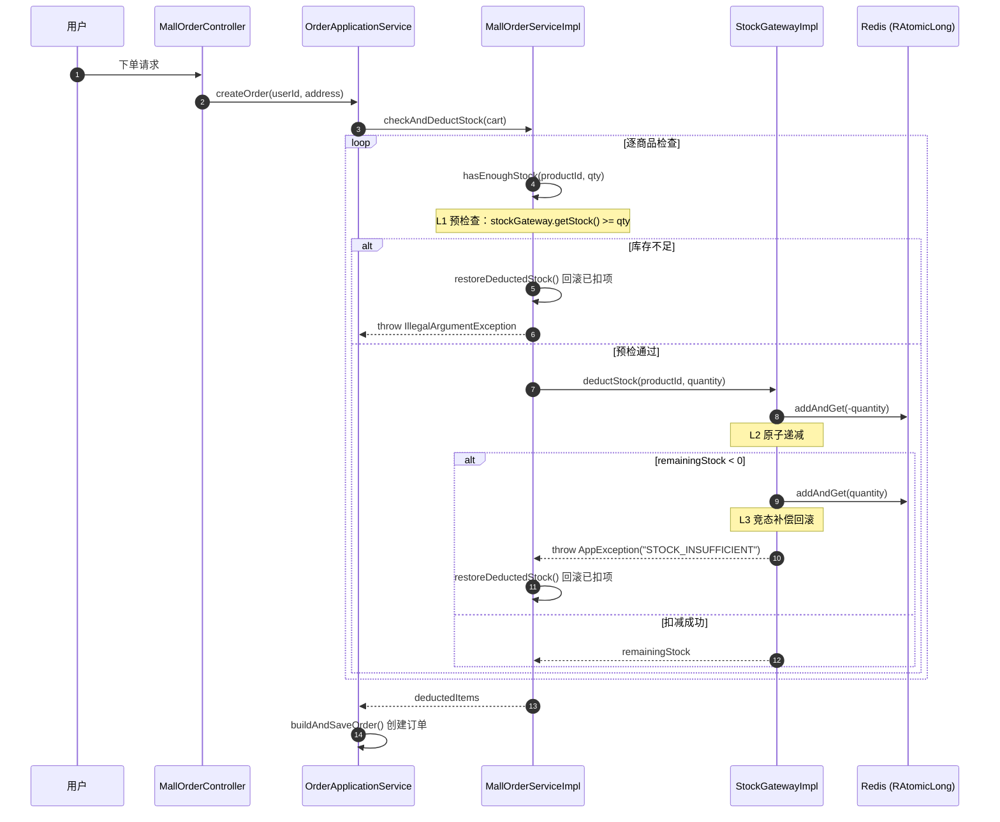
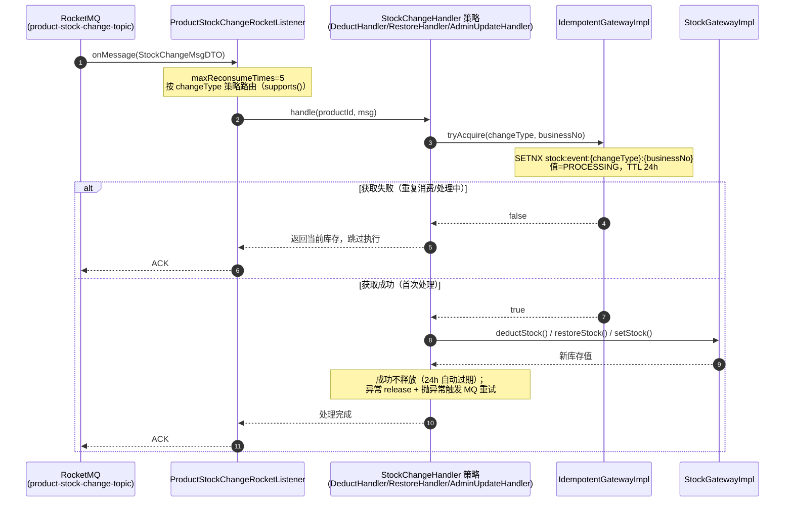
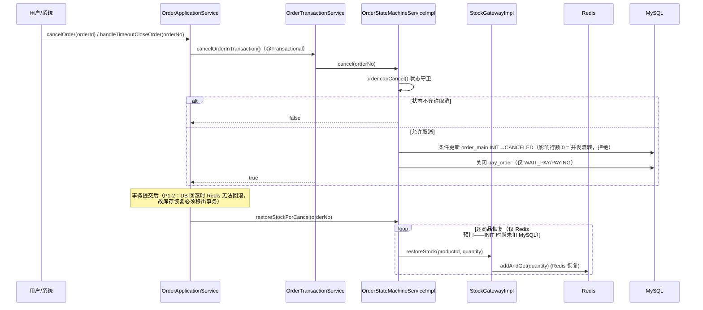
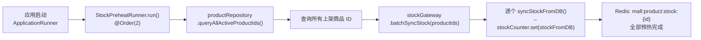

# 模块三：库存服务（Stock Service）

> **领域上下文**：Mall Context
> **核心场景**：高并发下库存预扣、异步同步 DB、幂等闭环、防超卖
> **依赖外部**：Redis / Redisson (RAtomicLong)、RocketMQ、MySQL
> **关键性质**：**系统重难点**——分布式原子性、最终一致性、幂等性

---

## 一、模块定位

库存是电商系统的**核心资源**，直接关联交易可用性与资金安全。本系统设计 **"Redis 预扣 + DB 异步同步"** 的双层架构：

| 层级 | 角色 | 一致性要求 | 实现 |
|------|------|------------|------|
| Redis（Redisson RAtomicLong） | 库存事实来源（高频读写） | 最终一致 | `StockGatewayImpl` |
| MySQL（product.stock） | 库存持久层（低频最终落库） | 强一致 | `IProductRepository.decreaseStock()` 乐观锁 |
| RocketMQ | 库存变更事件总线 | 至少一次 | `product-stock-change-topic`（当前无生产者，TD-9 考证为有意保留的接入点，见 §三） |

**为什么不在 DB 直接扣减？**
- DB 单行更新在 1k QPS 量级已是极限，难以承载高并发场景
- Redis `addAndGet()` 性能可达 10w+ QPS，且 RAtomicLong 提供原子操作保证

---

## 二、库存预扣减：核心流程

### 2.1 时序图（含三层检查分布）


```mermaid
sequenceDiagram
    autonumber
    participant U as 用户
    participant C as MallOrderController
    participant S as OrderApplicationService
    participant M as MallOrderServiceImpl
    participant Stock as StockGatewayImpl
    participant R as Redis (RAtomicLong)

    U->>C: 下单请求
    C->>S: createOrder(userId, address)
    S->>M: checkAndDeductStock(cart)

    loop 逐商品检查
        M->>M: hasEnoughStock(productId, qty)
        Note over M: L1 预检查：stockGateway.getStock() >= qty
        alt 库存不足
            M->>M: restoreDeductedStock() 回滚已扣项
            M-->>S: throw IllegalArgumentException
        else 预检通过
            M->>Stock: deductStock(productId, quantity)
            Stock->>R: addAndGet(-quantity)
            Note over Stock: L2 原子递减
            alt remainingStock < 0
                Stock->>R: addAndGet(quantity)
                Note over Stock: L3 竞态补偿回滚
                Stock-->>M: throw AppException("STOCK_INSUFFICIENT")
                M->>M: restoreDeductedStock() 回滚已扣项
            else 扣减成功
                Stock-->>M: remainingStock
            end
        end
    end

    M-->>S: deductedItems
    S->>S: buildAndSaveOrder() 创建订单
```

### 2.2 关键代码：双层检查 + 补偿回滚

**StockGatewayImpl.deductStock() — 原子扣减（L2 + L3）**

```java
// 文件: s-pay-mall-infrastructure/.../mall/product/gateway/StockGatewayImpl.java (第35-53行)

@Override
public long deductStock(Long productId, Integer quantity) {
    String stockKey = STOCK_KEY_PREFIX + productId;         // "mall:product:stock:{id}"
    RAtomicLong stockCounter = redissonClient.getAtomicLong(stockKey);

    // 【DDD】预检查已上移至 Domain 层（MallOrderServiceImpl），
    // 本方法仅保留原子操作和竞态补偿，不再做前置读判断。

    // L2：原子递减 — 直接执行 addAndGet(-qty)
    long remainingStock = stockCounter.addAndGet(-quantity);

    // L3：竞态补偿 — 多个并发请求同时扣减时，若结果库存为负则回滚
    if (remainingStock < 0) {
        stockCounter.addAndGet(quantity);                   // 回滚已扣数量
        throw new AppException("STOCK_INSUFFICIENT", "商品库存不足，无法下单");
    }

    log.info("【库存扣减成功】productId={}, 扣减后库存={}", productId, remainingStock);
    return remainingStock;
}
```

**MallOrderServiceImpl.checkAndDeductStock() — 预检查 + 回滚编排（L1）**

```java
// 文件: s-pay-mall-domain/.../order/service/impl/MallOrderServiceImpl.java (第44-65行)

public List<CartItemVO> checkAndDeductStock(List<CartItemVO> cart) {
    List<CartItemVO> deductedItems = new ArrayList<>();

    for (CartItemVO item : cart) {
        // L1：预检查 — 在调用 Redis 原子操作之前，先检查库存是否充足
        if (!hasEnoughStock(item.getProductId(), item.getQuantity())) {
            restoreDeductedStock(deductedItems);            // 回滚已扣项
            throw new IllegalArgumentException("商品库存不足: productId=" + item.getProductId());
        }
        try {
            stockGateway.deductStock(item.getProductId(), item.getQuantity());
            deductedItems.add(item);
        } catch (Exception e) {
            restoreDeductedStock(deductedItems);            // Redis 异常也回滚
            throw e;
        }
    }
    return deductedItems;
}
```

### 2.3 三层检查总览

| 检查层 | 位置 | 机制 | 作用 |
|--------|------|------|------|
| **L1 预检查** | `MallOrderServiceImpl.hasEnoughStock()` | `stockGateway.getStock() >= qty`（读 Redis 当前值） | 快速失败，避免不必要的原子操作 |
| **L2 原子递减** | `StockGatewayImpl.deductStock()` L42 | `RAtomicLong.addAndGet(-quantity)`（原子操作） | 实际执行库存扣减 |
| **L3 竞态补偿** | `StockGatewayImpl.deductStock()` L45-49 | `remainingStock < 0` → `addAndGet(quantity)` 回滚 | 兜底保护并发的"最后一单位"超卖 |

**为什么需要 L3？**

线程 A 与线程 B 同时通过 L1 预检查（都看到 stock=1）→ A 先执行 L2 扣减成功（stock=0）→ B 再执行 L2 扣减到 -1 → L3 触发回滚。这本质上是 **CAS 思想**在 Redis 端的实现。

---

## 三、库存变更消费：策略路由 + 幂等闭环

> **现状**：`product-stock-change-topic` 目前**仅有消费者、无生产者**（订单主链路的 DB 库存同步由状态机
> `syncDBStockForPaySuccess()` 在支付成功事务内直接完成）。消费者与 Handler 链路保留，
> 作为存量消息兼容与后续库存事件化的接入点。

### 3.1 时序图


```mermaid
sequenceDiagram
    autonumber
    participant MQ as RocketMQ<br/>(product-stock-change-topic)
    participant Consumer as ProductStockChangeRocketListener
    participant Handler as StockChangeHandler 策略<br/>(DeductHandler/RestoreHandler/AdminUpdateHandler)
    participant Idem as IdempotentGatewayImpl
    participant Stock as StockGatewayImpl

    MQ->>Consumer: onMessage(StockChangeMsgDTO)
    Note over Consumer: maxReconsumeTimes=5<br/>按 changeType 策略路由（supports()）
    Consumer->>Handler: handle(productId, msg)
    Handler->>Idem: tryAcquire(changeType, businessNo)
    Note over Idem: SETNX stock:event:{changeType}:{businessNo}<br/>值=PROCESSING，TTL 24h
    alt 获取失败（重复消费/处理中）
        Idem-->>Handler: false
        Handler-->>Consumer: 返回当前库存，跳过执行
        Consumer-->>MQ: ACK
    else 获取成功（首次处理）
        Idem-->>Handler: true
        Handler->>Stock: deductStock() / restoreStock() / setStock()
        Stock-->>Handler: 新库存值
        Note over Handler: 成功不释放（24h 自动过期）；<br/>异常 release + 抛异常触发 MQ 重试
        Handler-->>Consumer: 处理完成
        Consumer-->>MQ: ACK
    end
```

### 3.2 变更类型与策略映射

| 变更类型 | Handler | 幂等 businessType | 操作 |
|----------|---------|-------------------|------|
| `PAY_DEDUCT` | `DeductHandler` | `deduct` | `deductStock()` Redis 原子扣减 |
| `ORDER_RESTORE` | `RestoreHandler` | `restore` | `restoreStock()` Redis 原子恢复 |
| `ADMIN_UPDATE` | `AdminUpdateHandler` | `admin_update` | `setStock()` Redis 覆盖 |

### 3.3 幂等 Key 规范

```java
// 文件: IdempotentGatewayImpl.java — buildKey()

public String buildKey(String businessType, String businessNo) {
    return "stock:event:" + businessType + ":" + businessNo;
    // 例：stock:event:deduct:{orderId}
}
```

| 维度 | 规范 |
|------|------|
| Key 格式 | `stock:event:{businessType}:{businessNo}`（前缀 `stock:event:` 为历史兼容保留） |
| 值 | `PROCESSING`（处理中标记）；完成后可被业务结果值覆盖（如下单幂等记录 orderNo） |
| TTL | 24h，覆盖 MQ 重试窗口 |
| 失败语义 | 异常时 `release()` 释放幂等键并抛异常，交给 MQ 重投；成功不释放，重投自然跳过 |

---

## 四、订单取消：库存恢复链路


```mermaid
sequenceDiagram
    participant U as 用户/系统
    participant S as OrderApplicationService
    participant TX as OrderTransactionService
    participant SM as OrderStateMachineServiceImpl
    participant Stock as StockGatewayImpl
    participant R as Redis
    participant DB as MySQL

    U->>S: cancelOrder(orderId) / handleTimeoutCloseOrder(orderNo)
    S->>TX: cancelOrderInTransaction()（@Transactional）
    TX->>SM: cancel(orderNo)
    SM->>SM: order.canCancel() 状态守卫
    alt 状态不允许取消
        SM-->>S: false
    else 允许取消
        SM->>DB: 条件更新 order_main INIT→CANCELED（影响行数 0 = 并发流转，拒绝）
        SM->>DB: 关闭 pay_order（仅 WAIT_PAY/PAYING）
        TX-->>S: true
    end
    Note over S: 事务提交后（P1-2：DB 回滚时 Redis 无法回滚，<br/>故库存恢复必须移出事务）
    S->>SM: restoreStockForCancel(orderNo)
    loop 逐商品恢复（仅 Redis 预扣——INIT 时尚未扣 MySQL）
        SM->>Stock: restoreStock(productId, quantity)
        Stock->>R: addAndGet(quantity) (Redis 恢复)
    end
```

---

## 五、库存预热：冷启动优化


```mermaid
flowchart LR
    A["应用启动<br/>ApplicationRunner"] --> B["StockPreheatRunner.run()<br/>@Order(2)"]
    B --> C["productRepository<br/>.queryAllActiveProductIds()"]
    C --> D["查询所有上架商品 ID"]
    D --> E["stockGateway<br/>.batchSyncStock(productIds)"]
    E --> F["逐个 syncStockFromDB()<br/>→ stockCounter.set(stockFromDB)"]
    F --> G["Redis: mall:product:stock:{id}<br/>全部预热完成"]
```

**实现细节（StockPreheatRunner）：**

- 实现 `ApplicationRunner`，`@Order(2)`，在管理员初始化之后执行
- 查询所有 `status=1`（上架）商品，批量调用 `stockGateway.batchSyncStock()`
- 单个商品同步失败不影响整体，逐条 `catch` 后继续
- 预热失败不影响应用启动，仅记录日志，Redis 库存将在首次访问时懒加载

---

## 六、容错与降级

| 场景 | 现象 | 降级策略 |
|------|------|----------|
| Redis 不可用 | `getAtomicLong()` 失败 | 拒绝下单（保护资金安全，不允许穿透 DB） |
| MQ 消费失败 | 库存未同步到 DB | RocketMQ 自动重试（`maxReconsumeTimes=5`，显式配置），耗尽进入 `%DLQ%` 死信队列（DLQ 告警监听器已落地，见 [ROADMAP](ROADMAP.md) TD-2 / U-5） |
| DB 扣减失败 | `affectedRows = 0` | Redis 已预扣不改，DB 失败仅记日志（最终一致性） |
| 批量预热异常 | 单个商品同步失败 | catch 后继续处理其他商品，不影响整体预热 |

---

## 七、技术亮点与面试高频考点

| 维度 | 考点 | 标准答案 |
|------|------|----------|
| **超卖防御** | 如何确保不超卖？ | 三层检查：Domain 层预检查 (L1) + Redis RAtomicLong 原子递减 (L2) + 竞态负库存回滚 (L3) |
| **Redis vs DB** | 为什么用 Redis 扣库存？ | 性能差 100 倍（10w+ vs 1k QPS），RAtomicLong.addAndGet() 保证原子性 |
| **预检查上移** | 为什么 L1 在 Domain 层？ | DDD 原则：业务规则归 Domain；Infrastructure 层仅负责原子操作，不包含业务判断 |
| **幂等性** | MQ 重复消息如何处理？ | Handler 内经 `IIdempotentGateway` SETNX：key=`stock:event:{changeType}:{businessNo}`（值=PROCESSING，24h TTL）；成功不释放（过期自动清），异常 release + 抛异常走 MQ 重投 |
| **冷启动** | Redis 重启后库存丢失？ | StockPreheatRunner 应用启动时批量同步 DB → Redis |
| **CAP 取舍** | 库存系统一致性模型？ | AP 偏向：Redis 优先保证可用性，DB 通过 MQ 异步同步最终一致 |
| **DB 兜底** | DB 扣减失败怎么办？ | MySQL 乐观锁 (`UPDATE WHERE stock >= ?`)，Redis 为主事实源，DB 失败不影响主流程 |
| **边扣边回滚** | 多商品下单中途失败？ | checkAndDeductStock 逐项扣减，失败时 restoreDeductedStock 回滚已扣项 |

---

> **关键源码索引**（仓库内相对路径）：
> - 原子扣减/恢复/同步：`s-pay-mall-infrastructure/.../infrastructure/mall/product/gateway/StockGatewayImpl.java`（`deductStock()` L35 / `syncDBStockDeduct()` L127）
> - 预检查编排：`s-pay-mall-domain/.../domain/order/service/impl/MallOrderServiceImpl.java`（`checkAndDeductStock()` L44）
> - 状态机库存同步：`s-pay-mall-domain/.../domain/order/service/impl/OrderStateMachineServiceImpl.java`（`syncDBStockForPaySuccess()` L75 / `restoreStockForCancel()` L186）
> - 幂等网关：`s-pay-mall-infrastructure/.../infrastructure/mall/product/gateway/IdempotentGatewayImpl.java`（SETNX + PROCESSING 分态）
> - 库存预热：`s-pay-mall-trigger/.../trigger/job/StockPreheatRunner.java`（ApplicationRunner @Order(2)）
> - MQ 消费：`s-pay-mall-trigger/.../trigger/listener/ProductStockChangeRocketListener.java`（策略路由）
> - Handler 策略：`s-pay-mall-domain/.../domain/mall/product/service/handler/DeductHandler.java` / `RestoreHandler.java` / `AdminUpdateHandler.java`
> - Domain 接口：`s-pay-mall-domain/.../domain/mall/product/gateway/IStockGateway.java`
