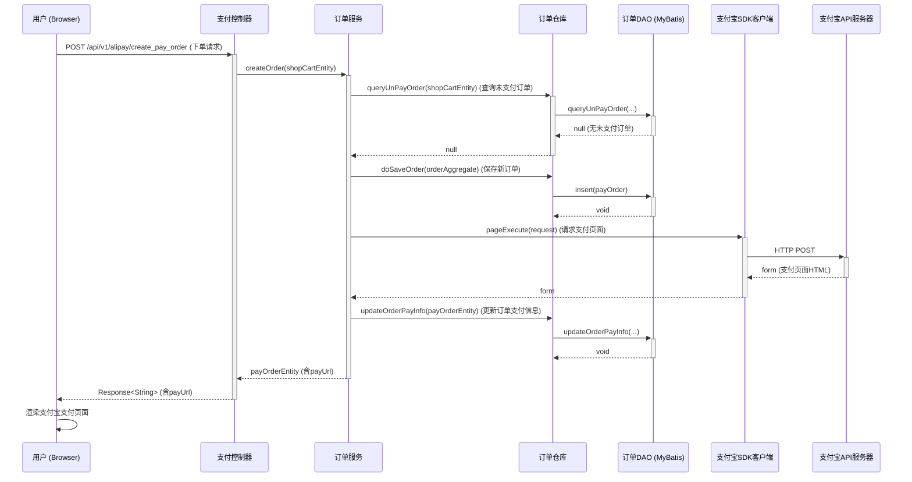
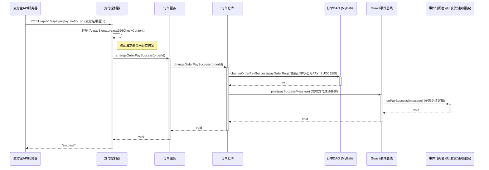

# 支付宝支付流程

本文档详细描述了用户在微信登录后，使用支付宝进行商品支付的完整技术流程。整个过程分为两大核心部分：**创建支付订单** 和 **接收异步回调**。

## 1. 创建支付订单 (Create Pay Order)

这是用户点击“立即下单”后，系统生成支付宝支付页面并返回给前端的同步流程。

### 时序图 (Sequence Diagram)

### 逻辑解释

1.  **用户请求**：用户在前端点击下单按钮，浏览器携带登录后获取的 `token`（在此场景下为 `userId`）和商品 `productId`，向 `AliPayController` 的 `create_pay_order` 接口发起 POST 请求。
2.  **服务编排**：`OrderService` 作为核心领域服务，开始编排整个下单流程。
3.  **幂等性检查**：服务首先调用 `OrderRepository` 查询该用户对同一商品是否存在状态为 `PAY_WAIT`（等待支付）的订单。这是一个非常重要的**幂等性**设计，可以防止用户因网络抖动等原因重复点击，从而创建多个重复订单。如果存在，则直接返回已有的支付链接。
4.  **创建订单**：如果不存在未支付订单，`OrderRepository` 会通过 `IOrderDao` 在数据库中插入一条新的订单记录，初始状态为 `CREATE`。
5.  **预支付处理**：`OrderService` 调用 `AlipayClient`（支付宝官方SDK）的 `pageExecute` 方法。SDK会组装好所有必要的参数（如订单号 `out_trade_no`、金额 `total_amount`、回调地址 `notify_url` 等），并向支付宝API服务器发起请求。
6.  **获取支付凭证**：支付宝API服务器返回一个包含自动提交表单的完整HTML页面。这个HTML就是唤起支付宝收银台的关键。
7.  **更新订单状态**：`OrderService` 将返回的支付页面HTML（`payUrl`）和 `PAY_WAIT` 状态更新到数据库中的订单记录。
8.  **返回前端**：`AliPayController` 将包含支付页面HTML的 `payUrl` 返回给前端。前端可以直接将这段HTML渲染到页面上，或者在新窗口中打开，从而引导用户进入支付宝支付流程。

## 2. 接收异步回调 (Receive Asynchronous Notification)

用户完成支付后，支付宝服务器会主动向我们在创建订单时提供的 `notify_url` 发送一个POST请求，通知我们支付结果。这是一个异步流程。

### 时序图 (Sequence Diagram)

### 逻辑解释

1.  **支付宝通知**：用户支付成功后，支付宝服务器向 `alipay_notify_url` 发送异步通知。
2.  **安全验签**：`AliPayController` 收到通知后，做的第一件也是最重要的一件事就是**验签**。它使用预先配置的支付宝公钥，调用 `AlipaySignature.rsa256CheckContent` 方法来验证请求的合法性，确保该请求确实是支付宝官方发出的，而不是伪造的。
3.  **状态检查**：控制器还会检查 `trade_status` 参数是否为 `TRADE_SUCCESS`，只有支付成功的通知才需要处理。
4.  **更新订单**：验签通过后，调用 `OrderService` 的 `changeOrderPaySuccess` 方法。
5.  **持久化状态**：`OrderRepository` 通过 `IOrderDao` 将数据库中对应订单的状态更新为 `PAY_SUCCESS`。
6.  **发布领域事件**：这是设计的亮点。订单状态更新后，`OrderRepository` 并不直接调用其他业务服务（如发货、发送通知等），而是构建一个 `PaySuccessMessage` 事件，并通过 `EventBus` (Guava EventBus) **发布**出去。
7.  **解耦的后续处理**：系统中任何关心“支付成功”这一事件的模块（`Subscriber`），都可以订阅这个事件。当事件发布时，`EventBus` 会自动通知所有订阅者。这样，支付流程与后续的发货、增加积分、发送短信/邮件通知等业务完全解耦，极大地提高了系统的可维护性和扩展性。
8.  **响应支付宝**：处理完所有逻辑后，必须向支付宝返回字符串 `"success"`。如果返回其他任何字符串或不返回，支付宝会认为通知失败，并会在接下来24小时内按照一定的策略重试发送通知，这会造成不必要的重复处理。
