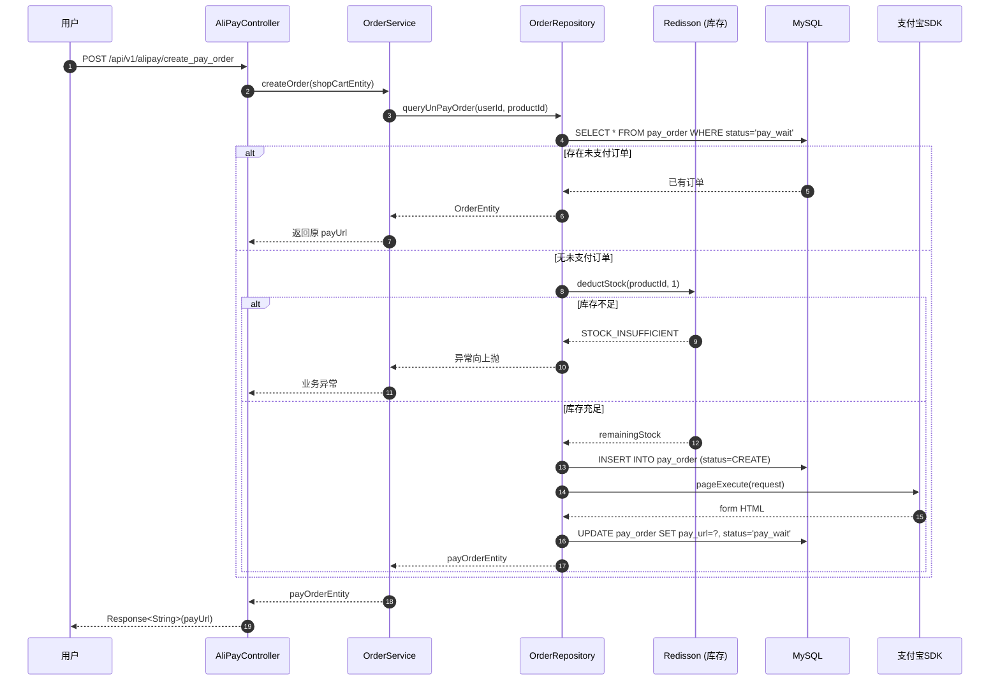
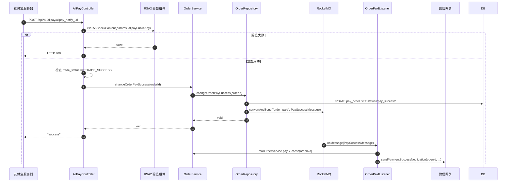

# 支付宝支付流程（V2.0）

> **领域上下文**：Order Context  
> **演进说明**：V1.0 使用 Guava EventBus（进程内同步）→ V2.0 使用 RocketMQ（分布式异步）

---

## 一、流程总览

支付流程分为两大阶段：

| 阶段 | 同步/异步 | 核心职责 |
|------|----------|----------|
| 创建支付订单 | 同步 | 幂等检查、库存预扣、获取支付链接 |
| 接收异步回调 | 异步 | RSA2 验签、状态更新、MQ 消息投递 |

---

## 二、创建支付订单

---

## 三、接收异步回调

---

## 四、演进对比

| 维度 | V1.0 (EventBus) | V2.0 (RocketMQ) |
|------|-----------------|-----------------|
| **消息范围** | 进程内 | 跨服务/跨机房 |
| **消息持久化** | 内存，重启丢失 | 磁盘持久化 |
| **重试机制** | 无 | 最多 16 次 |
| **延时消息** | 不支持 | 支持（18个级别） |
| **吞吐量** | 有限 | 10w+ QPS |
| **解耦程度** | 进程内解耦 | 完全解耦 |

---

## 五、技术亮点与面试高频考点

| 考点 | 标准答案 |
|------|----------|
| **幂等性** | 三层防御：业务层查询未支付订单 + 数据库唯一索引 + MQ SETNX 幂等键 |
| **验签必要性** | 防止伪造回调攻击，保证支付状态变更的真实性 |
| **MQ 解耦价值** | 主链路快速响应，后置业务（发货、通知）故障不影响支付成功 |
| **回 "success"** | 不返回会触发支付宝 24h 内 7 次重试，必须保证处理幂等 |
| **库存预扣** | Redis RAtomicLong 原子操作 + 双检查防超卖 |

---

> **详细架构请参考**：[module-order-pay.md](module-order-pay.md)
