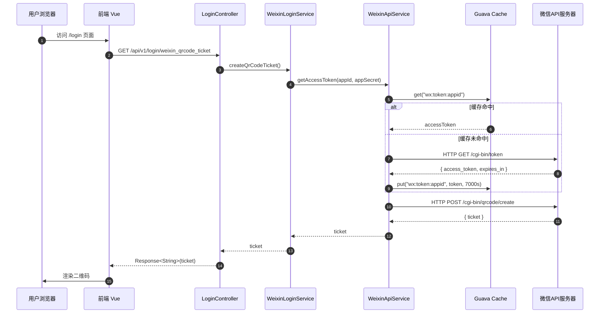
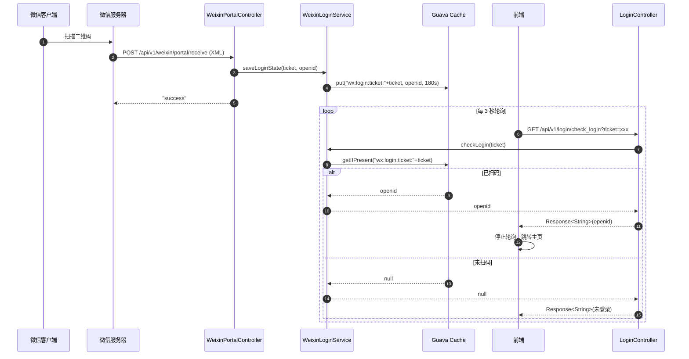

# 微信扫码登录流程（V2.0）

> **领域上下文**：Auth Context  
> **演进说明**：架构保持稳定，新增"技术亮点与面试高频考点"章节

---

## 一、流程总览

登录流程分为两大阶段：

| 阶段 | 同步/异步 | 核心职责 |
|------|----------|----------|
| 获取登录二维码 | 同步 | AccessToken 缓存、生成 ticket |
| 扫码回调与轮询 | 异步 | 微信回调处理、前端轮询检测 |

---

## 二、获取登录二维码

---

## 三、扫码回调与轮询

---

## 四、凭证时效控制

| 凭证 | 存储位置 | TTL | 说明 |
|------|----------|-----|------|
| accessToken | Guava Cache | 7000s | 提前于官方 7200s 过期 |
| ticket | 微信服务器 | 1800s | 微信侧强制 |
| ticket→openid | Guava Cache | 180s | 防止轮询无限重试 |

---

## 五、技术亮点与面试高频考点

| 考点 | 标准答案 |
|------|----------|
| **AccessToken 缓存** | 微信 API 有频率限制（2000次/分），缓存可显著降低 RT 与限流风险 |
| **轮询 vs 长连接** | 短时一次性交互，3s 轮询实现简单、容错高；大规模场景可升级 SSE |
| **OpenID vs UnionID** | OpenID 是某公众号下的唯一标识；UnionID 是开放平台下跨应用统一标识 |
| **安全性** | ticket→openid 仅存于服务端缓存，前端只见 ticket；短 TTL 降低重放窗口 |
| **解耦设计** | 微信回调是被动事件，轮询是主动探查，二者解耦保证系统稳定 |

---

> **详细架构请参考**：[module-auth.md](module-auth.md)
