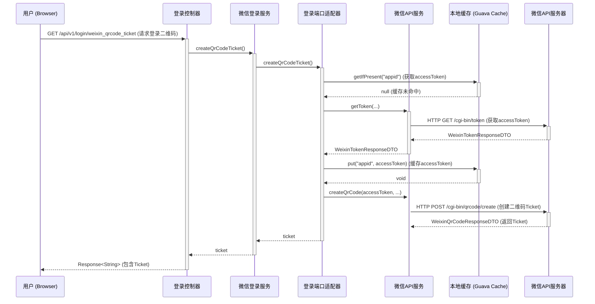
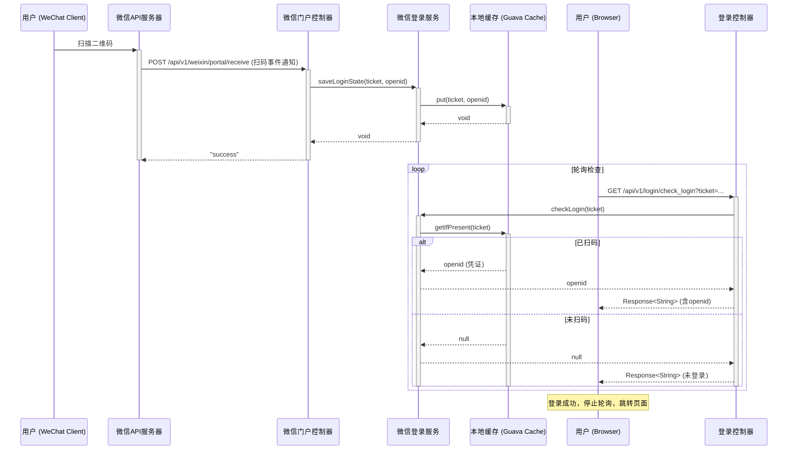

# 微信扫码登录流程

本文档详细拆解了项目中的微信扫码登录功能，该功能涉及前端、后端与微信服务器之间的多次交互。整个流程分为两大核心部分：**获取登录二维码** 和 **接收扫码回调与轮询检查**。

## 1. 获取登录二维码 (Get Login QR Code)

这是用户进入登录页后，前端向后端请求一个用于微信扫码的动态二维码的流程。

### 时序图 (Sequence Diagram)

### 逻辑解释

1.  **触发层 (Trigger)**: 用户浏览器向 `LoginController` 发起请求，希望获取一个用于微信登录的二维码。
2.  **应用服务层 (Application/Domain Service)**: `LoginController` 调用 `WeixinLoginService` 的 `createQrCodeTicket` 方法，由领域服务负责核心逻辑的编排。
3.  **领域与基础设施 (Domain & Infrastructure)**:
    *   `WeixinLoginService` 通过 `ILoginPort` 端口调用外部依赖。
    *   `LoginPort` 作为适配器，首先检查本地缓存 `Cache` (Guava Cache) 中是否存在有效的 `accessToken`。
    *   如果缓存未命中，则通过 `WeixinApiService` (Retrofit客户端) 向微信API服务器请求最新的 `accessToken`，并将其存入缓存。
    *   使用获取到的 `accessToken`，再次调用微信API创建带场景值的二维码，并获得 `ticket`。
4.  **返回结果**: `ticket` 最终被包装成标准响应格式返回给前端。前端页面拿到 `ticket` 后，就可以通过微信提供的地址 `https://mp.weixin.qq.com/cgi-bin/showqrcode?ticket=TICKET` 来生成并展示二维码。

## 2. 接收扫码回调与轮询检查 (Receive Scan Callback & Polling Check)

用户使用微信扫描二维码后，会触发微信服务器的回调，同时前端页面会通过轮询机制来检查用户是否已完成扫码授权。

### 时序图 (Sequence Diagram)

### 逻辑解释

1.  **微信回调**: 用户用微信客户端扫描二维码后，微信服务器会向我们预设的 `WeixinPortalController` 推送一个XML格式的事件通知。
2.  **保存登录态**: `WeixinPortalController` 解析通知，获取到用户的 `openid` 和二维码的 `ticket`。随后调用 `WeixinLoginService` 的 `saveLoginState` 方法，将 `ticket` 作为 key，`openid` 作为 value，存入本地缓存 `Cache` 中。这相当于一个临时的登录凭证。
3.  **前端轮询**: 与此同时，前端页面正以固定的频率（例如每3秒）调用 `LoginController` 的 `check_login` 接口，并带上之前获取的 `ticket`。
4.  **检查状态**: `LoginController` 调用 `WeixinLoginService`，后者直接从缓存中根据 `ticket` 查询是否存在对应的 `openid`。
5.  **登录成功**: 一旦用户扫码，缓存中就会有数据。`check_login` 接口将查询到的 `openid`（作为登录 `token`）返回给前端。前端接收到 `token` 后，即判定为登录成功，便会停止轮询，保存 `token`，并跳转到业务主页。