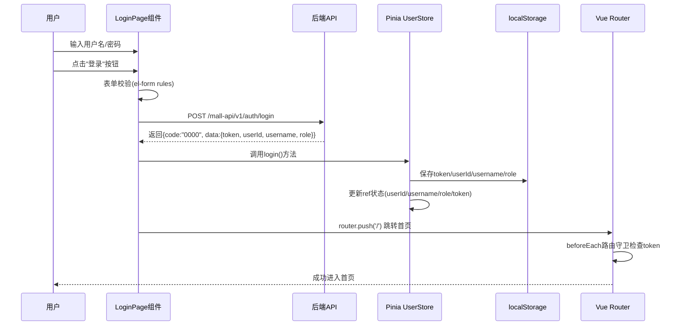
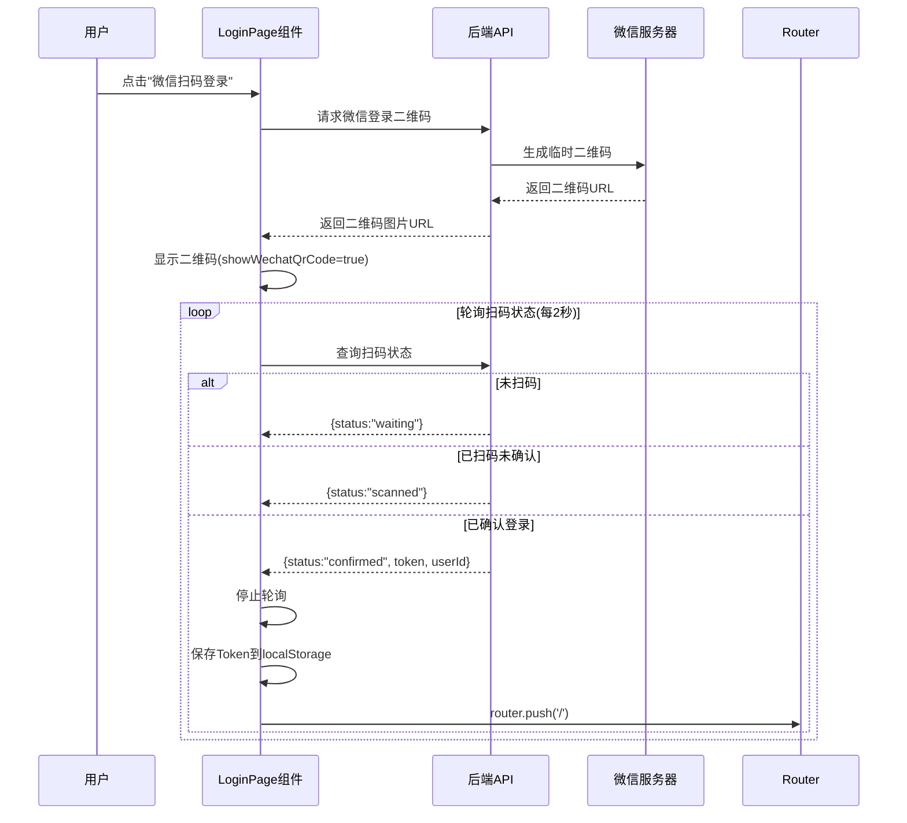
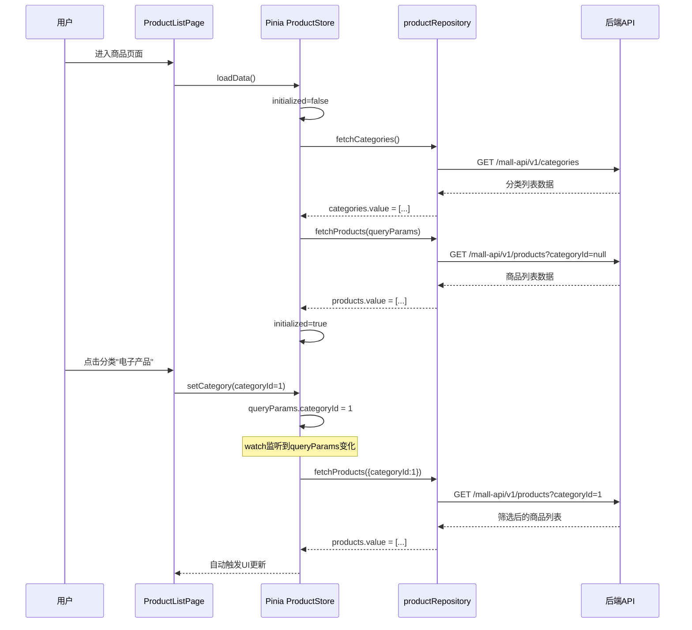
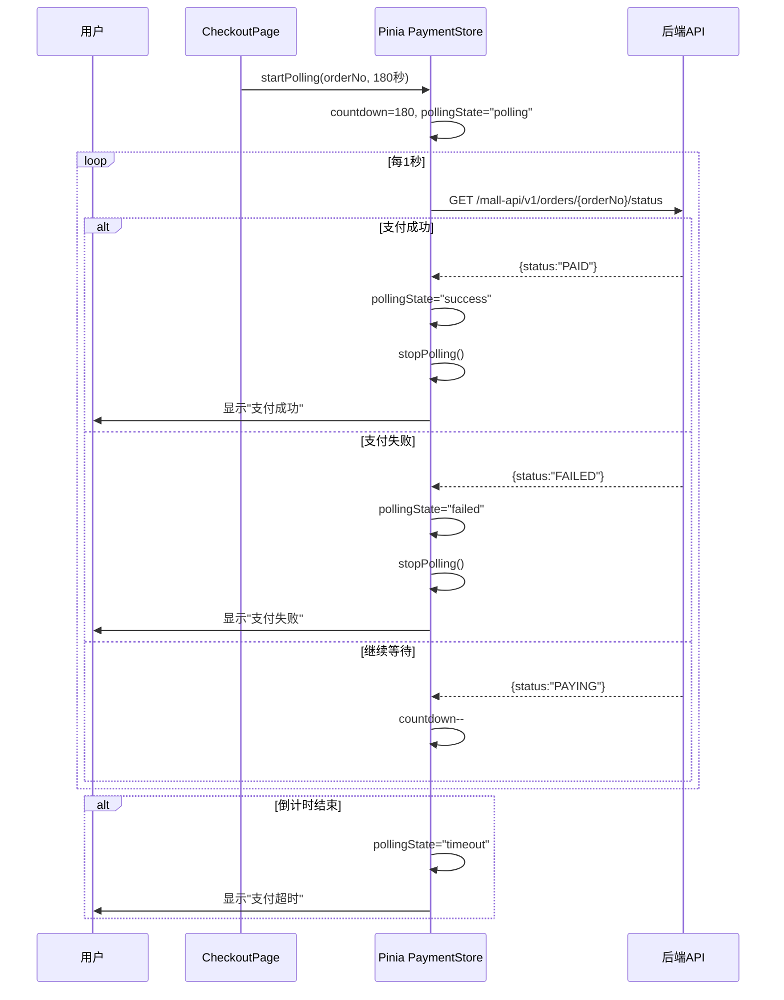
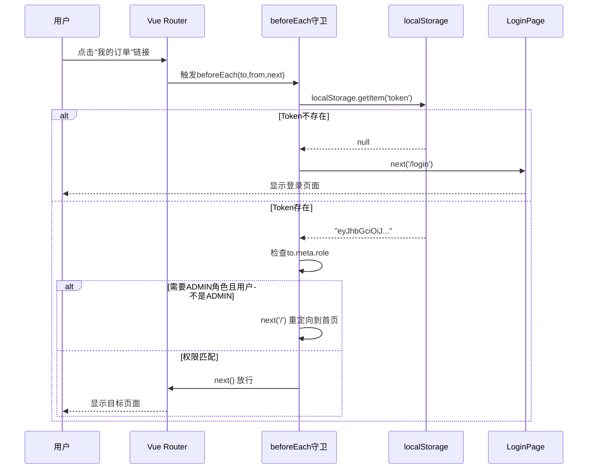
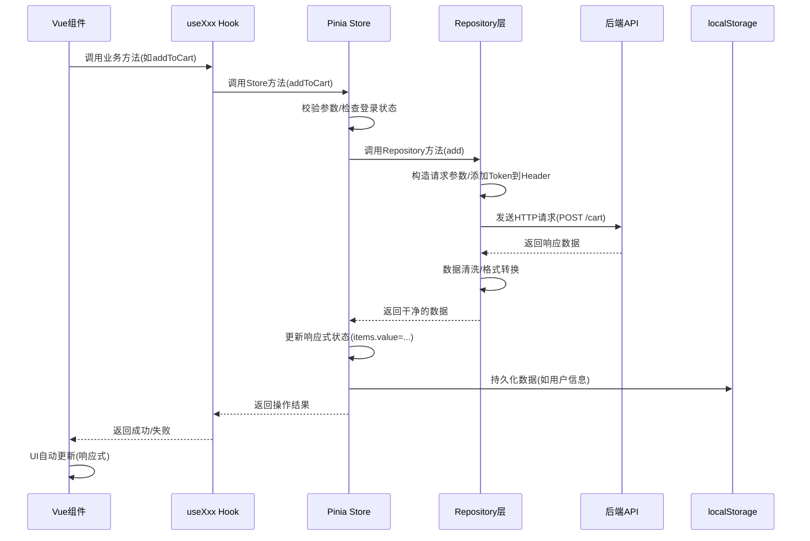

# S-Pay Mall 前端技术答辩报告

> **答辩人**：傅崇睿
> **技术栈**：Vue3 + TypeScript + Element Plus + Pinia + Vite
> **架构模式**：DDD领域驱动设计 + 分层架构

---

## 模块一：登录鉴权（微信扫码登录流程）

### 领域上下文
管理用户身份认证，支持用户名密码登录和微信扫码登录两种方式，维护全局登录状态。

### 核心场景
用户选择登录方式 → 完成身份验证 → 获取Token → 进入系统。

### 依赖关系
- **API接口**：`POST /mall-api/v1/auth/login`（密码登录）、微信登录二维码接口、扫码状态轮询接口
- **Pinia Store**：`useUserStore`（用户状态管理）
- **Element Plus组件**：`<el-form>`（表单）、`<el-button>`（按钮）、`<el-icon>`（图标）

---

### 一、模块定位

LoginPage.vue 负责处理两种登录方式的前端交互逻辑。用户名密码登录通过表单提交实现，微信扫码登录通过显示二维码并轮询扫码状态实现。登录成功后，Token和用户信息存储到Pinia Store和localStorage，供全局使用。

---

### 二、核心流程时序图

#### 用户名密码登录流程



#### 微信扫码登录流程



---

### 三、关键设计点

#### 1. 为什么用Pinia而不是直接在组件里请求？

**答案**：
- **状态共享**：用户信息（userId、username、role、token）需要在多个组件中使用（如导航栏显示用户名、权限判断），Pinia提供全局响应式状态，避免组件间prop drilling。
- **持久化**：登录信息需要持久化到localStorage，Pinia Store统一管理状态和持久化逻辑，组件无需关心存储细节。
- **解耦**：组件只负责UI交互，状态管理交给Store，符合单一职责原则。

#### 2. 为什么微信登录要用轮询而不是WebSocket？

**答案**：
- **简单可靠**：轮询实现简单，无需建立长连接，避免了WebSocket的连接管理复杂度（心跳、重连、断线处理）。
- **兼容性好**：HTTP请求兼容所有浏览器和网络环境，不受防火墙限制。
- **频率可控**：2秒轮询一次，对服务器压力小，用户体验足够（扫码场景低频）。
- **后端简单**：后端只需提供查询接口，无需维护WebSocket连接状态。

#### 3. 为什么用localStorage而不是Cookie存储Token？

**答案**：
- **前端控制**：localStorage完全由前端JavaScript控制，方便读取和清除，Cookie需要后端配合设置HttpOnly标志。
- **跨域友好**：本项目前后端分离，localStorage不受跨域Cookie限制。
- **简化逻辑**：Token不需要自动携带到每个请求，在axios拦截器中手动添加到Header更灵活。

#### 4. 为什么登录成功后要立即跳转而不是让用户自己导航？

**答案**：
- **用户体验**：登录是阻塞性操作，用户期望登录后立即进入系统，不跳转会留在登录页造成困惑。
- **路由守卫**：跳转触发路由守卫，确保Token正确存储后才能进入受保护页面。

---

### 四、关键代码定位表

| 文件路径 | 关键函数/变量 | 作用说明 |
|---------|------------|--------|
| [src/views/LoginPage.vue](file:///Users/xiaolv/Develop/projects/backend/java/s-pay-mall/s-pay-mall-front/src/views/LoginPage.vue#L90-L114) | `handleLogin()` | 处理用户名密码登录，调用API并保存Token |
| [src/views/LoginPage.vue](file:///Users/xiaolv/Develop/projects/backend/java/s-pay-mall/s-pay-mall-front/src/views/LoginPage.vue#L139-L155) | `toggleWechatLogin()` | 切换微信登录二维码显示，触发二维码生成 |
| [src/stores/user.ts](file:///Users/xiaolv/Develop/projects/backend/java/s-pay-mall/s-pay-mall-front/src/stores/user.ts#L42-L55) | `login()` | Pinia action，保存用户信息到状态和localStorage |
| [src/stores/user.ts](file:///Users/xiaolv/Develop/projects/backend/java/s-pay-mall/s-pay-mall-front/src/stores/user.ts#L57-L65) | `logout()` | 清除用户状态和localStorage |
| [src/router/index.ts](file:///Users/xiaolv/Develop/projects/backend/java/s-pay-mall/s-pay-mall-front/src/router/index.ts#L61-L81) | `router.beforeEach()` | 全局路由守卫，检查Token和角色权限 |

---

### 五、答辩高频考点

**Q1：为什么登录成功后要存Token到localStorage？**

**A：** Token是后端颁发的身份凭证，后续所有API请求都需要携带。存localStorage实现跨页面持久化，用户刷新页面或重新打开浏览器仍保持登录状态。

**Q2：微信扫码登录的轮询是怎么实现的？为什么不用WebSocket？**

**A：** 使用setInterval每2秒调用一次状态查询接口。不用WebSocket因为轮询实现简单、兼容性好，扫码场景频率低（2秒一次），对服务器压力小，无需维护长连接。

**Q3：如果用户关闭二维码弹窗，轮询会继续吗？怎么停止？**

**A：** 会继续。需要在关闭弹窗时调用clearInterval停止轮询，否则会浪费资源。代码中通过watch监听showWechatQrCode变化，false时停止轮询。

**Q4：路由守卫是怎么工作的？没有Token会怎么样？**

**A：** router.beforeEach在每次导航前检查目标路由的meta.requiresAuth，如果需要认证但localStorage中没有token，就重定向到/login页面，阻止未授权访问。

**Q5：管理员权限是怎么控制的？**

**A：** 路由配置中给/admin路径设置meta.role='ADMIN'，守卫中检查localStorage的role字段，如果不匹配就重定向到首页，防止普通用户访问管理后台。

---

## 模块二：商品列表与分类（Pinia缓存策略）

### 领域上下文
展示商品列表，支持按分类筛选和关键词搜索，管理商品数据和分类数据的全局状态。

### 核心场景
用户进入商品页面 → 加载分类列表 → 加载商品列表 → 切换分类筛选商品。

### 依赖关系
- **API接口**：`GET /mall-api/v1/products`（商品列表）、`GET /mall-api/v1/categories`（分类列表）
- **Pinia Store**：`useProductStore`（商品状态管理）
- **自定义Hook**：`useProduct`（封装Store调用）
- **Element Plus组件**：`<el-menu>`（分类菜单）、`<el-card>`（商品卡片）、`<el-input>`（搜索框）

---

### 一、模块定位

ProductListPage.vue负责商品展示和分类筛选的UI渲染。useProductStore管理商品和分类数据，通过watch监听查询参数变化自动重新加载商品列表，initialized标志避免重复加载分类。useProduct Hook封装Store调用，提供给组件简洁的接口。

---

### 二、核心流程时序图

#### 商品列表加载与筛选流程



---

### 三、关键设计点

#### 1. 为什么用watch监听queryParams而不是手动调用loadProducts？

**答案**：
- **自动响应**：用户修改queryParams的任何字段（categoryId、keyword、priceRange），watch自动触发loadProducts，无需在每个setter方法里重复调用。
- **解耦UI和逻辑**：组件只需调用setCategory，不需要关心"设置参数后要重新加载"，Store内部自动响应。
- **减少错误**：避免忘记调用loadProducts导致UI与数据不一致。

#### 2. 为什么要有initialized标志？

**答案**：
- **避免重复加载**：loadData被调用多次时（如组件重新挂载），initialized=true会跳过loadProducts，只重新加载分类（因为分类可能新增）。
- **区分首次加载和筛选**：首次加载由loadData触发，后续筛选由watch触发，避免watch和loadData同时请求造成竞态条件。

#### 3. 为什么分类每次都重新加载，商品要判断initialized？

**答案**：
- **分类数据变化频率低**：分类列表相对固定，但管理员可能随时新增分类，每次进入页面都重新加载保证数据最新。
- **商品数据筛选频繁**：商品通过queryParams筛选，watch已经覆盖了所有筛选场景，initialized避免重复加载默认商品列表。

#### 4. 为什么用Repository层而不是直接在Store里调axios？

**答案**：
- **DDD分层架构**：Store是应用层/领域层，只管理状态；Repository是基础设施层，负责HTTP请求和数据清洗。符合依赖倒置原则。
- **职责分离**：Store关心"什么时候加载"，Repository关心"怎么加载"，代码更清晰。
- **可测试性**：Repository可以轻松mock，Store测试时无需真实HTTP请求。

#### 5. 为什么useProduct Hook要封装Store？

**答案**：
- **简化组件调用**：组件通过Hook获得解构后的products、loadData等方法，不需要直接import Store。
- **逻辑复用**：多个组件可以使用同一个Hook，共享Store实例。
- **未来扩展**：Hook可以添加额外逻辑（如防抖、错误边界），不影响Store。

---

### 四、关键代码定位表

| 文件路径 | 关键函数/变量 | 作用说明 |
|---------|------------|--------|
| [src/views/ProductListPage.vue](file:///Users/xiaolv/Develop/projects/backend/java/s-pay-mall/s-pay-mall-front/src/views/ProductListPage.vue#L12-L17) | `handleCategoryChange()` | 分类切换事件处理，调用setCategory更新查询参数 |
| [src/stores/product.ts](file:///Users/xiaolv/Develop/projects/backend/java/s-pay-mall/s-pay-mall-front/src/stores/product.ts#L66-L75) | `loadData()` | 加载分类和商品数据，通过initialized标志避免重复加载 |
| [src/stores/product.ts](file:///Users/xiaolv/Develop/projects/backend/java/s-pay-mall/s-pay-mall-front/src/stores/product.ts#L77-L82) | `setCategory()` | 设置分类ID，触发watch重新加载商品 |
| [src/stores/product.ts](file:///Users/xiaolv/Develop/projects/backend/java/s-pay-mall/s-pay-mall-front/src/stores/product.ts#L116-L119) | `watch(queryParams)` | 监听查询参数变化，自动调用loadProducts |
| [src/hooks/useProduct.ts](file:///Users/xiaolv/Develop/projects/backend/java/s-pay-mall/s-pay-mall-front/src/hooks/useProduct.ts#L1-L20) | `useProduct()` | 封装Store调用，返回products、categories等状态 |

---

### 五、答辩高频考点

**Q1：Pinia缓存是怎么实现的？数据会过期吗？**

**A：** Pinia本身不提供缓存过期机制，数据存在内存中，刷新页面会丢失。如需持久化可以用pinia-plugin-persistedstate插件。本项目分类和商品数据每次进入页面都重新加载，保证最新。

**Q2：如果用户快速切换分类，会发多个请求吗？怎么处理？**

**A：** 会发多个请求，最后一次请求的结果会覆盖前面的。可以使用防抖（debounce）延迟请求，或用AbortController取消前一个请求。本项目请求频率不高，直接用watch触发。

**Q3：为什么商品列表用ref数组而不是reactive对象？**

**A：** ref适合基本类型和需要整体替换的数组/对象。商品列表会整体替换（products.value = [...newData]），用ref更直观。reactive适合需要深度响应的对象。

**Q4：Repository层的数据清洗是什么意思？**

**A：** 后端返回的数据字段名可能不符合前端规范（如user_name转userName），或需要格式化（如时间戳转日期字符串），Repository负责这些转换，Store只接收干净的数据。

**Q5：如果分类加载失败，商品还能显示吗？**

**A：** 能显示。loadCategories有try-catch包裹，失败后categories.value=[]，不影响loadProducts执行。分类菜单为空，但商品列表正常显示（只是无法筛选）。

---

## 模块三：订单创建与支付（支付宝支付跳转逻辑）

### 领域上下文
用户确认订单信息，提交订单并完成支付，支持支付宝沙箱支付，通过轮询查询支付状态。

### 核心场景
用户确认收货地址 → 提交订单 → 跳转支付宝支付页 → 完成支付 → 回到订单列表。

### 依赖关系
- **API接口**：`POST /mall-api/v1/orders`（创建订单）、`GET /mall-api/v1/orders/{orderNo}/status`（查询支付状态）
- **Pinia Store**：`useOrderStore`（订单状态）、`usePaymentStore`（支付状态）
- **自定义Hook**：`useOrder`（订单逻辑）、`usePayment`（支付逻辑）
- **Element Plus组件**：`<el-card>`（订单卡片）、`<el-table>`（商品清单）、`<el-button>`（提交按钮）

---

### 一、模块定位

CheckoutPage.vue负责订单确认页面的UI渲染，包括收货地址输入、商品清单展示、订单金额汇总。usePayment Hook管理支付状态（轮询、倒计时、错误处理），PaymentSubmitter组件负责自动提交支付宝返回的支付表单HTML，实现跳转到支付宝沙箱支付页面。

---

### 二、核心流程时序图

#### 订单创建与支付跳转流程

```mermaid
sequenceDiagram
    participant User as 用户
    participant Checkout as CheckoutPage
    participant OrderStore as Pinia OrderStore
    participant OrderRepo as orderRepository
    participant Backend as 后端API
    participant PaySubmitter as PaymentSubmitter组件
    participant Alipay as 支付宝沙箱

    User->>Checkout: 输入收货地址
    User->>Checkout: 点击"提交订单"
    Checkout->>Checkout: 校验地址非空
    Checkout->>OrderStore: createNewOrder(address)
    OrderStore->>OrderRepo: create(address)
    OrderRepo->>Backend: POST /mall-api/v1/orders
    Backend-->>OrderRepo: {orderNo, payHtml: "<form>...</form>"}
    OrderRepo-->>OrderStore: 返回payHtml
    OrderStore-->>Checkout: payUrl="<form>...</form>"
    
    Checkout->>PaySubmitter: payHtml="<form>...</form>"
    PaySubmitter->>PaySubmitter: 解析HTML，提取<form>元素
    PaySubmitter->>Alipay: 自动提交表单(form.submit())
    Alipay->>User: 显示支付宝沙箱支付页面
    
    User->>Alipay: 扫码/登录并支付
    Alipay->>Backend: 异步通知支付结果
    
    User->>Checkout: 点击"返回商家"
    Note over Checkout: 用户手动返回，或轮询查询支付状态
```



#### 支付状态轮询流程



---

### 三、关键设计点

#### 1. 为什么用PaymentSubmitter组件自动提交表单，而不是直接跳转URL？

**答案**：
- **支付宝要求**：支付宝沙箱支付接口返回的是HTML表单（包含hidden字段和自动提交脚本），需要渲染到页面并调用form.submit()才能正确跳转，普通URL跳转会丢失参数。
- **解耦DOM操作**：usePayment Hook只管理支付状态，PaymentSubmitter组件专门处理表单渲染和提交，符合单一职责原则。
- **错误处理**：组件可以校验表单HTML格式，如果缺少<form>标签就报错，避免无效跳转。

#### 2. 为什么用轮询而不是等待后端主动通知？

**答案**：
- **前端无法接收WebSocket**：前端无法监听后端的WebSocket推送（需要额外配置），轮询更简单。
- **支付宝异步通知是后端接收**：支付宝的支付结果通知（notify_url）是发送给后端的，前端无法直接接收。
- **实现成本低**：轮询每秒查询一次订单状态，代码简单，无需建立长连接。

#### 3. 为什么轮询要有倒计时（180秒）？

**答案**：
- **防止无限轮询**：如果用户一直不支付，轮询会永远进行下去，浪费服务器资源和浏览器性能。
- **用户体验**：180秒（3分钟）足够完成支付，超时后提示用户重新下单或联系客服。
- **资源释放**：倒计时结束停止轮询，释放定时器资源，组件卸载时也会清理。

#### 4. 为什么订单创建成功后不直接跳转，而是在当前页等待支付结果？

**答案**：
- **保持用户在线**：跳转到支付宝页面后，用户在支付宝完成支付会自动跳回商家页面，如果当前页已关闭，无法显示支付结果。
- **状态同步**：当前页保持打开，轮询可以实时获取支付状态，用户无需手动刷新。
- **用户体验**：支付成功后可以立即显示"支付成功"提示，并自动跳转到订单详情或订单列表。

#### 5. 为什么用usePayment Hook而不是直接在组件里管理支付状态？

**答案**：
- **逻辑复用**：支付逻辑（轮询、倒计时、状态管理）可能在多个页面使用（如订单详情页继续支付），封装成Hook避免重复代码。
- **关注点分离**：CheckoutPage组件关心UI渲染，usePayment Hook关心支付业务逻辑，代码更清晰。
- **易于测试**：Hook可以独立测试，无需渲染组件。

---

### 四、关键代码定位表

| 文件路径 | 关键函数/变量 | 作用说明 |
|---------|------------|--------|
| [src/views/CheckoutPage.vue](file:///Users/xiaolv/Develop/projects/backend/java/s-pay-mall/s-pay-mall-front/src/views/CheckoutPage.vue#L48-L68) | `submitOrder()` | 提交订单，调用createNewOrder并启动支付轮询 |
| [src/components/PaymentSubmitter.vue](file:///Users/xiaolv/Develop/projects/backend/java/s-pay-mall/s-pay-mall-front/src/components/PaymentSubmitter.vue#L55-L86) | `submitPaymentForm()` | 解析支付表单HTML，自动提交到支付宝 |
| [src/stores/order.ts](file:///Users/xiaolv/Develop/projects/backend/java/s-pay-mall/s-pay-mall-front/src/stores/order.ts#L74-L92) | `createNewOrder()` | 创建订单，返回支付表单HTML |
| [src/hooks/usePayment.ts](file:///Users/xiaolv/Develop/projects/backend/java/s-pay-mall/s-pay-mall-front/src/hooks/usePayment.ts#L28-L42) | `startPolling()` | 启动支付状态轮询，每秒查询订单状态 |
| [src/hooks/usePayment.ts](file:///Users/xiaolv/Develop/projects/backend/java/s-pay-mall/s-pay-mall-front/src/hooks/usePayment.ts#L44-L47) | `stopPolling()` | 停止轮询，清理定时器 |

---

### 五、答辩高频考点

**Q1：支付宝返回的payHtml是什么格式？为什么要用表单提交？**

**A：** payHtml是一个包含<form>标签的HTML字符串，里面有支付宝接口需要的参数（如partner、out_trade_no、sign等）和自动提交脚本。普通URL跳转会丢失这些参数，必须渲染表单并调用submit()才能正确跳转到支付宝页面。

**Q2：用户支付成功后，前端怎么知道的？**

**A：** 前端通过轮询查询订单状态接口（GET /mall-api/v1/orders/{orderNo}/status），每秒调用一次，后端返回status字段（PAYING/PAID/FAILED），前端根据状态显示对应提示。

**Q3：如果用户关闭页面，轮询会继续吗？怎么清理？**

**A：** 不会。组件卸载时（onUnmounted）会调用stopPolling清理定时器。如果用户关闭浏览器标签页，定时器会被浏览器自动清理。

**Q4：为什么用orderRepository而不是直接在Store里发axios请求？**

**A：** 符合DDD分层架构，Store是应用层/领域层，Repository是基础设施层。Store关心业务逻辑（创建订单、处理支付），Repository关心HTTP请求细节（请求参数、错误处理），职责分离，代码更易维护。

**Q5：支付失败或超时后，用户可以重试吗？**

**A：** 可以。支付失败或超时后，页面会显示"重试"按钮，点击后调用resetPayment()清空支付状态，用户可以重新提交订单或选择其他支付方式。

---

## 模块四：路由守卫与权限控制（Token管理）

### 领域上下文
管理前端路由访问权限，控制页面访问安全性，维护全局Token状态。

### 核心场景
用户访问受保护页面 → 路由守卫检查Token → 未登录重定向到登录页 → 已登录允许访问。

### 依赖关系
- **Vue Router**：`router.beforeEach`（全局路由守卫）
- **localStorage**：存储token、role等用户信息
- **路由配置**：meta.requiresAuth（是否需要认证）、meta.role（所需角色）

---

### 一、模块定位

router/index.ts定义前端路由配置和全局路由守卫。路由守卫在每次导航前检查目标路由的meta字段，如果requiresAuth为true但localStorage中没有token，就重定向到/login页面。管理员路由还需要检查role字段，确保只有ADMIN角色才能访问。

---

### 二、核心流程时序图

#### 路由守卫工作流程



---

### 三、关键设计点

#### 1. 为什么用meta字段而不是硬编码路径判断？

**答案**：
- **灵活扩展**：meta可以定义任意字段（requiresAuth、role、title等），新增权限字段无需修改守卫逻辑，只需在路由配置中添加meta。
- **集中管理**：路由配置中清晰标记每个路由的权限要求，方便维护和查看。
- **代码清晰**：守卫中通过to.meta.requiresAuth判断，语义明确，比硬编码路径（如if (to.path === '/admin')）更易读。

#### 2. 为什么Token存localStorage而不是Vuex/Pinia？

**答案**：
- **持久化需求**：Token需要跨页面刷新保持，Vuex/Pinia的状态存在内存中，刷新页面会丢失。
- **路由守卫访问**：beforeEach守卫执行时Vue实例可能未完全初始化，Pinia Store可能未准备好，localStorage同步API可直接访问。
- **简单可靠**：localStorage是浏览器原生API，无需额外配置，兼容性好。

#### 3. 为什么登出时要清除localStorage而不是只清除Pinia状态？

**答案**：
- **完全清除**：登出需要完全清除用户身份信息，包括持久化的Token，否则下次打开浏览器仍会认为已登录。
- **安全考虑**：Token是敏感信息，登出后应立即清除，避免被恶意脚本读取。
- **状态一致**：Pinia状态和localStorage应保持同步，只清除一个会导致不一致。

#### 4. 为什么白名单路径（/login、/register）不检查Token？

**答案**：
- **避免死循环**：如果/login页面也检查Token，未登录用户会被重定向到/login，形成死循环。
- **用户体验**：登录和注册页面本身就是公开页面，任何用户都应能访问，无需Token。

#### 5. 为什么管理员权限检查要在守卫里而不是页面里？

**答案**：
- **提前拦截**：守卫在路由导航前拦截，用户根本无法进入页面，体验更好。
- **集中权限逻辑**：所有权限检查集中在守卫中，避免每个页面重复编写权限判断代码。
- **安全性**：即使页面组件内部有权限判断，用户也可能通过浏览器地址栏绕过，守卫提供更底层的保护。

---

### 四、关键代码定位表

| 文件路径 | 关键函数/变量 | 作用说明 |
|---------|------------|--------|
| [src/router/index.ts](file:///Users/xiaolv/Develop/projects/backend/java/s-pay-mall/s-pay-mall-front/src/router/index.ts#L18-L46) | `routes` | 路由配置，定义meta.requiresAuth和meta.role |
| [src/router/index.ts](file:///Users/xiaolv/Develop/projects/backend/java/s-pay-mall/s-pay-mall-front/src/router/index.ts#L61-L81) | `router.beforeEach()` | 全局路由守卫，检查Token和角色权限 |
| [src/stores/user.ts](file:///Users/xiaolv/Develop/projects/backend/java/s-pay-mall/s-pay-mall-front/src/stores/user.ts#L42-L55) | `login()` | 保存Token到localStorage和Pinia |
| [src/stores/user.ts](file:///Users/xiaolv/Develop/projects/backend/java/s-pay-mall/s-pay-mall-front/src/stores/user.ts#L57-L65) | `logout()` | 清除Token和用户信息 |

---

### 五、答辩高频考点

**Q1：路由守卫的执行时机是什么？**

**A：** beforeEach守卫在每次路由导航前执行，包括页面初次加载、点击链接跳转、编程式导航（router.push），执行顺序：全局前置守卫 → 路由独享守卫 → 组件内守卫。

**Q2：如果Token过期了，前端怎么处理？**

**A：** Token过期后，后端API会返回401 Unauthorized错误，前端axios拦截器捕获后清除localStorage中的token并跳转到/login页面。本项目还可以在路由守卫中添加Token过期时间判断。

**Q3：为什么管理员路由要单独配置AdminLayout？**

**A：** 管理后台和前台商城的布局不同（管理后台有左侧菜单），使用AdminLayout提供统一的管理后台布局，路径前缀/admin也方便权限控制。

**Q4：如果用户直接在浏览器输入路径，守卫还能拦截吗？**

**A：** 能拦截。无论用户通过点击链接还是浏览器地址栏输入路径，都会触发路由导航，beforeEach守卫都会执行，都能拦截未授权访问。

**Q5：为什么不把角色信息也存到Pinia而是localStorage？**

**A：** 角色信息也存了localStorage，因为角色需要在路由守卫中访问，而守卫执行时Pinia可能未初始化。存localStorage保证守卫能同步读取。

---

## 模块五：全局状态管理（Pinia Store设计）

### 领域上下文
管理应用全局状态，包括用户信息、购物车、商品、订单、支付状态，提供响应式数据和业务方法。

### 核心场景
组件需要共享状态 → 调用Pinia Store方法 → Store调用Repository/API → 更新响应式数据 → 组件自动更新。

### 依赖关系
- **Pinia**：`defineStore`（定义Store）、`storeToRefs`（解构响应式）
- **Repository层**：`productRepository`、`orderRepository`、`cartRepository`
- **localStorage**：持久化用户信息

---

### 一、模块定位

Pinia Store负责管理应用全局状态，每个Store对应一个领域（用户、商品、订单、购物车、支付）。Store通过Repository层调用后端API，管理响应式数据（ref、computed），提供业务方法（login、addToCart、createNewOrder），组件通过Hook或直接调用Store方法更新状态。

---

### 二、核心流程时序图

#### Pinia Store数据流向



---

### 三、关键设计点

#### 1. 为什么用Pinia而不是Vuex？

**答案**：
- **Composition API友好**：Pinia完美支持Composition API（setup语法），代码更简洁，无需mutations，直接修改ref即可。
- **TypeScript支持**：Pinia原生TypeScript支持，类型推断完整，Vuex需要额外类型声明。
- **模块化自然**：每个Store独立定义，无需嵌套modules，代码结构清晰。
- **更小体积**：Pinia核心只有1KB，Vuex较重。

#### 2. 为什么Store不直接调用axios，要通过Repository层？

**答案**：
- **DDD分层架构**：Store是应用层/领域层，Repository是基础设施层，Store关心业务逻辑，Repository关心HTTP请求细节。
- **职责分离**：Store处理状态管理和业务规则（如参数校验、登录检查），Repository处理请求构造、错误处理、数据清洗。
- **易于测试**：Repository可以轻松mock，Store测试时无需真实HTTP请求。
- **复用性**：多个Store可以复用同一个Repository方法。

#### 3. 为什么用computed而不是直接在模板里计算？

**答案**：
- **性能优化**：computed有缓存，依赖不变时不会重新计算，直接在模板里计算每次渲染都会执行。
- **语义清晰**：computed定义的计算属性语义明确，如totalAmount、pendingOrders，模板中直接使用更易读。
- **逻辑复用**：computed可以在多个组件中复用，模板里的计算逻辑无法复用。

#### 4. 为什么UserStore要同时存localStorage和ref状态？

**答案**：
- **持久化需求**：Token和用户信息需要跨页面刷新保持，存localStorage实现持久化。
- **响应式需求**：组件需要响应式地读取用户信息（如导航栏显示用户名），Pinia的ref提供响应式。
- **同步机制**：login()和logout()同时更新localStorage和ref，确保两者同步，reloadFromStorage()可以在页面刷新后从localStorage恢复状态。

#### 5. 为什么有些Store有loading状态，有些没有？

**答案**：
- **用户反馈需求**：涉及网络请求的操作（如加载商品列表、提交订单）需要loading状态显示加载动画，提升用户体验。
- **纯内存操作**：纯内存操作（如toggleSelect购物车商品选中状态）不涉及网络请求，无需loading。
- **避免过度设计**：不需要loading的地方不加，保持代码简洁。

---

### 四、关键代码定位表

| 文件路径 | 关键函数/变量 | 作用说明 |
|---------|------------|--------|
| [src/stores/user.ts](file:///Users/xiaolv/Develop/projects/backend/java/s-pay-mall/s-pay-mall-front/src/stores/user.ts#L1-L90) | `useUserStore` | 用户状态管理，包含userId、username、role、token |
| [src/stores/product.ts](file:///Users/xiaolv/Develop/projects/backend/java/s-pay-mall/s-pay-mall-front/src/stores/product.ts#L1-L139) | `useProductStore` | 商品和分类状态管理，watch监听queryParams |
| [src/stores/cart.ts](file:///Users/xiaolv/Develop/projects/backend/java/s-pay-mall/s-pay-mall-front/src/stores/cart.ts#L1-L150) | `useCartStore` | 购物车状态管理，包含totalAmount、totalCount计算属性 |
| [src/stores/order.ts](file:///Users/xiaolv/Develop/projects/backend/java/s-pay-mall/s-pay-mall-front/src/stores/order.ts#L1-L125) | `useOrderStore` | 订单状态管理，包含ordersByStatus计算属性 |
| [src/stores/payment.ts](file:///Users/xiaolv/Develop/projects/backend/java/s-pay-mall/s-pay-mall-front/src/stores/payment.ts) | `usePaymentStore` | 支付状态管理，包含轮询逻辑和倒计时 |

---

### 五、答辩高频考点

**Q1：Pinia的ref和reactive怎么选择？**

**A：** ref适合基本类型（string、number、boolean）和需要整体替换的数组/对象（如products.value = [...]）。reactive适合需要深度响应的对象（如表单数据）。本项目商品列表用ref，因为会整体替换。

**Q2：为什么不在Store里直接用async/await，而要返回Promise？**

**A：** Store里确实用了async/await，如addToCart方法。调用时组件可以通过const success = await addToCart()获取结果，Store内部用try-catch处理错误，组件可以处理成功/失败逻辑。

**Q3：多个组件同时修改Store状态会冲突吗？**

**A：** 不会冲突。Pinia是单一数据源，所有组件共享同一个Store实例，状态修改是同步的。如果是异步操作（如同时发请求修改同一数据），后返回的会覆盖前面的，这是正常的业务逻辑。

**Q4：Pinia的watch和组件的watch有什么区别？**

**A：** Pinia的watch在Store内部监听状态变化，用于触发业务逻辑（如queryParams变化时自动加载商品）。组件的watch监听组件的props或data，用于组件内部逻辑。本项目用Store内部的watch实现自动加载。

**Q5：如果Store里的数据很复杂，怎么优化性能？**

**A：** 可以用computed缓存计算结果，避免重复计算。可以拆分多个Store，每个Store管理一部分状态。可以用shallowRef避免深度响应（如果数据量大且不需要深度监听）。

---

## 附录：架构设计总结

### 整体架构：DDD分层 + 前端分层

本项目前端遵循DDD分层思想，结合Vue3生态特点，形成清晰的分层结构：

```
┌─────────────────────────────────────────┐
│          Views/Pages（视图层）            │  负责UI渲染和用户交互
├─────────────────────────────────────────┤
│        Components（组件层）               │  可复用的UI组件
├─────────────────────────────────────────┤
│          Hooks（组合式函数）              │  封装业务逻辑，连接Store和组件
├─────────────────────────────────────────┤
│        Pinia Stores（状态管理层）        │  管理全局状态和业务方法
├─────────────────────────────────────────┤
│     Repositories（基础设施层）           │  封装HTTP请求和数据清洗
├─────────────────────────────────────────┤
│          Utils/API（工具层）              │  通用工具函数和axios封装
└─────────────────────────────────────────┘
```

### 核心设计原则

1. **单一职责**：每个文件/模块只做一件事，组件只管UI，Store只管状态，Repository只管请求。
2. **依赖倒置**：高层模块（Store）不依赖低层模块（axios），而是依赖抽象（Repository接口）。
3. **关注点分离**：UI渲染、业务逻辑、数据获取清晰分离，便于维护和测试。
4. **响应式优先**：充分利用Vue3的响应式系统，减少手动DOM操作和事件监听。

### 常见问题汇总

**Q：为什么前端也要分DDD层？**

**A：** 前端分层不是过度设计，而是为了应对复杂业务场景。本项目有用户、商品、订单、支付等多个领域，清晰的分层让代码结构更清晰，新人能快速定位代码，修改一个领域不影响其他领域。

**Q：Repository层和API层有什么区别？**

**A：** API层（utils/axios.ts）负责axios实例配置和拦截器。Repository层负责具体的业务请求（如fetchProducts、createOrder），构造请求参数、处理响应数据、清洗格式。Repository调用API层发送请求。

**Q：为什么用Composition API而不是Options API？**

**A：** Composition API更适合TypeScript，逻辑组织更灵活（可以按功能组织，而不是按data/methods分开），复用逻辑更方便（自定义Hook），性能更好（更好的Tree-shaking）。

**Q：前端的安全措施有哪些？**

**A：** Token存储在localStorage，但前端无法完全防止XSS攻击。本项目通过路由守卫保护前端路由，后端API也需要验证Token。生产环境应使用HttpOnly Cookie存储Token。

---

**答辩提示**：老师可能会问"为什么这么设计"，回答时要强调**业务需求驱动设计**，而不是"为了炫技"。例如："微信扫码登录用轮询而不是WebSocket，是因为扫码场景频率低，轮询实现简单，对服务器压力小，完全满足业务需求。"